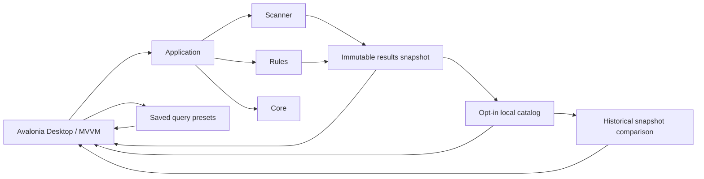

# System Overview

> This document describes the current OpenSorSe implementation and identifies broader architecture material that remains future design intent.

---

## Current product boundary

OpenSorSe is a local-first desktop application for safely analyzing selected folders. The validated v0.9 release is implemented in .NET 8, C#, Avalonia UI, and MVVM.

The Desktop workflow is intentionally read-only. It scans selected folders, enriches file information in memory, and presents review data without renaming, moving, deleting, overwriting, or otherwise modifying selected user files.

The current release includes optional validated suggestions through an explicitly configured Ollama-compatible endpoint, deterministic metadata search, an opt-in bounded local catalog, user-managed result tags, named saved catalog queries, snapshot names/source scope, and bounded historical snapshot comparison. The default AI endpoint is local, but a custom endpoint can be remote. It does not implement live monitoring, OCR, content readers, semantic search, a persistent search index, database-backed storage, report generation/export, or plugins.

## Implemented architecture

| Component | Current responsibility |
| --- | --- |
| `OpenSorSe.Core` | Configuration, logging, events, application state, lifecycle, error handling, dependency injection, and task infrastructure. |
| `OpenSorSe.Scanner` | Read-only folder traversal, file discovery, metadata extraction, SHA-256 hashing, deterministic classification, and exact duplicate detection. |
| `OpenSorSe.Rules` | Deterministic rule evaluation, planning, and lexical conflict resolution. |
| `OpenSorSe.Executor` | Historical execution and undo components retained for isolated testing; the current Desktop neither registers nor exposes them. |
| `OpenSorSe.Application` | Read-only processing orchestration, immutable snapshots, tag validation, bounded schema-2 catalog persistence, bounded saved-query persistence, and pure historical comparison. |
| `OpenSorSe.AI` | Optional configured Ollama-compatible transport and bounded AI-decision-history persistence. |
| `OpenSorSe.Desktop` | Avalonia MVVM shell, Dashboard, Scan, Results Explorer, duplicate review, Catalog, Catalog Search, Compare Snapshots, Settings, Diagnostics, Operation History, and notifications. |

## Read-only processing flow

1. The user selects one or more local folders.
2. The Scanner discovers entries and reads filesystem metadata.
3. The pipeline calculates hashes, applies deterministic classification, detects exact duplicates, and evaluates rules.
4. The Application layer produces an in-memory result snapshot for a completed session.
5. The Desktop application presents the Results Explorer and duplicate review.
6. A user can add or remove bounded OpenSorSe metadata tags for the selected result; no embedded or sidecar file metadata is changed.
7. When explicitly enabled, a completed bounded snapshot and accepted tags may be stored in OpenSorSe application data and later reopened or searched as historical metadata.
8. Named query text may be saved separately and explicitly rerun against the current catalog; search hits are never persisted.
9. New catalog entries capture bounded selected source roots and can receive an application-owned name. Two explicit entries can be compared in memory without checking a stored path.

The current Desktop composition root does not register or invoke execution or undo components. By default result data is process-local and discarded when the application closes. The optional catalog is a bounded application-owned historical snapshot, never a live filesystem view or user-folder sidecar.

## Architecture maturity

The architecture documentation also contains longer-term designs for Readers, Database, Search, Reports, and Plugins. Those sections are future architectural intent unless a current release document explicitly identifies a narrow v0.9 implementation.

Future work should preserve the current component boundaries and receive its own implementation proposal before changing the read-only safety model.

## Documentation structure

| Section | Status in current release |
| --- | --- |
| `00_System` | Current system guidance and future design context. |
| `01_Core` | Implemented foundation. |
| `02_Scanner` | Implemented read-only analysis pipeline. |
| `03_Readers` | Future design intent. |
| `04_AI` | Future design intent. |
| `05_Database` | Future design intent; the bounded catalog and saved-query JSON files are not a database. |
| `06_Search` | Deterministic in-memory/catalog search, v0.6 user tags, and v0.7 named query presets; v0.9 comparison is separate stored-metadata analysis, not a search index. |
| `07-Rules` | Implemented deterministic evaluation and planning infrastructure; no Desktop execution workflow. |
| `08_Gui` | Implemented read-only pages include Results, Catalog, Catalog Search, and Compare Snapshots; broader pages remain future design. |
| `09_Reports` | Future design intent. |
| `10_Plugins` | Future design intent. |

## Related documents

- [Release Status](../../RELEASE_STATUS.md)
- [System Goals](01_System_Goals.md)
- [Component Map](03_Component_Map.md)
- [Data Flow](04_Data_Flow.md)
- [Technology Stack](../99_Appendix/Technology_Stack.md)
- [Safety and Privacy](../../SAFETY_AND_PRIVACY.md)
