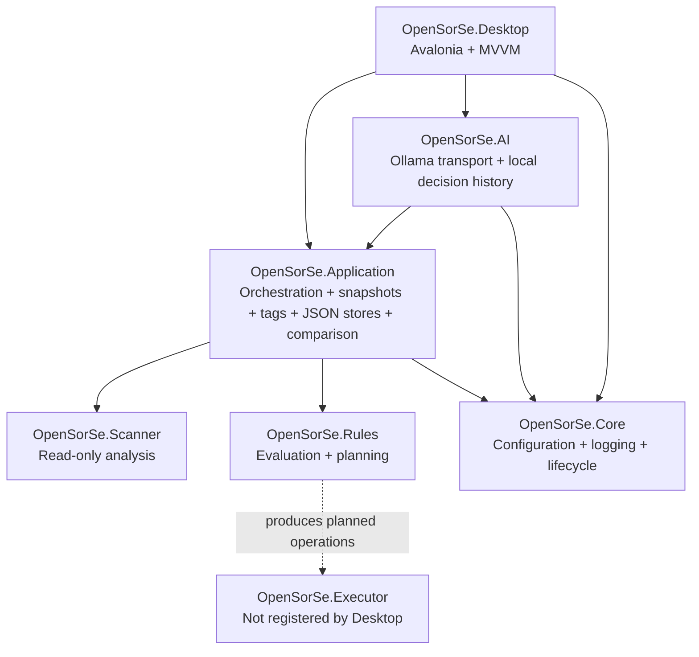

# Component Map

> The map below reflects the implemented v0.9 component relationships. Longer-term components are listed separately as future design intent.

---

## Implemented components

| Component | Implemented responsibility | Current safety boundary |
| --- | --- | --- |
| Desktop | Presents scan/review workflows, Results Explorer, user tags, Catalog, Catalog Search, named query controls, and historical comparison. | Contains no selected-user-file operation control. |
| Application | Coordinates the completed processing pipeline, immutable results, tag normalization, bounded catalog snapshots/queries, and pure stored-metadata comparison. | Comparison and persistence never access stored user paths; persisted metadata is application-owned and historical only. |
| AI | Implements optional Ollama transport and local decision-history persistence behind application-owned contracts. | Does not expose transport DTOs to Desktop and cannot mutate files. |
| Scanner | Traverses selected folders, reads metadata, hashes files, classifies deterministically, and detects exact duplicates. | Read-only filesystem access. |
| Rules | Evaluates supplied rules and produces display-only plans and conflict resolution. | Does not execute plans. |
| Core | Provides shared infrastructure and local application configuration/logging support. | Does not create a user-file mutation path. |
| Executor | Contains execution and undo infrastructure from the foundation work. | Not registered, invoked, or surfaced by the validated Desktop workflow. |

## Future design areas

Readers, the broader Database subsystem, Reports, and Plugins remain future architectural design areas. Search and AI have only the narrow v0.3-v0.9 capabilities documented in current release material: deterministic metadata search, bounded historical comparison, and optional validated Ollama suggestions. They are not live-monitoring, content-reader, report-export, persistent-index, or semantic-search implementations.

As of v0.9, bounded comparison is an implemented Application service over two loaded catalog entries. It is not live monitoring, a report-export subsystem, a database index, or semantic search.

Future additions should use the implemented boundaries above rather than bypassing the Application layer or coupling UI code directly to scanner models.

## Related documents

- [System Overview](00_Overview.md)
- [Data Flow](04_Data_Flow.md)
- [Release Status](../../RELEASE_STATUS.md)
