# Data Flow

> This document describes the current read-only v0.9 data flow. Broader storage, readers, AI, reports, and search architecture remains future intent unless explicitly identified below.

---

## Implemented flow

```mermaid
flowchart LR
    User["Selected local folders"] --> Scan["Scanner\nDiscovery + metadata"]
    Scan --> Hash["SHA-256 hashing"]
    Hash --> Classify["Deterministic classification"]
    Classify --> Duplicates["Exact duplicate detection"]
    Duplicates --> Rules["Rule evaluation + planning"]
    Rules --> Snapshot["Immutable in-memory results snapshot"]
    Snapshot --> Explorer["Results Explorer + duplicate review"]
    Snapshot -->|Optional explicit opt-in| Catalog["Bounded OpenSorSe catalog.json"]
    Catalog --> Historical["Historical Catalog + Catalog Search"]
    Catalog --> Compare["In-memory historical comparison"]
    Explorer --> Tags["Bounded user-managed OpenSorSe tags"]
    Tags -->|Catalog-backed snapshot only| Catalog
    Presets["Named query text\nsaved-catalog-searches.json"] --> Historical
```

## Data ownership and lifetime

| Data | Producer | Consumer | Lifetime |
| --- | --- | --- | --- |
| Scan entries and recoverable issues | Scanner | Application pipeline | Processing session. |
| Metadata, hashes, classifications, and duplicate groups | Scanner enrichers | Application pipeline and results snapshot | Processing session. |
| Rule decisions and planned operations | Rules | Results snapshot | Processing session; display-only in Desktop. |
| Results snapshot | Application | Desktop Results Explorer and duplicate review | Process memory until replaced or application exit. |
| Optional catalog snapshot, accepted tags, name, and captured source roots | Application catalog store | Desktop Catalog, Catalog Search, and Compare Snapshots | Bounded local application-data storage; historical, never live filesystem state. |
| User-managed tags | Application validation / Desktop Results | Results search and optional catalog entry | Bounded application metadata; in memory unless the active snapshot is catalog-backed. |
| Named catalog query presets | Application saved-search store | Desktop Catalog Search | Up to 25 local application-data records; names/query text only, no hits. |
| Historical comparison result/filter | Application comparison service / Desktop | Desktop Compare Snapshots | Process memory only; at most 4,000 changes and 500 published rows. |
| Settings and diagnostic logs | Core | Desktop and supporting services | Local application-data scope, independent of scan results. |

## Safety constraints

- The Scanner reads selected filesystem information; it does not modify selected user files.
- The Results Explorer filters and sorts already-projected in-memory data; it does not rescan, open, reveal, or validate paths.
- Duplicate review consumes existing exact-hash groups and does not recalculate hashes or recommend deletion.
- Catalog search reads only stored snapshot metadata. Catalog remove/clear affects only explicit OpenSorSe application-owned data after user action.
- Snapshot comparison loads only two explicit catalog entries and performs pure metadata/tag comparison; it never opens or validates a stored path.
- Tag controls change only in-memory/application-owned associations. Saved-query remove/reset changes only `saved-catalog-searches.json`; corrupt reset requires a separate confirmation.
- The current Desktop workflow does not register or invoke `IActionExecutor` or `IUndoEngine`; those mutation-capable types remain dormant historical/test infrastructure.

## Deferred flows

Persistent databases, content readers, OCR, embedding/semantic search indexes, live monitoring, report generation/export, and plugins are not part of the current flow. The optional Ollama suggestions, bounded catalog search, and historical comparison have only the current release scope documented elsewhere.

## Related documents

- [System Overview](00_Overview.md)
- [Component Map](03_Component_Map.md)
- [Results Explorer Specification](../../Implementation_Spec/v0.2/030_ResultsExplorer.md)
