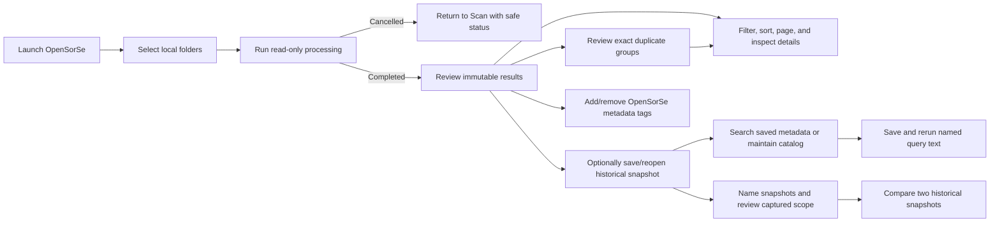

# User Flow

> This document describes the validated v0.9 read-only user workflow.

---

## Primary workflow

## User actions available today

| Action | Behavior |
| --- | --- |
| Scan | Select one or more local folders and start a read-only analysis pipeline. |
| Cancel | Request cancellation of active processing; incomplete results are not presented as completed review data. |
| Review results | Filter, sort, page, and inspect the in-memory output of a completed scan. |
| Review duplicates | Inspect existing exact SHA-256 groups and return to their result rows. |
| Saved catalog | Opt in to store bounded display-safe snapshots locally, reopen them, and explicitly remove application-owned catalog data. |
| Catalog search | Deterministically search metadata already stored in saved snapshots and open the related historical result view. |
| User tags | Add/remove bounded application-owned labels for the selected result; catalog-backed labels are searchable after restart. |
| Saved searches | Save named query text, rerun it against the current catalog, and explicitly remove/reset it without storing hits. |
| Snapshot identity | Set, replace, or clear an application-owned snapshot name and review captured scan roots; legacy scope remains explicitly unknown. |
| Compare snapshots | Compare two distinct stored snapshots, filter bounded changes, cancel work, and open either historical snapshot without live path access. |
| Configure | Update implemented application settings. |
| Diagnose | Review aggregate diagnostic information. |
| View history | Review available in-memory operation-history state without performing operations. |

## Safety boundary

Users cannot rename, move, delete, overwrite, open, reveal, execute, or undo files through the validated Desktop workflow. Planned operations are informational only.

AI suggestions remain review-only. Live monitoring, OCR, semantic search, content readers, database-backed indexes, scheduled/background search, report export, automatic organization, and selected-user-file mutation are not part of the current user flow.

## Related documents

- [System Overview](00_Overview.md)
- [GUI Overview](../08_Gui/00_Overview.md)
- [Release Status](../../RELEASE_STATUS.md)
