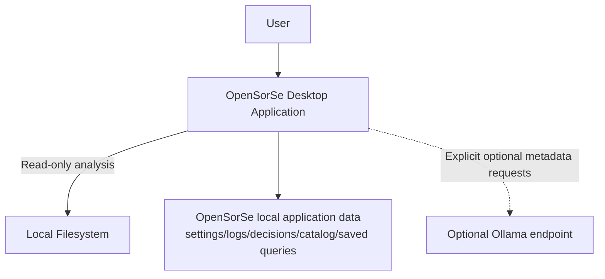

# Deployment

> This document describes the runtime deployment architecture of OpenSorSe, including the major runtime components, local storage, optional external services, and the overall execution environment.

---

## Purpose

The purpose of this document is to define how OpenSorSe is deployed and executed.

Unlike the logical architecture described in previous documents, this document focuses on the physical arrangement of application components during runtime.

The deployment architecture is designed around a **local-first** philosophy where all core functionality operates directly on the user's machine.

---

# Deployment Overview

OpenSorSe v0.9 runs as a .NET 8 Avalonia desktop application built from source; this repository has no installer or published package.

All primary components execute locally and communicate internally through the application's architecture.

No internet connection is required for core functionality.

An explicitly configured Ollama endpoint is optional for review-only suggestions. It is not required for scanning, Results, tags, catalog search, saved searches, snapshot identity, or historical comparison.

---

# Deployment Diagram

---

# Runtime Components

The deployed application consists of the following runtime components.

| Component               | Description                                                  |
| ----------------------- | ------------------------------------------------------------ |
| Desktop Application     | Hosts the user interface and application logic.              |
| Local Filesystem | Source of folders analyzed through the read-only scanner. |
| Local application data | Holds JSON settings, bounded logs/decision history, optional bounded `catalog.json`, and bounded `saved-catalog-searches.json`. |
| Optional Ollama endpoint | Receives bounded metadata only when enabled for validated review-only suggestions. |

---

# Local Storage

Application data is stored locally.

Implemented stored information is application settings, diagnostic logs, bounded AI decision history, optional schema-2 display-safe catalog snapshots/accepted tags/names/source roots, and up to 25 saved query names/text values. Historical comparison results and filters are process-local. OpenSorSe does not store extracted contents, hashes in the Results snapshot, persistent search hits, full-text/vector indexes, plugin data, or sidecars beside selected files.

Production settings, decision history, catalog, saved searches, and default logs are rooted below `Environment.SpecialFolder.LocalApplicationData/OpenSorSe`. The user can explicitly select another absolute log directory; ownership-aware names and markers ensure retention never targets an unowned collision. Tests use unique disposable temporary directories.

---

# Optional External Services

Although OpenSorSe is designed to operate completely offline, optional integrations may be supported.

The only implemented optional integration is a user-configured Ollama-compatible endpoint. Cloud AI providers, cloud storage, and synchronization are future ideas.

These integrations should always be optional and require explicit user configuration.

Core functionality must remain available without them.

---

# Deployment Principles

The deployment architecture follows several important principles:

* Local-first execution
* Offline operation
* Minimal external dependencies
* User ownership of data
* Simple installation
* Cross-platform design compatibility (formal platform certification is not claimed)
* Modular runtime components

These principles ensure that users retain full control over their files and data.

---

# Scalability

The deployment architecture should support:

* Small personal file collections
* Large document libraries
* Multiple storage locations
* Large AI models
* Additional plugins
* Future architectural expansion

Scalability should be achieved without significantly increasing deployment complexity.

---

# Future Considerations

The architecture should allow future support for additional deployment scenarios without affecting the core design.

Examples include:

* Portable installations
* Enterprise deployments
* Shared configuration profiles
* Remote AI inference
* Network-attached storage (NAS)
* Distributed indexing

These deployment models should extend the architecture rather than replace the existing local-first approach.

---

# Related Documents

* [System Overview](00_Overview.md)
* [Configuration](../01_Core/02_Configuration.md)
* [Database Overview](../05_Database/00_Overview.md)
* [Plugin Overview](../10_Plugins/00_Overview.md)
