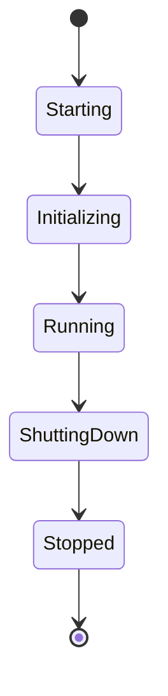

# Application

> This document defines the Application component, which is responsible for managing the lifecycle of OpenSorSe.

---

## Purpose

The Application component acts as the entry point of OpenSorSe.

It is responsible for initializing the application, coordinating startup and shutdown, creating the required infrastructure, and ensuring that all subsystems are started in the correct order.

The Application itself should contain very little business logic. Its primary responsibility is orchestration.

---

# Responsibilities

The Application component is responsible for:

* Starting the application.
* Initializing core services.
* Loading application configuration.
* Creating shared infrastructure.
* Starting application modules.
* Managing the application lifecycle.
* Coordinating graceful shutdown.
* Handling fatal startup errors.

---

# Scope

### In Scope

* Application startup
* Application shutdown
* Initialization sequence
* Lifecycle management
* Module initialization
* Global startup validation

### Out of Scope

The Application component is **not** responsible for:

* File scanning
* AI processing
* Database operations
* Search
* GUI logic
* Business rules

Those responsibilities belong to their respective subsystems.

---

# Application Lifecycle

The Application progresses through a series of well-defined lifecycle stages.

Each stage has clearly defined responsibilities and should complete successfully before progressing to the next stage.

---

# Startup Sequence

A typical startup sequence consists of the following steps:

1. Launch the application.
2. Load configuration.
3. Initialize logging.
4. Create the Event Bus.
5. Register shared services.
6. Initialize the database.
7. Initialize plugins.
8. Initialize application modules.
9. Start the graphical user interface.
10. Enter the running state.

If any required step fails, the application should stop initialization and report the error.

---

# Shutdown Sequence

When the application exits, resources should be released in a controlled manner.

Typical shutdown order:

1. Stop accepting new work.
2. Finish or cancel background tasks.
3. Save application state.
4. Flush pending logs.
5. Close database connections.
6. Unload plugins.
7. Release remaining resources.
8. Exit the application.

A graceful shutdown helps prevent data corruption and incomplete operations.

---

# Lifecycle States

| State         | Description                                              |
| ------------- | -------------------------------------------------------- |
| Starting      | The application executable has been launched.            |
| Initializing  | Core infrastructure and services are being created.      |
| Running       | The application is fully operational.                    |
| Shutting Down | Active tasks are being completed and resources released. |
| Stopped       | The application has terminated successfully.             |

---

# Design Principles

The Application component should remain:

* Lightweight
* Predictable
* Easy to understand
* Independent of business logic
* Responsible only for orchestration

Whenever possible, work should be delegated to dedicated components rather than implemented directly within the Application.

---

# Error Handling

Startup failures should:

* Produce meaningful log messages.
* Present understandable error messages to the user.
* Prevent partially initialized application states.
* Shut down gracefully whenever possible.

Unexpected runtime errors should be delegated to the application's centralized error handling infrastructure.

---

# Related Components

The Application component coordinates the initialization of:

* Configuration
* Logging
* Event Bus
* Service Registry
* Application State
* Task Manager

It does not own these components; it is responsible only for creating and coordinating them.

---

# Related Documents

* [Core Overview](00_Overview.md)
* [Configuration](02_Configuration.md)
* [Logging](03_Logging.md)
* [Event Bus](04_Event_Bus.md)
* [Service Registry](05_Service_Registry.md)
* [Application State](06_Application_State.md)
* [Task Manager](07_Task_Manager.md)
* [Error Handling](09_Error_Handling.md)
