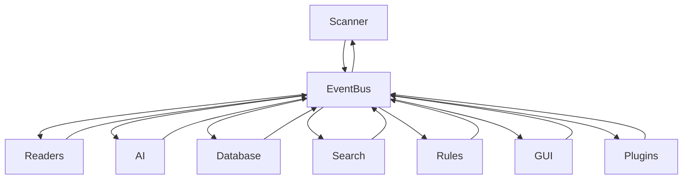

# Event Bus

> This document defines the Event Bus architecture used for communication between the various subsystems of OpenSorSe.

---

## Purpose

The Event Bus provides a centralized communication mechanism that enables subsystems to exchange information without requiring direct knowledge of one another.

By using an event-driven architecture, OpenSorSe reduces coupling between components while improving modularity, extensibility, and maintainability.

The Event Bus is responsible only for delivering events. It does not contain business logic.

---

# Responsibilities

The Event Bus is responsible for:

* Publishing events.
* Delivering events to interested subscribers.
* Managing event subscriptions.
* Decoupling communicating components.
* Supporting communication between subsystems.
* Providing a consistent messaging mechanism across the application.

---

# Scope

### In Scope

* Event publication
* Event subscription
* Event delivery
* Event dispatching
* Event registration

### Out of Scope

The Event Bus is **not** responsible for:

* Business logic
* Data processing
* Workflow orchestration
* Event persistence
* Application state management

These responsibilities belong to other components.

---

# Architectural Overview

All major subsystems communicate through the Event Bus rather than calling each other directly whenever event-based communication is appropriate.



The Event Bus acts as a communication hub while remaining independent of subsystem implementation.

---

# Communication Model

Communication follows a publish-subscribe model.

1. A component publishes an event.
2. The Event Bus receives the event.
3. Subscribers registered for that event are notified.
4. Each subscriber independently performs its own processing.

Publishers do not know which components receive their events.

Subscribers do not know which component published an event.

This separation significantly reduces coupling throughout the application.

---

# Event Lifecycle

A typical event progresses through the following stages:

```text
Component Action
        │
        ▼
Publish Event
        │
        ▼
Event Bus
        │
        ▼
Registered Subscribers
        │
        ▼
Subscriber Processing
```

Each event represents something that has already happened within the application.

---

# Design Principles

The Event Bus should follow these principles:

* Loose coupling
* High cohesion
* Predictable event delivery
* Clear event ownership
* Simple communication model
* Extensibility
* Minimal overhead

The Event Bus should remain lightweight and independent of business logic.

---

# Event Design Guidelines

Events should:

* Represent completed actions or state changes.
* Use descriptive and consistent naming.
* Be immutable once published.
* Contain only the information required by subscribers.
* Avoid exposing internal implementation details.

Events should describe **what happened**, not instruct other components what to do.

---

# Subscribers

Any subsystem may subscribe to one or more event types.

Multiple subscribers may receive the same event.

Subscribers should remain independent and should not assume execution order unless explicitly defined elsewhere in the architecture.

---

# Error Handling

Errors within one subscriber should not prevent other subscribers from receiving the same event.

The Event Bus should isolate subscriber failures wherever practical and report failures through the application's logging and error handling infrastructure.

---

# Future Considerations

The Event Bus architecture should support future enhancements, including:

* Event priorities
* Asynchronous event delivery
* Event filtering
* Plugin-defined events
* Event tracing and diagnostics
* Performance monitoring

These enhancements should preserve the existing communication model.

---

# Related Documents

* [Event Flow](../00_System/05_Event_Flow.md)
* [Application](01_Application.md)
* [Logging](03_Logging.md)
* [Service Registry](05_Service_Registry.md)
* [Task Manager](07_Task_Manager.md)
