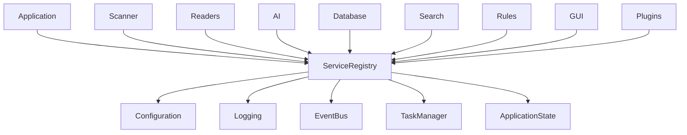

# Service Registry

> This document defines the Service Registry architecture used to manage shared services within OpenSorSe.

---

## Purpose

The Service Registry provides a centralized mechanism for registering, discovering, and accessing shared application services.

Rather than creating or managing shared infrastructure independently, application components obtain common services through the Service Registry.

This promotes consistency, reduces duplication, and simplifies dependency management throughout the application.

---

# Responsibilities

The Service Registry is responsible for:

* Registering shared services.
* Providing access to registered services.
* Managing service lifecycles.
* Preventing duplicate service registration.
* Supporting future service extensibility.

The Service Registry does not implement the services themselves.

---

# Scope

### In Scope

* Service registration
* Service discovery
* Service lookup
* Shared infrastructure services
* Service lifecycle coordination

### Out of Scope

The Service Registry is **not** responsible for:

* Business logic
* Creating application features
* Managing application state
* Event communication
* Configuration management

Those responsibilities belong to their respective components.

---

# Architectural Overview

The Service Registry acts as a central access point for shared infrastructure services.

Application components obtain shared infrastructure through the Service Registry rather than creating duplicate instances.

---

# Shared Services

Typical services managed by the Service Registry include:

| Service           | Purpose                                             |
| ----------------- | --------------------------------------------------- |
| Configuration     | Provides application settings and user preferences. |
| Logging           | Records application events and diagnostics.         |
| Event Bus         | Enables communication between subsystems.           |
| Application State | Maintains global runtime state.                     |
| Task Manager      | Coordinates background operations.                  |

Additional shared services may be introduced as the application evolves.

---

# Registration Lifecycle

A typical service lifecycle follows these stages:

1. Service creation.
2. Service registration.
3. Service discovery.
4. Service usage.
5. Service shutdown.
6. Service deregistration.

Services should be registered during application initialization and remain available until application shutdown unless explicitly designed otherwise.

---

# Design Principles

The Service Registry should follow these principles:

* Single registration per service.
* Centralized service discovery.
* Loose coupling between components.
* Clear ownership of shared services.
* Extensible architecture.
* Predictable service availability.

The Service Registry should remain lightweight and focused solely on infrastructure management.

---

# Service Access

Application components should access shared infrastructure through the Service Registry rather than constructing or managing shared services themselves.

This approach provides:

* Consistent service access.
* Reduced duplication.
* Easier testing.
* Improved maintainability.
* Clear dependency management.

---

# Future Considerations

The architecture should support future enhancements, including:

* Lazy service initialization.
* Optional services.
* Plugin-provided services.
* Service replacement.
* Scoped services.
* Diagnostic tooling.

Future enhancements should preserve the existing architectural principles without introducing unnecessary complexity.

---

# Related Documents

* [Application](01_Application.md)
* [Configuration](02_Configuration.md)
* [Logging](03_Logging.md)
* [Event Bus](04_Event_Bus.md)
* [Application State](06_Application_State.md)
* [Task Manager](07_Task_Manager.md)
