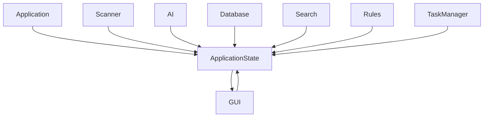
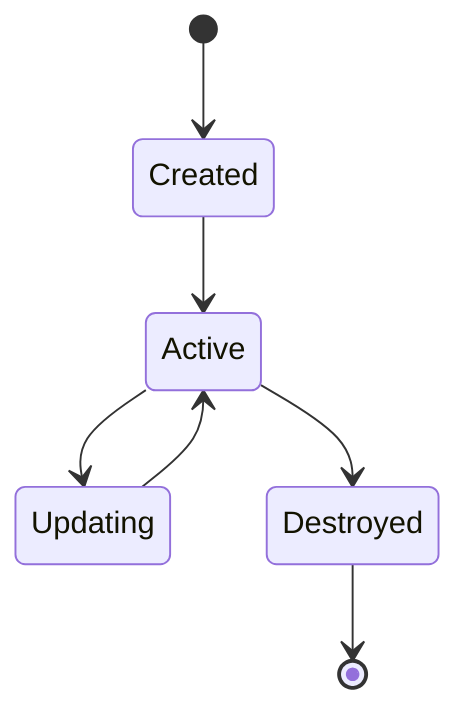

# Application State

> This document defines the Application State architecture used to manage the runtime state of OpenSorSe.

---

## Purpose

The Application State component provides a centralized representation of the application's current runtime state.

It enables different subsystems to access and observe shared runtime information without maintaining duplicate or inconsistent state.

Unlike application configuration, application state exists only while the application is running and is recreated each time the application starts.

---

# Responsibilities

The Application State component is responsible for:

* Managing global runtime state.
* Providing access to shared state information.
* Coordinating state changes across the application.
* Exposing the current status of the application.
* Supporting state observation by interested components.

The Application State component does not persist data between application sessions.

---

# Scope

### In Scope

* Runtime status
* Active operations
* Current application mode
* Current user session
* Progress information
* Global runtime flags

### Out of Scope

The Application State component is **not** responsible for:

* User settings
* Configuration
* File metadata
* Search indexes
* Database records
* Processing history
* Cached AI results

These belong to their respective components.

---

# Architectural Overview

Application State acts as a shared runtime information source for all major subsystems.

Subsystems may update or observe application state as appropriate, while the Application State component remains the authoritative source of runtime information.

---

# Runtime State

Examples of runtime information include:

| State                | Description                                 |
| -------------------- | ------------------------------------------- |
| Application Status   | Starting, Running, or Shutting Down         |
| Active Scan          | Current scan operation, if any              |
| Background Tasks     | Running background operations               |
| Current Workspace    | Active user workspace                       |
| Progress Information | Overall progress of long-running operations |
| Connected Services   | Availability of optional external services  |

The exact state model may evolve as the application grows.

---

# State Lifecycle

Application State follows the application's lifecycle.

State is initialized during application startup and destroyed during shutdown.

---

# State Management Principles

Application State should follow these principles:

* Single source of truth.
* Consistent and predictable updates.
* Clear ownership of state.
* Minimal duplication.
* Easy observation by interested components.
* Temporary by design.

Runtime state should never be confused with persistent configuration.

---

# State Changes

Changes to application state should occur in a controlled and predictable manner.

Whenever practical:

* State changes should be intentional.
* Related components should be notified appropriately.
* Invalid state transitions should be prevented.
* State should remain internally consistent.

---

# Future Considerations

The architecture should support future enhancements, including:

* Multiple workspaces
* Session restoration
* Observable state updates
* Fine-grained state partitions
* Performance monitoring
* Additional runtime metrics

These enhancements should extend the existing architecture without changing its overall responsibilities.

---

# Related Documents

* [Application](01_Application.md)
* [Configuration](02_Configuration.md)
* [Event Bus](04_Event_Bus.md)
* [Task Manager](07_Task_Manager.md)
