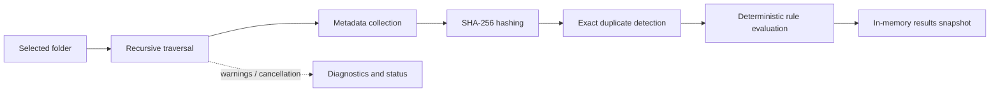

# Scanner Overview

> This document describes the read-only Scanner subsystem implemented in the validated v0.2 release.

---

## Purpose

The Scanner analyzes a user-selected folder without changing its contents. It traverses directories recursively, gathers filesystem metadata, calculates SHA-256 hashes, detects exact duplicates, and reports recoverable issues, progress, and cancellation through the application pipeline.

---

## Current Responsibilities

* Validate the selected scan root.
* Traverse accessible directories recursively while respecting the configured link/reparse-point policy.
* Discover files and collect filesystem metadata.
* Calculate SHA-256 hashes for analysis and exact-duplicate detection.
* Isolate inaccessible paths and other recoverable failures as diagnostics.
* Report progress and honour cancellation.
* Produce data consumed by deterministic rules and the in-memory results snapshot.

---

## Safety Boundary

The Scanner reads filesystem information only. It does not rename, move, delete, modify, or organize user files; it does not read document content, perform OCR, or execute AI.

---

## Processing Flow

---

## Related Documents

* [System Data Flow](../00_System/04_Data_Flow.md)
* [Folder Scanner](01_Folder_Scanner.md)
* [Cancellation](07_Cancellation.md)
* [Scanner Error Handling](08_Error_Handling.md)
* [Release Status](../../RELEASE_STATUS.md)
