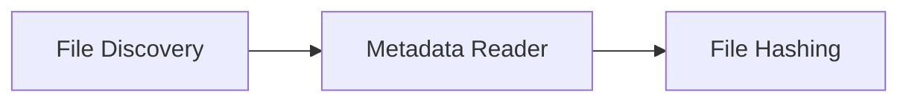

# Metadata Reader

> This document defines the Metadata Reader component, which is responsible for collecting filesystem metadata from discovered files.

---

## Purpose

The Metadata Reader collects filesystem metadata for files discovered during the scanning process.

This metadata provides essential information required for downstream processing, indexing, duplicate detection, and AI analysis.

The Metadata Reader is limited to metadata provided by the operating system or filesystem. It does not extract metadata embedded within document formats.

---

# Responsibilities

The Metadata Reader is responsible for:

* Reading filesystem metadata.
* Validating metadata availability.
* Normalizing metadata values.
* Creating metadata records.
* Forwarding metadata for subsequent processing.

---

# Scope

### In Scope

* File size
* File extension
* Creation date
* Modification date
* Last access date (where available)
* File attributes
* File permissions (where applicable)
* Filesystem path

### Out of Scope

The Metadata Reader is **not** responsible for:

* Reading PDF properties
* Reading Office document metadata
* Reading image EXIF data
* Reading audio tags
* Reading video metadata
* OCR
* Document content extraction
* AI analysis

These responsibilities belong to the Readers subsystem.

---

# Architectural Overview

The Metadata Reader receives validated file descriptors from the File Discovery component and enriches them with filesystem metadata.

---

# Metadata Collection Workflow

A typical metadata collection operation consists of the following stages:

1. Receive a file descriptor.
2. Verify that the file is accessible.
3. Read available filesystem metadata.
4. Normalize collected values.
5. Attach metadata to the file descriptor.
6. Forward the enriched file descriptor to the File Hashing component.

---

# Filesystem Metadata

Typical filesystem metadata includes:

| Metadata          | Description                                                 |
| ----------------- | ----------------------------------------------------------- |
| File Name         | Name of the file.                                           |
| File Extension    | File type extension.                                        |
| File Size         | Size in bytes.                                              |
| Creation Time     | Time the file was created (where supported).                |
| Modification Time | Most recent modification timestamp.                         |
| Last Access Time  | Most recent access timestamp (where supported).             |
| Absolute Path     | Full filesystem location.                                   |
| File Attributes   | Filesystem-specific attributes such as hidden or read-only. |
| Permissions       | Access permissions where supported by the operating system. |

Availability of certain metadata depends on the underlying filesystem and operating system.

---

# Metadata Normalization

Collected metadata should be normalized before being passed to downstream components.

Normalization helps ensure:

* Consistent date and time formats.
* Platform-independent representations where practical.
* Predictable handling of missing values.
* Consistent data structures across supported operating systems.

---

# Design Principles

The Metadata Reader should remain:

* Lightweight.
* Platform-aware.
* Deterministic.
* Read-only.
* Independent of document formats.

Its sole responsibility is collecting filesystem metadata.

---

# Error Handling

Metadata collection should continue whenever possible after encountering recoverable failures.

Examples include:

* Missing metadata
* Unsupported filesystem features
* Permission restrictions
* Files deleted during processing

Missing metadata should not prevent a file from continuing through the processing pipeline unless that metadata is required for subsequent stages.

---

# Future Considerations

The architecture should support future enhancements, including:

* Extended filesystem attributes
* Alternate data streams
* Platform-specific metadata
* Network filesystem metadata
* Additional normalization strategies

These enhancements should remain limited to filesystem metadata and should not introduce document-specific processing.

---

# Related Documents

* [File Discovery](02_File_Discovery.md)
* [File Hashing](04_File_Hashing.md)
* [Readers Overview](../03_Readers/00_Overview.md)
* [Scanner Overview](00_Overview.md)
