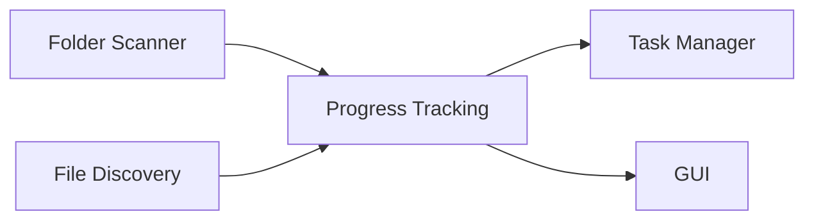
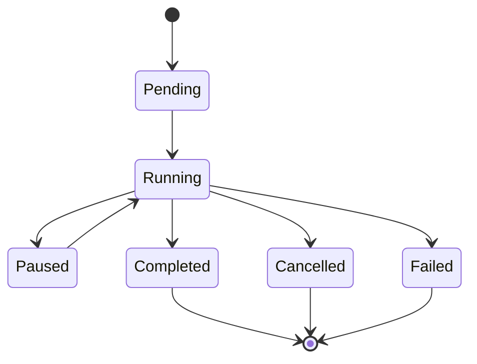

# Progress Tracking

> This document defines the Progress Tracking component, which is responsible for monitoring and reporting the progress of scanning operations within OpenSorSe.

---

## Purpose

The Progress Tracking component provides real-time visibility into the status of scanning operations.

Its primary purpose is to monitor scan progress, expose meaningful progress information to other subsystems, and provide users with clear feedback during long-running operations.

The Progress Tracking component observes scanning activity but does not control or perform scanning itself.

---

# Responsibilities

The Progress Tracking component is responsible for:

* Tracking scan progress.
* Reporting scan status.
* Monitoring completed work.
* Estimating remaining work where practical.
* Publishing progress updates.
* Providing progress information to other components.

---

# Scope

### In Scope

* Progress monitoring
* Status reporting
* Completion tracking
* Progress updates
* Scan statistics

### Out of Scope

The Progress Tracking component is **not** responsible for:

* Directory traversal
* File discovery
* Metadata extraction
* Task scheduling
* User interface rendering
* Task cancellation

These responsibilities belong to other architectural components.

---

# Architectural Overview

The Progress Tracking component receives updates from scanning operations and makes progress information available to interested components.

---

# Progress Lifecycle

A typical scan progresses through the following states:

Not every scan will enter every state.

---

# Progress Information

The Progress Tracking component may expose information such as:

| Information              | Description                                         |
| ------------------------ | --------------------------------------------------- |
| Current Status           | Current stage of the scan.                          |
| Files Discovered         | Number of files found.                              |
| Files Processed          | Number of files processed.                          |
| Folders Scanned          | Number of directories traversed.                    |
| Current File             | File currently being processed (where appropriate). |
| Elapsed Time             | Time since the scan started.                        |
| Estimated Remaining Time | Approximate time remaining, when available.         |

The exact metrics may evolve as the application develops.

---

# Progress Updates

Progress information should be updated whenever meaningful changes occur.

Updates should be:

* Accurate
* Timely
* Lightweight
* Consistent
* Non-blocking

Progress reporting should avoid generating unnecessary overhead during large scans.

---

# Design Principles

The Progress Tracking component should remain:

* Passive
* Lightweight
* Accurate
* Independent
* Observable

It should report progress without influencing the execution of the scanning process.

---

# Error Handling

Failures affecting progress reporting should not interrupt the scanning operation.

If progress information becomes temporarily unavailable:

* The scan should continue.
* The most recent valid progress should remain available where practical.
* Errors should be reported through the application's logging infrastructure.

---

# Future Considerations

The architecture should support future enhancements, including:

* Detailed scan statistics
* Historical progress analysis
* Performance metrics
* Plugin-defined progress reporting
* Multiple concurrent scan sessions
* Remote progress monitoring

These enhancements should extend the reporting capabilities without affecting the scanning pipeline.

---

# Related Documents

* [Folder Scanner](01_Folder_Scanner.md)
* [Cancellation](07_Cancellation.md)
* [Task Manager](../01_Core/07_Task_Manager.md)
* [Scanner Overview](00_Overview.md)
