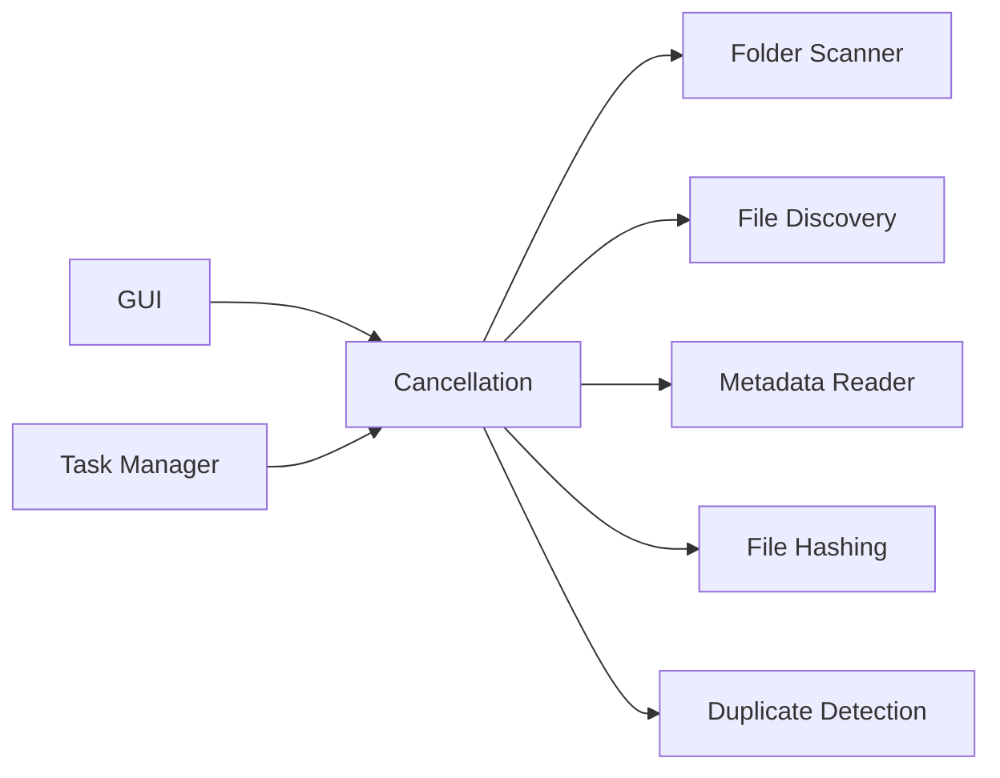

# Cancellation

> This document defines the Cancellation component, which is responsible for safely stopping active scanning operations.

---

## Purpose

The Cancellation component provides a consistent mechanism for interrupting and terminating active scanning operations.

Its purpose is to ensure that long-running tasks can be stopped safely while preserving application stability and maintaining data integrity.

Cancellation requests should be handled gracefully without leaving the application in an inconsistent state.

---

# Responsibilities

The Cancellation component is responsible for:

* Receiving cancellation requests.
* Coordinating scan termination.
* Notifying active scanner components.
* Managing cancellation state.
* Ensuring safe shutdown of scanning operations.
* Reporting cancellation status.

The Cancellation component does not perform scanning itself.

---

# Scope

### In Scope

* Scan cancellation
* Cancellation requests
* Cancellation coordination
* Cancellation state
* Graceful termination

### Out of Scope

The Cancellation component is **not** responsible for:

* File discovery
* Directory traversal
* Metadata extraction
* Background task management
* Error handling
* Progress reporting

These responsibilities belong to their respective components.

---

# Architectural Overview

The Cancellation component coordinates cancellation requests across the Scanner subsystem.

---

# Cancellation Workflow

A typical cancellation request follows these stages:

1. A cancellation request is received.
2. The cancellation state is updated.
3. Active scanner components are notified.
4. Ongoing operations complete or terminate safely.
5. Resources are released.
6. The scan is marked as cancelled.
7. Control returns to the application.

Cancellation should always be cooperative rather than forcing immediate termination whenever practical.

---

# Cancellation Principles

Cancellation should follow these principles:

* Safe
* Predictable
* Responsive
* Graceful
* Recoverable

A cancellation request should stop future work while allowing active operations to complete safely where appropriate.

---

# Cancellation States

| State      | Description                               |
| ---------- | ----------------------------------------- |
| Idle       | No cancellation request is active.        |
| Requested  | A cancellation request has been received. |
| Cancelling | Active operations are shutting down.      |
| Cancelled  | The scan has terminated successfully.     |

The exact internal implementation of these states is left to the implementation.

---

# Resource Cleanup

When a scan is cancelled, components should release resources responsibly.

Examples include:

* Closing open file handles.
* Releasing memory.
* Stopping background operations.
* Clearing temporary resources.
* Updating runtime state.

Cleanup should leave the application ready for a future scan.

---

# Design Principles

The Cancellation component should remain:

* Lightweight
* Independent
* Cooperative
* Reliable
* Easy to integrate

It should coordinate cancellation without becoming involved in the implementation details of scanning operations.

---

# Future Considerations

The architecture should support future enhancements, including:

* Pausing and resuming scans
* Partial scan cancellation
* Multiple concurrent scan sessions
* Task-level cancellation
* Plugin-aware cancellation

These capabilities should build upon the existing cancellation model without changing its primary responsibility.

---

# Related Documents

* [Progress Tracking](06_Progress_Tracking.md)
* [Task Manager](../01_Core/07_Task_Manager.md)
* [Scanner Overview](00_Overview.md)
* [Scanner Error Handling](08_Error_Handling.md)
