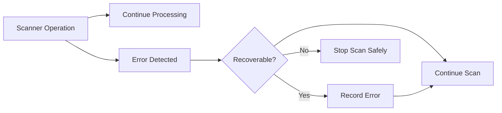

# Error Handling

> This document defines the error handling strategy used by the Scanner subsystem.

---

## Purpose

The Scanner subsystem interacts directly with the filesystem, making it particularly susceptible to environmental errors such as missing files, permission issues, and unavailable storage devices.

The purpose of this document is to define how Scanner components detect, report, isolate, and recover from these failures while allowing the overall scanning operation to continue whenever possible.

This document complements the application's global error handling architecture by defining Scanner-specific behavior.

---

# Responsibilities

The Scanner subsystem is responsible for:

* Detecting scanning failures.
* Isolating failures to the affected file or directory.
* Reporting recoverable and non-recoverable errors.
* Continuing scan operations whenever practical.
* Recording sufficient diagnostic information.

---

# Scope

### In Scope

* Filesystem errors
* Permission errors
* Missing files
* Missing directories
* Corrupted filesystem entries
* Interrupted scan operations
* Scanner component failures

### Out of Scope

The Scanner subsystem is **not** responsible for:

* Global application error handling
* User notification policies
* Logging implementation
* Database recovery
* AI processing failures

These responsibilities belong to other architectural components.

---

# Error Handling Strategy

The Scanner should prioritize completing the scan while isolating failures to the smallest possible scope.

Whenever practical:

* A failed file should not stop the current directory.
* A failed directory should not stop the entire scan.
* A recoverable error should not terminate the application.

Only unrecoverable failures should cause the scanning operation to stop.

---

# Error Flow

---

# Common Error Scenarios

Examples of Scanner-specific errors include:

| Error                 | Typical Cause                           | Expected Behavior                                       |
| --------------------- | --------------------------------------- | ------------------------------------------------------- |
| File Not Found        | File removed during scan                | Skip the file and continue.                             |
| Permission Denied     | Insufficient access rights              | Record the error and continue scanning other files.     |
| Directory Unavailable | Network or removable drive disconnected | Skip the directory and continue where possible.         |
| Corrupted File Entry  | Filesystem inconsistency                | Record the failure and continue scanning.               |
| Read Failure          | Temporary filesystem error              | Retry where appropriate or continue with the next file. |

---

# Recovery Principles

Scanner components should follow these recovery principles:

* Fail locally whenever possible.
* Continue scanning unaffected files.
* Avoid repeating failed operations unnecessarily.
* Preserve partial scan results.
* Leave the Scanner in a consistent state.

Recovery should prioritize completing as much of the scan as possible without compromising application stability.

---

# Design Principles

Scanner error handling should be:

* Resilient
* Predictable
* Non-destructive
* Informative
* Isolated

Scanner components should anticipate that filesystem errors are normal rather than exceptional.

---

# Future Considerations

The architecture should support future enhancements, including:

* Automatic retry strategies
* Configurable recovery policies
* Detailed scan diagnostics
* Error reporting dashboards
* Plugin-defined recovery mechanisms

These enhancements should improve robustness without changing the Scanner's primary responsibilities.

---

# Related Documents

* [Scanner Overview](00_Overview.md)
* [Folder Scanner](01_Folder_Scanner.md)
* [Cancellation](07_Cancellation.md)
* [Core Error Handling](../01_Core/09_Error_Handling.md)
