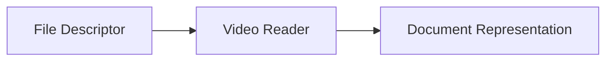

# Video Reader

> This document defines the Video Reader component, which is responsible for extracting metadata and technical information from supported video file formats.

---

## Purpose

The Video Reader extracts metadata and technical information from video files and converts it into a normalized representation for downstream processing.

Its primary responsibility is to gather structural and technical information about a video while preserving its integrity.

The Video Reader does not perform scene recognition, object detection, speech transcription, or any other AI-based analysis.

---

# Responsibilities

The Video Reader is responsible for:

* Reading supported video formats.
* Extracting embedded metadata.
* Determining video properties.
* Determining audio stream properties.
* Identifying subtitle tracks.
* Identifying embedded chapters.
* Extracting embedded thumbnails where available.
* Forwarding extracted information for further processing.

---

# Scope

### In Scope

* Video metadata
* Video duration
* Resolution
* Frame rate
* Video codec
* Audio codec
* Subtitle tracks
* Chapter information
* Embedded thumbnails
* Container properties

### Out of Scope

The Video Reader is **not** responsible for:

* Scene recognition
* Object detection
* Speech-to-text transcription
* Video summarization
* AI analysis
* Video editing
* Thumbnail generation

These responsibilities belong to downstream subsystems.

---

# Architectural Overview

The Video Reader extracts technical information from video files before forwarding the resulting document representation for further processing.

---

# Processing Workflow

A typical video processing operation consists of the following stages:

1. Receive a file descriptor.
2. Verify that the file is a supported video format.
3. Read container information.
4. Extract video properties.
5. Extract audio stream information.
6. Extract embedded metadata.
7. Identify subtitle tracks, chapters, and thumbnails where available.
8. Produce a normalized document representation.
9. Forward the document for further processing.

---

# Supported Formats

The architecture should support common video formats, including:

* MP4
* MKV
* AVI
* MOV
* WMV
* FLV
* WebM
* MPEG
* M4V

Additional video formats may be supported as the application evolves.

---

# Extracted Information

The Video Reader may extract information including:

| Information        | Description                      |
| ------------------ | -------------------------------- |
| Title              | Embedded title where available.  |
| Duration           | Length of the video.             |
| Resolution         | Video width and height.          |
| Frame Rate         | Frames per second.               |
| Video Codec        | Video compression format.        |
| Audio Codec        | Audio compression format.        |
| Bitrate            | Overall media bitrate.           |
| Container Format   | Video container type.            |
| Subtitle Tracks    | Available subtitle streams.      |
| Audio Tracks       | Available audio streams.         |
| Chapters           | Embedded chapter markers.        |
| Embedded Thumbnail | Thumbnail image where available. |
| Creation Date      | Recording or creation timestamp. |

The exact information extracted depends on the file format and available metadata.

---

# Design Principles

The Video Reader should remain:

* Read-only.
* Deterministic.
* Format-specific.
* Independent of AI.
* Independent of transcription.
* Independent of business logic.

Its responsibility is limited to extracting technical and embedded information from video files.

---

# Error Handling

The Video Reader should handle common video-related failures gracefully.

Examples include:

* Corrupted video files.
* Unsupported codecs.
* Invalid media containers.
* Missing metadata.
* Extraction failures.

Whenever practical, available metadata should still be extracted even if some information cannot be recovered.

---

# Future Considerations

The architecture should support future enhancements, including:

* HDR metadata extraction.
* Multiple camera stream support.
* Enhanced subtitle extraction.
* Thumbnail extraction from video frames.
* Streaming media support.
* Plugin-defined video readers.

These enhancements should extend extraction capabilities while preserving the component's primary responsibility.

---

# Related Documents

* [Readers Overview](00_Overview.md)
* [Audio Reader](06_Audio.md)
* [OCR](09_OCR.md)
* [Document Classification](../04_AI/04_Document_Classification.md)
* [Summarization](../04_AI/05_Summarization.md)
