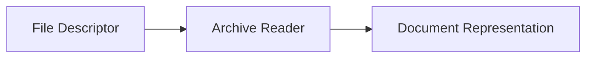

# Archive Reader

> This document defines the Archive Reader component, which is responsible for inspecting supported archive formats and extracting structural information without modifying or extracting their contents.

---

## Purpose

The Archive Reader extracts structural information and metadata from supported archive formats.

Its primary responsibility is to inspect archive contents, identify the files and folders contained within the archive, and produce a normalized representation for downstream processing.

The Archive Reader does not modify archives or automatically extract their contents.

---

# Responsibilities

The Archive Reader is responsible for:

* Reading supported archive formats.
* Inspecting archive contents.
* Extracting archive metadata.
* Enumerating contained files and directories.
* Determining archive properties.
* Forwarding extracted information for further processing.

---

# Scope

### In Scope

* Archive metadata
* Archive structure
* File listings
* Directory listings
* Compression information
* Archive properties

### Out of Scope

The Archive Reader is **not** responsible for:

* Extracting archive contents
* Modifying archives
* Decompressing files to disk
* AI analysis
* Search indexing
* Virus scanning

These responsibilities belong to other architectural components or future extensions.

---

# Architectural Overview

The Archive Reader inspects archive files and produces a structured representation of their contents.

---

# Processing Workflow

A typical archive processing operation consists of the following stages:

1. Receive a file descriptor.
2. Verify that the file is a supported archive format.
3. Open the archive.
4. Read archive metadata.
5. Enumerate contained files and directories.
6. Collect archive properties.
7. Produce a normalized document representation.
8. Forward the document for further processing.

---

# Supported Formats

The architecture should support common archive formats, including:

* ZIP
* 7Z
* TAR
* TAR.GZ
* TAR.BZ2
* RAR (where supported)
* GZIP
* BZIP2

Additional archive formats may be supported as the application evolves.

---

# Extracted Information

The Archive Reader may extract information including:

| Information        | Description                                         |
| ------------------ | --------------------------------------------------- |
| Archive Format     | Archive container type.                             |
| Compression Method | Compression algorithm used.                         |
| Compressed Size    | Size of the archive file.                           |
| Uncompressed Size  | Total size of contained files where available.      |
| File Count         | Number of files contained within the archive.       |
| Directory Count    | Number of directories contained within the archive. |
| Archive Comment    | Archive comment where supported.                    |
| Creation Date      | Archive creation timestamp where available.         |
| File Listing       | List of contained files and folders.                |

The exact information extracted depends on the archive format.

---

# Design Principles

The Archive Reader should remain:

* Read-only.
* Deterministic.
* Format-specific.
* Independent of AI.
* Independent of extraction.
* Independent of business logic.

Its responsibility is limited to inspecting archive contents and extracting metadata.

---

# Error Handling

The Archive Reader should handle common archive-related failures gracefully.

Examples include:

* Corrupted archives.
* Unsupported archive formats.
* Password-protected archives.
* Invalid archive structures.
* Incomplete archives.

Whenever practical, partial archive information should still be extracted.

---

# Future Considerations

The architecture should support future enhancements, including:

* Nested archive inspection.
* Additional archive formats.
* Archive integrity verification.
* Selective archive extraction.
* Plugin-defined archive readers.

These enhancements should preserve the component's primary responsibility while expanding supported capabilities.

---

# Related Documents

* [Readers Overview](00_Overview.md)
* [OCR](09_OCR.md)
* [Document Classification](../04_AI/04_Document_Classification.md)
* [Scanner Overview](../02_Scanner/00_Overview.md)
