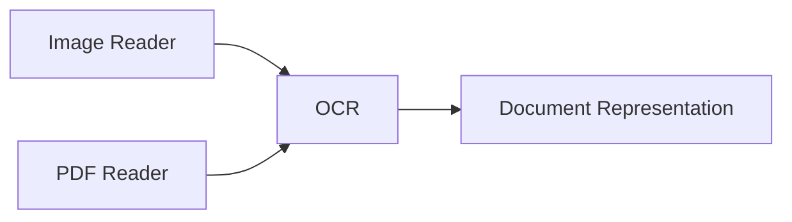

# OCR

> This document defines the Optical Character Recognition (OCR) component, which is responsible for extracting textual information from image-based documents and media.

---

## Purpose

The OCR component extracts machine-readable text from image-based content that does not already contain accessible textual information.

It complements the Readers subsystem by enabling scanned documents, images, and similar media to participate in the same document processing pipeline as text-based documents.

The OCR component performs text extraction only. It does not interpret or classify the extracted text.

---

# Responsibilities

The OCR component is responsible for:

* Detecting image-based text.
* Extracting textual content from images.
* Producing normalized text output.
* Associating extracted text with the originating document.
* Forwarding extracted text for downstream processing.

---

# Scope

### In Scope

* Scanned PDF documents
* Images containing text
* Screenshots
* Photographs of documents
* Image-based text extraction
* Multi-page OCR processing

### Out of Scope

The OCR component is **not** responsible for:

* Document classification
* Language understanding
* Text summarization
* Translation
* Image recognition
* Object detection
* Search indexing

These responsibilities belong to downstream subsystems.

---

# Architectural Overview

The OCR component enhances document representations by extracting textual information from image-based content.

---

# Processing Workflow

A typical OCR operation consists of the following stages:

1. Receive a document representation.
2. Determine whether OCR is required.
3. Detect text regions within the image.
4. Extract machine-readable text.
5. Normalize extracted text.
6. Attach the extracted text to the document representation.
7. Forward the enriched document for further processing.

OCR should only be performed when meaningful textual information cannot already be extracted by the originating Reader.

---

# Supported Sources

The OCR component may operate on content originating from:

* PDF documents
* Images
* Screenshots
* Scanned pages
* Photographs
* Other image-based document formats

Support for additional sources may be introduced in the future.

---

# Extracted Information

The OCR component may produce information including:

| Information            | Description                                                  |
| ---------------------- | ------------------------------------------------------------ |
| Extracted Text         | Machine-readable text identified within the image.           |
| Page Association       | Page or image from which the text originated.                |
| Text Regions           | Approximate locations of detected text where available.      |
| Recognition Confidence | Confidence score reported by the OCR engine where available. |
| Detected Language      | Language identified during recognition where supported.      |

The availability of information depends on the OCR engine and the source material.

---

# Design Principles

The OCR component should remain:

* Read-only.
* Deterministic where practical.
* Independent of AI interpretation.
* Independent of document classification.
* Focused solely on text extraction.

OCR exists to enhance document accessibility rather than analyze document meaning.

---

# Error Handling

The OCR component should handle common recognition failures gracefully.

Examples include:

* Low-quality source images.
* Blurred or distorted text.
* Unsupported image formats.
* Low recognition confidence.
* OCR engine failures.

Failure to extract text should not prevent the document from continuing through the processing pipeline.

---

# Future Considerations

The architecture should support future enhancements, including:

* Handwriting recognition.
* Multi-language OCR.
* Table recognition.
* Mathematical expression recognition.
* Layout-aware OCR.
* Plugin-defined OCR providers.

These enhancements should improve extraction capabilities while preserving the component's primary responsibility.

---

# Related Documents

* [Readers Overview](00_Overview.md)
* [Image Reader](05_Images.md)
* [PDF Reader](01_PDF.md)
* [Document Classification](../04_AI/04_Document_Classification.md)
* [Summarization](../04_AI/05_Summarization.md)
