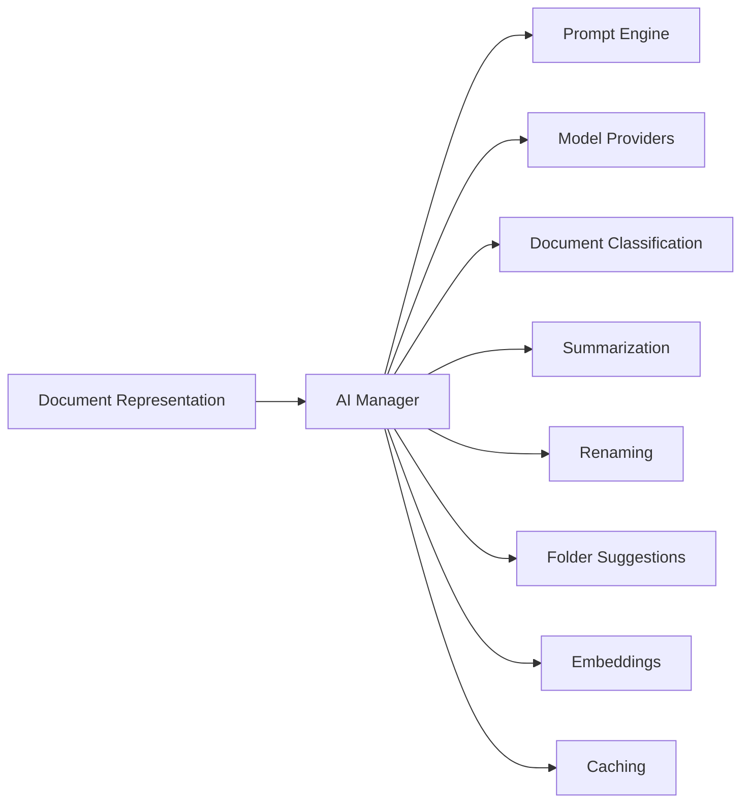

# AI Manager

> This document defines the AI Manager component, which is responsible for coordinating all AI operations within OpenSorSe.

---

## Purpose

The AI Manager serves as the central coordinator for all Artificial Intelligence functionality within OpenSorSe.

Rather than performing AI operations directly, it determines which AI capabilities are required, coordinates the execution of those operations, and manages the flow of information between AI components.

The AI Manager provides a single entry point for the application's AI subsystem.

---

# Responsibilities

The AI Manager is responsible for:

* Coordinating AI operations.
* Determining required AI tasks.
* Managing AI workflows.
* Selecting appropriate AI providers.
* Coordinating prompt generation.
* Managing AI execution order.
* Returning normalized AI results.

The AI Manager delegates individual AI tasks to specialized components.

---

# Scope

### In Scope

* AI workflow orchestration
* AI request coordination
* AI task sequencing
* Provider selection
* AI result coordination

### Out of Scope

The AI Manager is **not** responsible for:

* Building prompts
* Executing model inference
* Document classification
* Summarization
* Embedding generation
* Response caching

These responsibilities belong to dedicated AI components.

---

# Architectural Overview

The AI Manager coordinates all AI components while presenting a unified interface to the rest of the application.

---

# AI Workflow

A typical AI operation follows these stages:

1. Receive a document representation.
2. Determine the requested AI capabilities.
3. Generate the required prompts.
4. Select the configured AI provider.
5. Execute the AI request.
6. Validate the returned results.
7. Combine the generated information.
8. Return an enriched document representation.

The AI Manager coordinates this workflow while delegating implementation to specialized components.

---

# Coordination Principles

The AI Manager should:

* Coordinate rather than implement.
* Delegate specialized tasks.
* Minimize duplicated AI requests.
* Remain independent of specific AI providers.
* Provide consistent behavior regardless of the underlying model.

This separation allows individual AI components to evolve independently.

---

# Design Principles

The AI Manager should remain:

* Lightweight.
* Modular.
* Provider-independent.
* Extensible.
* Predictable.
* Easy to maintain.

Business logic should remain within specialized AI components rather than accumulating inside the AI Manager.

---

# Error Handling

The AI Manager should coordinate failures without compromising unrelated AI operations.

Examples include:

* AI provider unavailable.
* Invalid AI responses.
* Prompt generation failures.
* Timeout conditions.
* Unsupported model capabilities.

Whenever practical, failures should be isolated to the affected AI task while allowing other AI operations to continue.

---

# Future Considerations

The architecture should support future enhancements, including:

* Multi-model orchestration.
* Parallel AI execution.
* AI task prioritization.
* Automatic provider fallback.
* Cost-aware provider selection.
* Plugin-defined AI capabilities.

These enhancements should build upon the existing orchestration model without changing the AI Manager's primary responsibility.

---

# Related Documents

* [AI Overview](00_Overview.md)
* [Model Providers](02_Model_Providers.md)
* [Prompt Engine](03_Prompt_Engine.md)
* [Document Classification](04_Document_Classification.md)
* [Summarization](05_Summarization.md)
* [Embeddings](08_Embeddings.md)
* [Caching](10_Caching.md)
