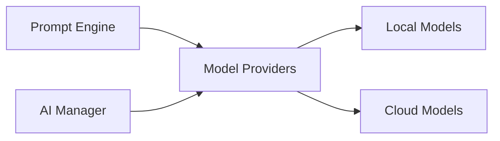

# Model Providers

> This document defines the Model Providers component, which is responsible for providing a unified interface to local and cloud-based AI models.

---

## Purpose

The Model Providers component abstracts communication with Artificial Intelligence models.

It provides a consistent interface for the AI subsystem, allowing OpenSorSe to support multiple local and cloud-based providers without affecting higher-level application components.

The rest of the application should remain independent of provider-specific APIs and implementation details.

## v0.3 implementation status

v0.3 implements one optional provider: Ollama. `IAiSuggestionProvider` is the narrow application contract; `OllamaSuggestionProvider` lives in the infrastructure-oriented `OpenSorSe.AI` project and owns `/api/tags` and `/api/generate` DTOs. It supports a configurable endpoint, localhost default, health/model discovery, model selection, timeout, cancellation, structured JSON requests, redacted logging, and safe unavailable states.

No cloud provider, automatic fallback, streaming, embeddings, or broad capability negotiation is shipped. The application owns all parsing and validation, so no Ollama contract leaks into result/domain values or ViewModels.

---

# Responsibilities

The Model Providers component is responsible for:

* Managing AI provider connections.
* Selecting configured providers.
* Executing inference requests.
* Managing provider capabilities.
* Normalizing provider responses.
* Handling provider-specific communication.

---

# Scope

### In Scope

* Local AI providers
* Cloud AI providers
* Embedding providers
* Provider configuration
* Request execution
* Response normalization
* Provider capability discovery

### Out of Scope

The Model Providers component is **not** responsible for:

* Prompt construction
* AI workflow orchestration
* Document classification
* Summarization
* Caching
* Business logic

These responsibilities belong to other AI components.

---

# Architectural Overview

The Model Providers component provides a unified interface between the AI subsystem and external AI models.

The rest of the application communicates only with the Model Providers component.

---

# Provider Workflow

A typical inference request follows these stages:

1. Receive a normalized AI request.
2. Select the appropriate provider.
3. Validate provider availability.
4. Execute the request.
5. Receive the provider response.
6. Normalize the returned data.
7. Return a provider-independent result.

---

# Supported Provider Types

The architecture should support multiple categories of AI providers.

| Provider Type    | Examples                            |
| ---------------- | ----------------------------------- |
| Local LLMs       | Ollama, llama.cpp, LM Studio        |
| Cloud LLMs       | OpenAI, Anthropic, Google Gemini    |
| Embedding Models | Local and cloud embedding providers |
| Vision Models    | Local and cloud multimodal models   |
| Future Providers | Plugin-defined implementations      |

Specific providers may change over time without affecting the architecture.

---

# Provider Capabilities

Different providers may offer different capabilities.

Examples include:

* Text generation
* Embedding generation
* Image understanding
* Function calling
* Structured output
* Streaming responses

The Model Providers component should expose capabilities in a provider-independent manner.

---

# Response Normalization

Provider responses should be converted into a common internal format before being returned to the AI subsystem.

Normalization helps ensure:

* Consistent data structures.
* Provider-independent workflows.
* Simplified downstream processing.
* Easier integration of future providers.

---

# Design Principles

The Model Providers component should remain:

* Provider-independent.
* Extensible.
* Reliable.
* Modular.
* Configurable.
* Easy to maintain.

The application should never depend directly on provider-specific APIs.

---

# Error Handling

The Model Providers component should handle provider-specific failures gracefully.

Examples include:

* Connection failures.
* Authentication failures.
* Timeouts.
* Unsupported capabilities.
* Rate limiting.
* Invalid responses.

Whenever practical, failures should be isolated to the affected provider and reported through the AI subsystem.

---

# Future Considerations

The architecture should support future enhancements, including:

* Automatic provider fallback.
* Load balancing across providers.
* Provider health monitoring.
* Cost-aware provider selection.
* Model capability negotiation.
* Plugin-defined providers.

These enhancements should preserve the abstraction between the AI subsystem and external providers.

---

# Related Documents

* [AI Overview](00_Overview.md)
* [AI Manager](01_AI_Manager.md)
* [Prompt Engine](03_Prompt_Engine.md)
* [Caching](10_Caching.md)
