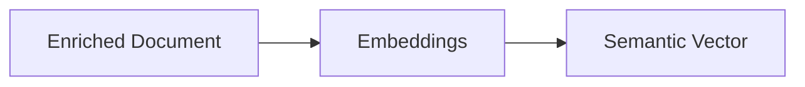

# Embeddings

> This document defines the Embeddings component, which is responsible for generating semantic vector representations of documents for similarity comparison and intelligent retrieval.

---

## Purpose

The Embeddings component generates semantic vector representations of documents.

These vector representations capture the semantic meaning of document content, enabling similarity comparisons, semantic search, document recommendations, and other AI-powered capabilities.

The Embeddings component produces vector representations only. It does not perform searching or ranking.

---

# Responsibilities

The Embeddings component is responsible for:

* Generating document embeddings.
* Managing embedding generation requests.
* Producing semantic vector representations.
* Supporting similarity analysis.
* Enriching document representations with embedding information.

---

# Scope

### In Scope

* Embedding generation
* Semantic vectors
* Vector normalization
* Embedding metadata
* Similarity preparation

### Out of Scope

The Embeddings component is **not** responsible for:

* Semantic search
* Ranking search results
* Document classification
* Summarization
* Vector database management
* Database persistence

These responsibilities belong to downstream architectural components.

---

# Architectural Overview

The Embeddings component enriches document representations with semantic vector information.

---

# Embedding Workflow

A typical embedding generation process consists of the following stages:

1. Receive an enriched document.
2. Determine the content to embed.
3. Select the configured embedding model.
4. Generate the semantic vector.
5. Validate the generated embedding.
6. Attach the embedding to the document representation.
7. Return the enriched document.

---

# Embedding Characteristics

Generated embeddings should be:

* Deterministic for identical input.
* Semantically meaningful.
* Independent of document location.
* Provider-independent.
* Suitable for similarity comparison.

Embeddings should represent the meaning of the document rather than its exact wording.

---

# Embedding Sources

Embeddings may be generated from information including:

* Extracted document text.
* OCR text.
* AI-generated summaries.
* Metadata where appropriate.
* User-defined content selection.

The embedding strategy may evolve as the application develops.

---

# Design Principles

The Embeddings component should remain:

* Provider-independent.
* Deterministic where practical.
* Extensible.
* Independent of search.
* Independent of database implementation.

Its responsibility is limited to generating semantic representations.

---

# Error Handling

Embedding generation failures should be isolated to the affected document.

Examples include:

* Model unavailable.
* Inference failures.
* Empty document content.
* Unsupported input.
* Invalid vector generation.

Failure to generate embeddings should not prevent the document from being stored or processed by other subsystems.

---

# Future Considerations

The architecture should support future enhancements, including:

* Multiple embedding models.
* Multi-modal embeddings.
* Incremental embedding updates.
* Domain-specific embedding models.
* Embedding versioning.
* Plugin-defined embedding providers.

These enhancements should preserve the component's primary responsibility of generating semantic vector representations.

---

# Related Documents

* [AI Overview](00_Overview.md)
* [Model Providers](02_Model_Providers.md)
* [Vector Search](09_Vector_Search.md)
* [Semantic Search](../06_Search/02_Semantic_Search.md)
* [Database Overview](../05_Database/00_Overview.md)
