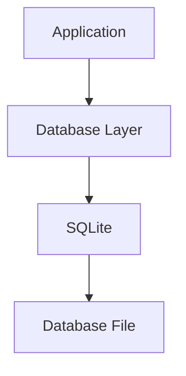

# SQLite

> This document defines the default database engine used by OpenSorSe and its role within the overall database architecture.

---

## Purpose

OpenSorSe uses SQLite as its default embedded database engine for persistent storage.

SQLite provides a lightweight, serverless, and cross-platform relational database that is well suited to desktop applications while requiring no external database server.

Although SQLite is the default implementation, the overall database architecture should remain sufficiently abstract to support alternative database engines in the future if required.

---

# Responsibilities

The SQLite component is responsible for:

* Persisting application data.
* Executing database queries.
* Maintaining transactional consistency.
* Providing reliable local storage.
* Supporting schema migrations.
* Ensuring database integrity.

---

# Scope

### In Scope

* Embedded database storage
* SQL execution
* Transactions
* Indexes
* Constraints
* Database files

### Out of Scope

The SQLite component is **not** responsible for:

* Business logic
* AI processing
* Search algorithms
* Rule execution
* User interface rendering

These responsibilities belong to higher-level application components.

---

# Architectural Overview

SQLite serves as the persistent storage engine beneath the Database subsystem.

Application components communicate with the Database layer rather than interacting directly with SQLite.

---

# Database Characteristics

The selected database engine should provide:

* ACID transactions.
* Reliable local storage.
* Cross-platform compatibility.
* Efficient indexing.
* SQL support.
* Minimal deployment complexity.

These characteristics make SQLite an appropriate default choice for OpenSorSe.

---

# Data Integrity

The database engine should support mechanisms including:

* Transactions
* Primary keys
* Foreign keys
* Constraints
* Atomic updates

These capabilities help ensure consistent and reliable data storage.

---

# Performance Considerations

The database should support efficient handling of:

* Large document collections.
* Metadata retrieval.
* AI enrichment storage.
* Search indexes.
* Concurrent read operations.
* Background processing tasks.

Database performance should scale appropriately with increasing document collections.

---

# Design Principles

The SQLite component should remain:

* Embedded.
* Reliable.
* Lightweight.
* Platform-independent.
* Easy to deploy.

The application should remain independent of SQLite-specific features whenever practical.

---

# Future Considerations

The architecture should support future enhancements, including:

* Alternative relational database engines.
* Database encryption.
* Read-only database mode.
* Cloud synchronization.
* Multi-device replication.
* Plugin-defined storage providers.

These enhancements should preserve the abstraction between the application and the underlying database engine.

---

# Related Documents

* [Database Overview](00_Overview.md)
* [Schema](02_Schema.md)
* [Migrations](03_Migrations.md)
* [Backups](08_Backups.md)
