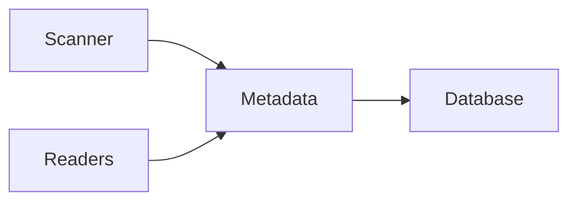

# Metadata

> This document defines the Metadata component, which is responsible for persistently storing structured information that describes documents managed by OpenSorSe.

---

## Purpose

The Metadata component stores structured information describing documents without storing the document's primary content.

Its primary purpose is to provide a reliable, searchable, and consistent representation of document properties collected throughout the processing pipeline.

Metadata serves as the foundation for document identification, filtering, organization, and retrieval.

---

# Responsibilities

The Metadata component is responsible for:

* Storing filesystem metadata.
* Storing extracted document metadata.
* Maintaining document identity.
* Supporting document retrieval.
* Maintaining metadata consistency.
* Providing metadata to other subsystems.

---

# Scope

### In Scope

* Filesystem metadata
* File properties
* Extracted document properties
* Technical metadata
* Document identifiers
* Persistent metadata storage

### Out of Scope

The Metadata component is **not** responsible for:

* Document content
* AI-generated summaries
* AI classifications
* Embeddings
* Processing history
* User settings

These responsibilities belong to other architectural components.

---

# Architectural Overview

The Metadata component receives structured information from multiple subsystems and stores it as part of the persistent document record.

Metadata represents factual information about a document rather than interpreted knowledge.

---

# Metadata Categories

The Metadata component may store information including:

| Category               | Examples                               |
| ---------------------- | -------------------------------------- |
| File Identity          | Unique identifier, filename, extension |
| Filesystem Information | Path, size, timestamps, permissions    |
| File Integrity         | Hash values, duplicate status          |
| Document Properties    | Title, author, page count              |
| Media Properties       | Resolution, duration, codecs           |
| Technical Information  | MIME type, encoding, compression       |
| Reader Information     | Reader used, extraction status         |

The available metadata depends on the document type and processing pipeline.

---

# Metadata Lifecycle

A typical metadata lifecycle consists of the following stages:

1. Create an initial document record.
2. Store filesystem metadata.
3. Enrich with extracted document metadata.
4. Validate metadata consistency.
5. Persist metadata updates.
6. Make metadata available to downstream subsystems.

Metadata may evolve as additional information becomes available during processing.

---

# Metadata Principles

Metadata should be:

* Structured.
* Accurate.
* Consistent.
* Persistent.
* Independent of AI interpretation.

Metadata should describe a document rather than explain its meaning.

---

# Design Principles

The Metadata component should remain:

* Reliable.
* Extensible.
* Normalized where practical.
* Independent of AI.
* Easy to query.

Metadata storage should remain separate from AI-generated enrichments.

---

# Error Handling

Metadata failures should be isolated whenever practical.

Examples include:

* Missing metadata.
* Invalid metadata values.
* Inconsistent document properties.
* Extraction failures.
* Metadata validation errors.

Whenever practical, partial metadata should still be stored rather than discarding the entire document record.

---

# Future Considerations

The architecture should support future enhancements, including:

* User-defined metadata fields.
* Plugin-defined metadata.
* Extended media metadata.
* Metadata versioning.
* Metadata synchronization across devices.
* Custom metadata providers.

These enhancements should preserve the Metadata component's primary responsibility of storing structured document information.

---

# Related Documents

* [Database Overview](00_Overview.md)
* [Schema](02_Schema.md)
* [History](05_History.md)
* [Document Classification](../04_AI/04_Document_Classification.md)
* [Readers Overview](../03_Readers/00_Overview.md)
