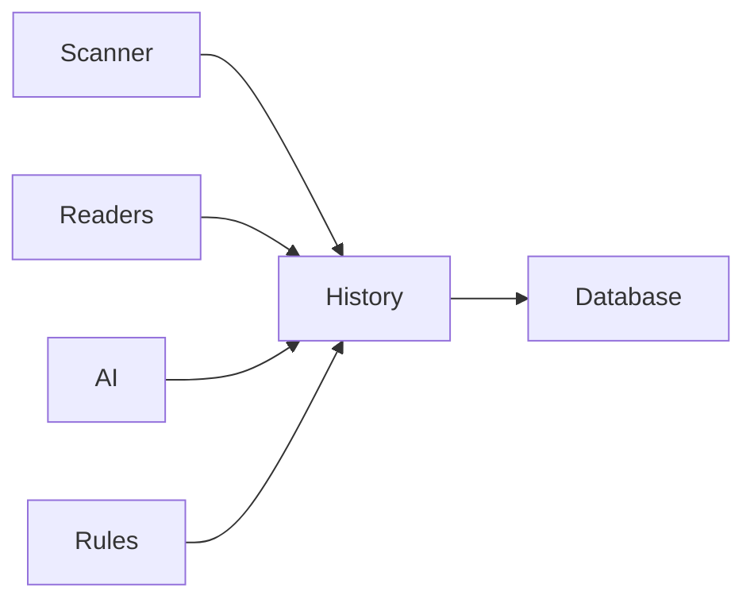

# History

> This document defines the History component, which is responsible for recording the lifecycle and processing history of documents managed by OpenSorSe.

## Implementation status

This component remains future architecture. v0.9's bounded catalog entries are user-enabled historical snapshots, and its comparison result is process-local stored-metadata analysis. Neither is an append-only event history, audit log, database timeline, live monitor, or rollback system.

---

## Purpose

The History component maintains a persistent record of significant events that occur throughout a document's lifecycle.

Its primary purpose is to provide traceability, auditing, diagnostics, and historical context for documents processed by the application.

History records describe **what happened**, **when it happened**, and **which component performed the operation**.

---

# Responsibilities

The History component is responsible for:

* Recording document lifecycle events.
* Maintaining processing history.
* Supporting auditing and diagnostics.
* Tracking significant document changes.
* Providing historical information to other subsystems.

---

# Scope

### In Scope

* Scan history
* Processing events
* AI processing history
* Rule execution history
* File operation history
* Audit information

### Out of Scope

The History component is **not** responsible for:

* Application logging
* Error reporting
* AI results
* Metadata storage
* User settings
* Database backups

These responsibilities belong to other architectural components.

---

# Architectural Overview

The History component records events generated throughout the document processing pipeline.

History provides a chronological record of significant processing events without affecting application behavior.

---

# Event Lifecycle

A typical history record may be created during the following stages:

1. Document discovered.
2. Metadata extracted.
3. Content extracted.
4. AI enrichment completed.
5. Rule executed.
6. User action performed.
7. Document updated or removed.

Additional events may be introduced as the application evolves.

---

# Recorded Information

History records may include information such as:

| Information         | Description                             |
| ------------------- | --------------------------------------- |
| Timestamp           | When the event occurred.                |
| Event Type          | Type of operation performed.            |
| Component           | Component responsible for the event.    |
| Document Identifier | Document associated with the event.     |
| Operation Result    | Success, warning, or failure.           |
| Additional Context  | Optional details relevant to the event. |

The exact information recorded depends on the event type.

---

# Event Categories

Examples of recorded events include:

* Document discovered
* Scan completed
* Metadata updated
* OCR completed
* AI classification generated
* Summary generated
* Rename suggestion created
* File renamed
* File moved
* Rule executed
* User approval recorded

History should record significant events rather than every internal operation.

---

# Design Principles

The History component should remain:

* Append-only where practical.
* Chronological.
* Reliable.
* Independent of business logic.
* Easy to query.

History should provide an accurate representation of the document lifecycle.

---

# Error Handling

Failures to record history should not prevent normal application operation.

Examples include:

* Database write failures.
* Invalid history records.
* Missing event context.
* Storage limitations.

Whenever practical, the application should continue operating even if individual history events cannot be recorded.

---

# Future Considerations

The architecture should support future enhancements, including:

* User activity history.
* Undo and rollback support.
* Event filtering.
* Event retention policies.
* Timeline visualization.
* Plugin-defined history events.

These enhancements should preserve the component's primary responsibility of recording document lifecycle events.

---

# Related Documents

* [Database Overview](00_Overview.md)
* [Metadata](04_Metadata.md)
* [Settings](06_Settings.md)
* [Logging](../01_Core/03_Logging.md)
* [Rules Overview](../07-Rules/00_Overview.md)
