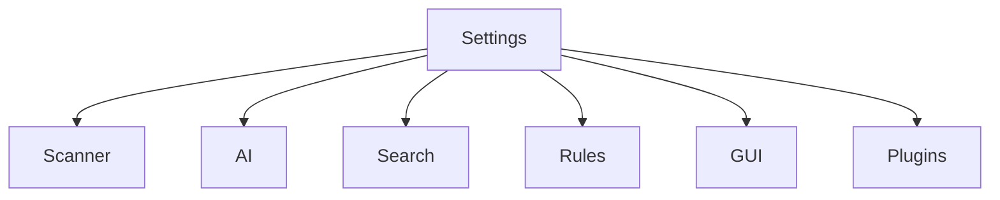

# Settings

> This document defines the Settings component, which is responsible for persistently storing and managing application configuration and user preferences within OpenSorSe.

---

## Purpose

The Settings component provides centralized storage for application configuration and user preferences.

Its primary purpose is to ensure that application behavior can be configured consistently across all subsystems while preserving user preferences between application sessions.

Settings influence application behavior but do not contain document-specific information.

---

# Responsibilities

The Settings component is responsible for:

* Persisting application settings.
* Managing user preferences.
* Providing configuration values.
* Supporting default settings.
* Validating configuration values.
* Maintaining configuration consistency.

---

# Scope

### In Scope

* Application configuration
* User preferences
* Default values
* Feature configuration
* AI configuration
* GUI preferences
* Plugin configuration

### Out of Scope

The Settings component is **not** responsible for:

* Document metadata
* AI-generated results
* Processing history
* Cache storage
* Business logic
* User authentication

These responsibilities belong to other architectural components.

---

# Architectural Overview

The Settings component provides centralized configuration for the application's subsystems.

Application components retrieve configuration through the Settings component rather than maintaining independent configuration stores.

---

# Configuration Categories

The Settings component may store configuration including:

| Category | Examples                                                |
| -------- | ------------------------------------------------------- |
| General  | Language, startup behavior, update preferences          |
| Scanner  | Scan locations, exclusions, recursion settings          |
| AI       | Preferred providers, model selection, inference options |
| Search   | Search preferences, ranking options, indexing behavior  |
| GUI      | Themes, layouts, notifications, accessibility           |
| Rules    | Automation preferences and rule configuration           |
| Plugins  | Plugin settings and provider configuration              |

Additional configuration categories may be introduced as the application evolves.

---

# Settings Lifecycle

A typical configuration lifecycle consists of the following stages:

1. Load default configuration.
2. Load persisted user settings.
3. Validate configuration values.
4. Apply configuration to application components.
5. Persist changes when settings are modified.

Configuration changes should become effective in a predictable and consistent manner.

---

# Configuration Principles

Application settings should be:

* Persistent.
* Consistent.
* Validated.
* Backward compatible where practical.
* Easy to modify.

Subsystems should avoid maintaining duplicate configuration values.

---

# Design Principles

The Settings component should remain:

* Centralized.
* Reliable.
* Extensible.
* Independent of business logic.
* Easy to maintain.

Configuration management should remain separate from application behavior.

---

# Error Handling

Configuration failures should be handled gracefully.

Examples include:

* Missing settings.
* Invalid configuration values.
* Corrupted settings.
* Unsupported configuration versions.
* Validation failures.

Whenever practical, the application should fall back to sensible default values and continue operating.

---

# Future Considerations

The architecture should support future enhancements, including:

* Multiple user profiles.
* Import and export of settings.
* Workspace-specific configuration.
* Cloud synchronization.
* Configuration templates.
* Plugin-defined settings.

These enhancements should preserve the Settings component's primary responsibility of managing application configuration.

---

# Related Documents

* [Database Overview](00_Overview.md)
* [History](05_History.md)
* [Scanner Overview](../02_Scanner/00_Overview.md)
* [AI Overview](../04_AI/00_Overview.md)
* [GUI Settings Page](../08_GUI/06_Settings_Page.md)
