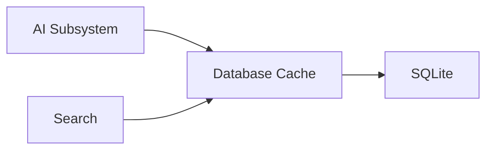

# Cache

> This document defines the Database Cache component, which is responsible for persistently storing reusable cached data generated by various application subsystems.

---

## Purpose

The Database Cache component provides persistent storage for reusable cached information generated during application operation.

Its primary purpose is to reduce unnecessary computation by allowing previously generated results to be reused when they remain valid.

The Database Cache stores cached data but does not determine caching policies or cache validity rules.

---

# Responsibilities

The Database Cache component is responsible for:

* Persisting cached data.
* Retrieving cached entries.
* Maintaining cache records.
* Supporting cache invalidation.
* Providing cache storage for application components.

---

# Scope

### In Scope

* Persistent cache storage
* AI result cache
* Embedding cache
* Cache metadata
* Cache retrieval
* Cache invalidation support

### Out of Scope

The Database Cache component is **not** responsible for:

* AI inference
* Cache policy decisions
* Cache generation
* Business logic
* Search indexing
* Application settings

These responsibilities belong to higher-level architectural components.

---

# Architectural Overview

The Database Cache provides persistent storage for reusable application data.

The Database Cache acts as a storage layer for cached information generated elsewhere in the application.

---

# Cache Lifecycle

A typical cache lifecycle consists of the following stages:

1. Receive cacheable data.
2. Persist the cache entry.
3. Retrieve the cache entry when requested.
4. Validate cache freshness.
5. Invalidate outdated entries.
6. Replace or remove stale cache records.

The specific validation strategy is defined by the subsystem responsible for generating the cached data.

---

# Cached Information

The Database Cache may store information including:

| Cache Type          | Description                                              |
| ------------------- | -------------------------------------------------------- |
| AI Responses        | Cached AI-generated outputs.                             |
| Embeddings          | Cached semantic vectors.                                 |
| Prompt Results      | Previously generated prompt outputs.                     |
| Search Results      | Reusable search-related cache entries where appropriate. |
| Processing Metadata | Cache validation information.                            |

Additional cache types may be introduced as the application evolves.

---

# Cache Integrity

Cache entries should include sufficient information to support validation.

Examples include:

* Document identifier.
* Document hash.
* Prompt version.
* Model identifier.
* Cache creation timestamp.
* Expiration information where applicable.

These values help determine whether cached information remains valid.

---

# Design Principles

The Database Cache should remain:

* Persistent.
* Reliable.
* Independent of cache policy.
* Efficient.
* Easy to invalidate.

The Database Cache stores cached information without determining whether it should be reused.

---

# Error Handling

Cache storage failures should not interrupt normal application operation.

Examples include:

* Failed cache writes.
* Missing cache entries.
* Corrupted cache records.
* Validation failures.
* Storage limitations.

When cache operations fail, the application should regenerate the required information whenever practical.

---

# Future Considerations

The architecture should support future enhancements, including:

* Cache compression.
* Selective cache cleanup.
* Automatic cache expiration.
* Cache usage statistics.
* Plugin-defined cache storage.
* Alternative cache providers.

These enhancements should preserve the component's primary responsibility of storing reusable cached information.

---

# Related Documents

* [Database Overview](00_Overview.md)
* [AI Caching](../04_AI/10_Caching.md)
* [SQLite](01_SQLite.md)
* [Schema](02_Schema.md)
