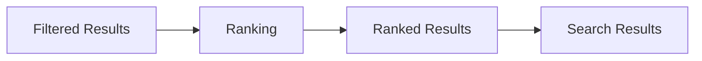

# Ranking

> This document defines the Ranking component, which is responsible for ordering search results according to their relevance before presentation to the user.

---

## Purpose

The Ranking component evaluates candidate search results and determines the order in which they should be presented.

Its primary purpose is to prioritize the most relevant documents by considering information from multiple retrieval strategies and document characteristics.

Ranking improves search quality without changing the underlying search results.

---

# Responsibilities

The Ranking component is responsible for:

* Calculating relevance scores.
* Ordering search results.
* Combining multiple relevance signals.
* Producing consistent result ordering.
* Returning ranked search results.

---

# Scope

### In Scope

* Relevance scoring
* Result ordering
* Score normalization
* Multi-factor ranking
* Ranking strategies

### Out of Scope

The Ranking component is **not** responsible for:

* Keyword search
* Semantic search
* Result filtering
* AI inference
* Search indexing
* User interface rendering

These responsibilities belong to other architectural components.

---

# Architectural Overview

The Ranking component receives filtered search results and orders them according to calculated relevance.

Ranking determines presentation order without modifying the underlying document information.

---

# Ranking Workflow

A typical ranking operation consists of the following stages:

1. Receive filtered search results.
2. Collect available relevance signals.
3. Calculate relevance scores.
4. Normalize scores where appropriate.
5. Order the result set.
6. Return ranked results.

Ranking should remain deterministic for identical inputs whenever practical.

---

# Ranking Signals

Ranking may consider multiple relevance signals, including:

| Signal              | Description                                       |
| ------------------- | ------------------------------------------------- |
| Keyword Match       | Strength of textual matches.                      |
| Semantic Similarity | Similarity between query and document embeddings. |
| Metadata Match      | Relevance of matching metadata.                   |
| Tag Match           | Matching user or AI-generated tags.               |
| Document Freshness  | Creation or modification dates.                   |
| User Preferences    | Configurable ranking behavior where supported.    |

The exact weighting of these signals may evolve as the application develops.

---

# Ranking Principles

Ranking should strive to be:

* Relevant.
* Consistent.
* Explainable where practical.
* Predictable.
* Configurable.

Ranking should improve search quality without introducing unexpected behavior.

---

# Design Principles

The Ranking component should remain:

* Independent of retrieval strategy.
* Independent of indexing.
* Extensible.
* Efficient.
* Easy to tune.

Its responsibility is limited to determining the most useful ordering of candidate search results.

---

# Error Handling

Ranking failures should be handled gracefully.

Examples include:

* Missing relevance information.
* Invalid ranking scores.
* Unsupported ranking strategies.
* Incomplete search data.

Whenever practical, fallback ranking strategies should be applied rather than preventing search results from being displayed.

---

# Future Considerations

The architecture should support future enhancements, including:

* Personalized ranking.
* Learning-to-rank models.
* Context-aware ranking.
* User-adjustable ranking preferences.
* Plugin-defined ranking strategies.

These enhancements should preserve the component's primary responsibility of ordering search results.

---

# Related Documents

* [Search Overview](00_Overview.md)
* [Keyword Search](01_Keyword_Search.md)
* [Semantic Search](02_Semantic_Search.md)
* [Filtering](03_Filtering.md)
* [Tagging](05_Tagging.md)
* [Indexing](06_Indexing.md)
