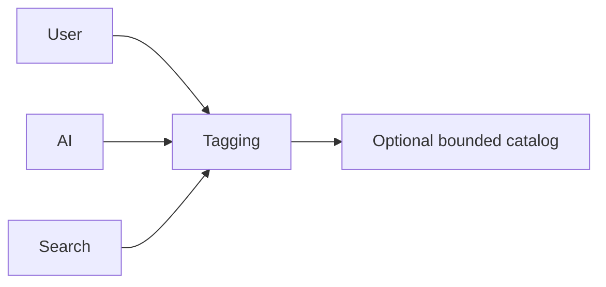

# Tagging

> This document defines the Tagging component, which is responsible for managing document tags used for organization, filtering, and search.

## Implementation status

v0.9 implements a narrow application-owned subset. Deterministic extension tags, accepted AI tags, and up to twelve accepted user-managed tags per result participate in in-memory and catalog metadata search. A selected result can add or remove non-deterministic tags; deterministic extension tags are protected. Tags remain associations with opaque snapshot file IDs and are persisted only when the active snapshot is catalog-backed. Historical comparison maps accepted non-deterministic normalized tag sets through each snapshot's file IDs and reports differences without writing them. There is no global taxonomy, database, bulk propagation, plugin tagging, embedded file-metadata write, or sidecar file.

---

## Purpose

The Tagging component provides a consistent mechanism for associating descriptive labels with documents.

Tags improve document organization, simplify retrieval, and support flexible categorization across the application.

Tags may originate from users, Artificial Intelligence, or future application components, but are managed through a unified tagging system.

---

# Responsibilities

The Tagging component is responsible for:

* Managing document tags.
* Associating tags with documents.
* Supporting tag-based retrieval.
* Maintaining tag consistency.
* Providing tag information to other subsystems.

---

# Scope

### In Scope

* User-defined tags
* AI-generated tags
* Tag relationships
* Tag storage
* Tag retrieval
* Tag filtering

### Out of Scope

The Tagging component is **not** responsible for:

* AI tag generation
* Search ranking
* Rule execution
* Metadata extraction
* User interface rendering
* Database indexing

These responsibilities belong to other architectural components.

---

# Architectural Overview

The Tagging component provides a unified tagging system for documents regardless of tag origin.

The Tagging component centralizes tag management while remaining independent of how tags are created.

---

# Tag Lifecycle

A typical tag lifecycle consists of the following stages:

1. Create or receive a tag.
2. Validate the tag.
3. Associate the tag with one or more documents.
4. Store the relationship.
5. Make the tag available for filtering and search.
6. Update or remove the association when required.

---

# Tag Categories

The architecture should support multiple tag categories.

| Tag Type    | Description                               |
| ----------- | ----------------------------------------- |
| User Tags   | Implemented as explicit bounded OpenSorSe metadata. |
| AI Tags     | Implemented only after explicit acceptance of a validated suggestion. |
| System Tags | Implemented for reproducible extension labels. |
| Plugin Tags | Future design; plugins are not implemented. |

Additional tag sources may be introduced as the application evolves.

---

# Tag Characteristics

Tags should be:

* Descriptive.
* Consistent.
* Reusable.
* Searchable.
* Independent of document location.

Multiple tags may be associated with a single document.

---

# Design Principles

The Tagging component should remain:

* Provider-independent.
* Extensible.
* Consistent.
* Independent of tag generation.
* Independent of search strategy.

Its responsibility is limited to managing tag associations.

---

# Error Handling

Tagging failures should be isolated whenever practical.

Examples include:

* Invalid tag names.
* Duplicate tag associations.
* Missing documents.
* Corrupted tag records.

Whenever practical, failures should affect only the relevant tag rather than the entire document.

---

# Future Considerations

The architecture should support future enhancements, including:

* Hierarchical tags.
* Tag aliases.
* Tag groups.
* Color-coded tags.
* Suggested tags.
* Plugin-defined tagging strategies.

These enhancements should preserve the component's primary responsibility of managing document tags.

---

# Related Documents

* [Search Overview](00_Overview.md)
* [Filtering](03_Filtering.md)
* [Database Metadata](../05_Database/04_Metadata.md)
* [Document Classification](../04_AI/04_Document_Classification.md)
* [Rules Overview](../07-Rules/00_Overview.md)
