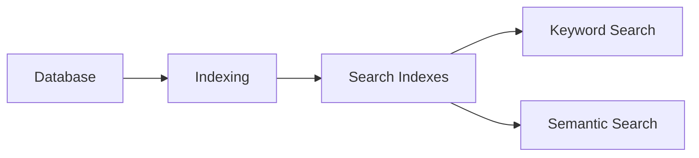

# Indexing

> This document defines the Indexing component, which is responsible for preparing and maintaining searchable data structures used by the Search subsystem.

---

## Purpose

The Indexing component prepares document information for efficient retrieval by creating and maintaining searchable indexes.

Its primary purpose is to organize document data into optimized structures that enable fast keyword, metadata, and semantic searches without modifying the original document information.

The Indexing component supports search performance but does not execute search operations.

---

# Responsibilities

The Indexing component is responsible for:

* Building search indexes.
* Updating indexes.
* Maintaining index consistency.
* Supporting incremental indexing.
* Preparing searchable data.
* Optimizing retrieval performance.

---

# Scope

### In Scope

* Full-text indexing
* Metadata indexing
* Tag indexing
* Embedding indexing
* Incremental indexing
* Index maintenance

### Out of Scope

The Indexing component is **not** responsible for:

* Keyword search
* Semantic search
* Search ranking
* AI inference
* Metadata extraction
* Database persistence

These responsibilities belong to other architectural components.

---

# Architectural Overview

The Indexing component prepares searchable structures from persistent document information.

The Search subsystem relies on indexes rather than scanning raw document data during every search.

---

# Indexing Workflow

A typical indexing operation consists of the following stages:

1. Detect document additions or updates.
2. Retrieve relevant document information.
3. Generate or update search indexes.
4. Validate index consistency.
5. Publish updated indexes for use by the Search subsystem.

Index updates should occur whenever searchable document information changes.

---

# Indexed Information

The architecture should support indexing of information including:

| Indexed Data   | Purpose                          |
| -------------- | -------------------------------- |
| File Names     | Fast filename searches.          |
| Metadata       | Structured filtering and lookup. |
| Extracted Text | Full-text search.                |
| AI Summaries   | Improved keyword retrieval.      |
| Tags           | Tag-based search and filtering.  |
| Embeddings     | Semantic retrieval.              |

Additional searchable information may be indexed as the application evolves.

---

# Index Maintenance

The Indexing component should support:

* Initial index creation.
* Incremental updates.
* Removal of obsolete entries.
* Consistency verification.
* Rebuilding indexes when necessary.

Index maintenance should remain transparent to users whenever practical.

---

# Design Principles

The Indexing component should remain:

* Efficient.
* Incremental.
* Reliable.
* Independent of search execution.
* Independent of AI providers.

Its responsibility is limited to preparing data for efficient retrieval.

---

# Error Handling

Indexing failures should not compromise the integrity of the underlying database.

Examples include:

* Corrupted indexes.
* Interrupted indexing operations.
* Missing document information.
* Index version mismatches.

Whenever practical, indexes should be rebuildable from the authoritative data stored in the Database.

---

# Future Considerations

The architecture should support future enhancements, including:

* Background indexing.
* Parallel indexing.
* Selective indexing.
* Plugin-defined index providers.
* Distributed indexes.
* Adaptive indexing strategies.

These enhancements should preserve the component's primary responsibility of preparing searchable data.

---

# Related Documents

* [Search Overview](00_Overview.md)
* [Keyword Search](01_Keyword_Search.md)
* [Semantic Search](02_Semantic_Search.md)
* [Filtering](03_Filtering.md)
* [Ranking](04_Ranking.md)
* [Database Overview](../05_Database/00_Overview.md)
