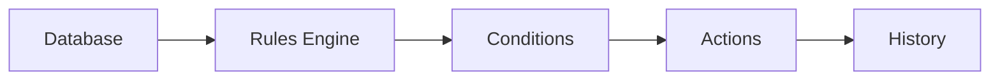

# Rules Overview

> This document provides an overview of the Rules subsystem, which is responsible for evaluating conditions and executing user-defined automation based on information available within OpenSorSe.

---

## Implementation Status

The validated v0.2 release implements deterministic rule evaluation as part of the read-only analysis pipeline. Rules evaluate supplied conditions and surface display-only plans or outcomes for review, but the Desktop application does not expose action execution and no rule may rename, move, delete, or otherwise modify user files.

The remaining material in this directory records broader automation architecture and must be read as future design where it refers to user-defined actions, execution, persistence, or database-backed history. It is not a shipped v0.2 capability or release commitment.

---

## Purpose

The Rules subsystem enables configurable automation by evaluating document information against user-defined conditions and executing corresponding actions.

It transforms the knowledge generated by other subsystems into optional automation while preserving user control over application behavior.

The Rules subsystem consumes information but does not generate new document knowledge.

---

# Responsibilities

The Rules subsystem is responsible for:

* Evaluating automation rules.
* Matching rule conditions.
* Executing configured actions.
* Managing rule execution.
* Recording rule outcomes.
* Supporting user-defined automation.

---

# Scope

### In Scope

* Rule evaluation
* Condition matching
* Action execution
* Rule management
* Automation workflows
* User-defined rules

### Out of Scope

The Rules subsystem is **not** responsible for:

* AI inference
* Metadata extraction
* Search execution
* Database persistence
* User interface rendering

These responsibilities belong to other architectural subsystems.

---

# Architectural Overview

The Rules subsystem evaluates information produced by other subsystems and performs configured automation.

The Rules subsystem operates on existing knowledge without modifying how that knowledge is generated.

---

# Rule Components

The Rules subsystem consists of several specialized components.

| Component   | Responsibility                              |
| ----------- | ------------------------------------------- |
| Rule Engine | Coordinates rule evaluation and execution.  |
| Conditions  | Determines when rules should trigger.       |
| Actions     | Defines the operations performed by a rule. |
| Execution   | Manages the rule execution lifecycle.       |
| User Rules  | Stores and manages user-defined automation. |

Each component is documented separately within this section.

---

# Rule Workflow

A typical rule execution consists of the following stages:

1. Detect an eligible event.
2. Load applicable rules.
3. Evaluate rule conditions.
4. Identify matching rules.
5. Execute configured actions.
6. Record execution history.
7. Continue normal application processing.

Rules should execute independently whenever practical.

---

# Rule Inputs

Rules may evaluate information including:

* Metadata.
* Document classifications.
* AI summaries.
* Tags.
* Duplicate status.
* Search information.
* Processing history.
* User-defined values.

Additional information sources may be introduced as the application evolves.

---

# Design Principles

The Rules subsystem should remain:

* Optional.
* Deterministic.
* Transparent.
* Extensible.
* Independent of AI providers.

Automation should remain predictable and understandable to users.

---

# Future Considerations

The architecture should support future enhancements, including:

* Rule priorities.
* Rule scheduling.
* Nested rule groups.
* Workflow automation.
* Plugin-defined actions.
* Shared rule libraries.

These enhancements should preserve the Rules subsystem's primary responsibility of automating application behavior.

---

# Related Documents

* [Rule Engine](01_Rule_Engine.md)
* [Conditions](02_Conditions.md)
* [Actions](03_Actions.md)
* [Execution](04_Execution.md)
* [User Rules](05_User_Rules.md)
* [History](../05_Database/05_History.md)
