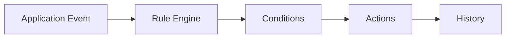

# Rule Engine

> This document defines the Rule Engine component, which is responsible for coordinating the evaluation and execution of automation rules within OpenSorSe.

---

## Purpose

The Rule Engine serves as the central coordinator for all automation within OpenSorSe.

It is responsible for receiving rule execution requests, evaluating applicable rules, coordinating condition evaluation, executing matching actions, and recording execution results.

The Rule Engine orchestrates automation but does not implement individual conditions or actions.

---

# Responsibilities

The Rule Engine is responsible for:

* Coordinating rule evaluation.
* Loading applicable rules.
* Managing rule execution.
* Coordinating condition evaluation.
* Coordinating action execution.
* Recording execution results.
* Ensuring predictable rule processing.

---

# Scope

### In Scope

* Rule orchestration
* Rule lifecycle management
* Condition coordination
* Action coordination
* Execution sequencing
* Rule result reporting

### Out of Scope

The Rule Engine is **not** responsible for:

* Defining rule conditions
* Performing actions
* AI inference
* Database persistence
* User interface rendering
* Metadata generation

These responsibilities belong to dedicated architectural components.

---

# Architectural Overview

The Rule Engine coordinates all automation by connecting rule definitions, conditions, and actions into a unified execution process.

The Rule Engine provides a single entry point for all rule evaluation and execution.

---

# Rule Execution Workflow

A typical rule execution consists of the following stages:

1. Receive an application event.
2. Identify applicable rules.
3. Evaluate rule conditions.
4. Determine matching rules.
5. Execute configured actions.
6. Record execution history.
7. Return execution results.

The Rule Engine should coordinate this workflow without implementing individual rule logic.

---

# Execution Principles

The Rule Engine should ensure that rule execution is:

* Predictable.
* Deterministic.
* Repeatable.
* Transparent.
* Isolated.

Individual rule failures should not prevent unrelated rules from executing whenever practical.

---

# Design Principles

The Rule Engine should remain:

* Lightweight.
* Modular.
* Extensible.
* Independent of business logic.
* Independent of individual conditions and actions.

Its responsibility is limited to coordinating the automation process.

---

# Error Handling

Rule execution failures should be isolated whenever practical.

Examples include:

* Invalid rule definitions.
* Condition evaluation failures.
* Action execution failures.
* Interrupted execution.
* Unexpected runtime errors.

The Rule Engine should record failures and continue processing remaining eligible rules whenever possible.

---

# Future Considerations

The architecture should support future enhancements, including:

* Parallel rule execution.
* Rule priorities.
* Rule dependency management.
* Scheduled rule execution.
* Distributed rule processing.
* Plugin-defined rule engines.

These enhancements should preserve the Rule Engine's primary responsibility of orchestrating rule execution.

---

# Related Documents

* [Rules Overview](00_Overview.md)
* [Conditions](02_Conditions.md)
* [Actions](03_Actions.md)
* [Execution](04_Execution.md)
* [User Rules](05_User_Rules.md)
* [History](../05_Database/05_History.md)
