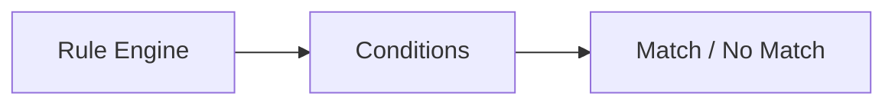

# Conditions

> This document defines the Conditions component, which is responsible for evaluating whether user-defined automation rules should be executed.

---

## Purpose

The Conditions component evaluates document information and application events against user-defined rule criteria.

Its primary purpose is to determine whether a rule should trigger by evaluating one or more logical conditions.

The Conditions component performs evaluation only. It does not execute rule actions.

---

# Responsibilities

The Conditions component is responsible for:

* Evaluating rule conditions.
* Comparing document information.
* Evaluating logical expressions.
* Combining multiple conditions.
* Returning evaluation results.

---

# Scope

### In Scope

* Metadata conditions
* AI result conditions
* Tag conditions
* File property conditions
* Date conditions
* Logical operators
* Condition evaluation

### Out of Scope

The Conditions component is **not** responsible for:

* Executing actions
* Rule orchestration
* AI inference
* Database persistence
* User interface rendering

These responsibilities belong to other architectural components.

---

# Architectural Overview

The Conditions component evaluates rule criteria and returns a boolean result to the Rule Engine.

The Conditions component determines whether a rule should continue to action execution.

---

# Evaluation Workflow

A typical condition evaluation consists of the following stages:

1. Receive a rule definition.
2. Load the required document information.
3. Evaluate each configured condition.
4. Combine results using logical operators.
5. Return the final evaluation result.

Condition evaluation should remain deterministic for identical inputs.

---

# Supported Condition Types

The architecture should support evaluating conditions including:

| Condition Type    | Examples                          |
| ----------------- | --------------------------------- |
| File Properties   | Extension, size, filename         |
| Metadata          | Author, creation date, page count |
| AI Classification | Invoice, Contract, Receipt        |
| AI Summary        | Contains specific concepts        |
| Tags              | User or AI-generated tags         |
| Duplicate Status  | Duplicate detected                |
| Folder Location   | Current directory                 |
| Processing Status | OCR completed, indexed            |

Additional condition types may be introduced as the application evolves.

---

# Logical Operations

The Conditions component should support logical combinations including:

* AND
* OR
* NOT
* Nested condition groups

Logical evaluation should remain predictable and easy to understand.

---

# Design Principles

The Conditions component should remain:

* Deterministic.
* Independent of actions.
* Extensible.
* Easy to evaluate.
* Independent of rule execution.

Its responsibility is limited to determining whether a rule should trigger.

---

# Error Handling

Condition evaluation failures should be isolated whenever practical.

Examples include:

* Missing metadata.
* Invalid condition definitions.
* Unsupported operators.
* Incomplete document information.

Whenever practical, invalid conditions should affect only the associated rule.

---

# Future Considerations

The architecture should support future enhancements, including:

* User-defined condition types.
* Date calculations.
* Relative time conditions.
* Similarity score conditions.
* Natural language rule creation.
* Plugin-defined condition providers.

These enhancements should preserve the component's primary responsibility of evaluating rule conditions.

---

# Related Documents

* [Rules Overview](00_Overview.md)
* [Rule Engine](01_Rule_Engine.md)
* [Actions](03_Actions.md)
* [Execution](04_Execution.md)
* [User Rules](05_User_Rules.md)
* [Metadata](../05_Database/04_Metadata.md)
