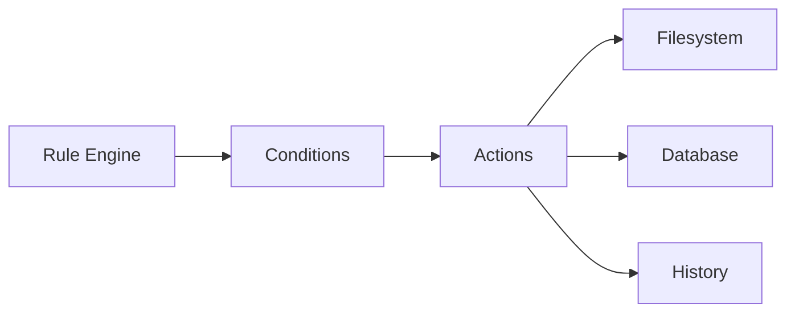

# Actions

> This document defines the Actions component, which is responsible for performing automation tasks after a rule has been successfully evaluated.

---

## Purpose

The Actions component executes the operations associated with automation rules.

Its primary purpose is to perform user-configured tasks when rule conditions have been satisfied.

Actions modify application state or perform operations on behalf of the user according to the configured automation rules.

---

# Responsibilities

The Actions component is responsible for:

* Executing rule actions.
* Performing file operations.
* Updating document information.
* Triggering application workflows.
* Reporting execution results.

---

# Scope

### In Scope

* File operations
* Tag management
* Notification generation
* AI task requests
* Rule-driven workflows
* Application automation

### Out of Scope

The Actions component is **not** responsible for:

* Rule evaluation
* Condition evaluation
* Rule orchestration
* AI inference
* Search execution
* User interface rendering

These responsibilities belong to other architectural components.

---

# Architectural Overview

The Actions component performs operations after successful rule evaluation.

The Actions component performs the requested operations and reports the results back to the Rule Engine.

---

# Action Workflow

A typical action execution consists of the following stages:

1. Receive an execution request.
2. Validate action parameters.
3. Execute the configured operation.
4. Verify execution success.
5. Record execution results.
6. Return the outcome to the Rule Engine.

Actions should execute independently whenever practical.

---

# Supported Actions

The architecture should support actions including:

| Action                | Description                                                      |
| --------------------- | ---------------------------------------------------------------- |
| Move File             | Move a document to another folder.                               |
| Rename File           | Apply a filename to a document.                                  |
| Add Tag               | Associate one or more tags with a document.                      |
| Remove Tag            | Remove existing tag associations.                                |
| Request AI Processing | Trigger AI capabilities such as summarization or classification. |
| Notify User           | Display a notification or alert.                                 |
| Update Metadata       | Modify application-managed document metadata where appropriate.  |

Additional actions may be introduced as the application evolves.

---

# Action Principles

Actions should be:

* Predictable.
* Independent.
* Reusable.
* Verifiable.
* Transparent.

Each action should perform a single responsibility and report its outcome clearly.

---

# Design Principles

The Actions component should remain:

* Modular.
* Extensible.
* Independent of rule evaluation.
* Independent of condition logic.
* Easy to test.

Actions should perform work without deciding whether they should execute.

---

# Error Handling

Action failures should be isolated whenever practical.

Examples include:

* File permission errors.
* Missing destination folders.
* Invalid action parameters.
* Filesystem failures.
* Interrupted operations.

Whenever practical, failures should be recorded while allowing unrelated actions and rules to continue executing.

---

# Future Considerations

The architecture should support future enhancements, including:

* Composite actions.
* Transactional action groups.
* Undoable actions.
* Scheduled actions.
* Plugin-defined actions.
* External integration actions.

These enhancements should preserve the component's primary responsibility of executing automation tasks.

---

# Related Documents

* [Rules Overview](00_Overview.md)
* [Rule Engine](01_Rule_Engine.md)
* [Conditions](02_Conditions.md)
* [Execution](04_Execution.md)
* [User Rules](05_User_Rules.md)
* [History](../05_Database/05_History.md)
