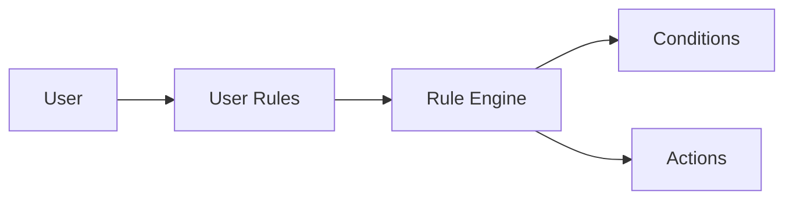

# User Rules

> This document defines the User Rules component, which is responsible for creating, storing, managing, and configuring user-defined automation rules within OpenSorSe.

---

## Purpose

The User Rules component enables users to define personalized automation without modifying the application itself.

Its primary purpose is to provide a configurable rule system that allows users to automate document organization, processing, and workflow according to their own preferences.

User Rules define **what** should happen, while the Rule Engine determines **how** those rules are executed.

---

# Responsibilities

The User Rules component is responsible for:

* Creating automation rules.
* Storing rule definitions.
* Managing rule configuration.
* Enabling and disabling rules.
* Organizing user-defined rules.
* Providing rule definitions to the Rule Engine.

---

# Scope

### In Scope

* Rule creation
* Rule editing
* Rule storage
* Rule validation
* Rule organization
* Rule configuration

### Out of Scope

The User Rules component is **not** responsible for:

* Rule evaluation
* Condition evaluation
* Action execution
* AI inference
* Database persistence
* User interface rendering

These responsibilities belong to other architectural components.

---

# Architectural Overview

The User Rules component provides configurable rule definitions to the Rule Engine.

User Rules define automation behavior without participating directly in execution.

---

# Rule Lifecycle

A typical rule lifecycle consists of the following stages:

1. Create a new rule.
2. Configure conditions.
3. Configure actions.
4. Validate the rule definition.
5. Enable the rule.
6. Execute the rule when applicable.
7. Modify, disable, or remove the rule when required.

Rules should remain editable throughout their lifecycle.

---

# Rule Structure

A user-defined rule typically consists of:

| Component   | Description                                          |
| ----------- | ---------------------------------------------------- |
| Name        | Human-readable rule name.                            |
| Description | Optional explanation of the rule.                    |
| Trigger     | Event that starts rule evaluation.                   |
| Conditions  | Criteria that determine whether the rule matches.    |
| Actions     | Operations to perform when conditions are satisfied. |
| Status      | Enabled or disabled state.                           |

Additional rule properties may be introduced as the application evolves.

---

# Rule Principles

User-defined rules should be:

* Predictable.
* Transparent.
* Easy to understand.
* Easy to modify.
* Safe to execute.

Users should always remain in control of their automation.

---

# Design Principles

The User Rules component should remain:

* User-centric.
* Independent of execution.
* Extensible.
* Easy to configure.
* Easy to validate.

Its responsibility is limited to defining automation behavior.

---

# Error Handling

Rule definition problems should be identified before execution whenever practical.

Examples include:

* Invalid rule definitions.
* Missing conditions.
* Missing actions.
* Unsupported rule features.
* Validation failures.

Invalid rules should be reported clearly without affecting unrelated rules.

---

# Future Considerations

The architecture should support future enhancements, including:

* Rule templates.
* Rule import and export.
* Rule versioning.
* Rule sharing.
* AI-assisted rule generation.
* Plugin-defined rule types.

These enhancements should preserve the component's primary responsibility of defining user automation.

---

# Related Documents

* [Rules Overview](00_Overview.md)
* [Rule Engine](01_Rule_Engine.md)
* [Conditions](02_Conditions.md)
* [Actions](03_Actions.md)
* [Execution](04_Execution.md)
* [Settings](../05_Database/06_Settings.md)
