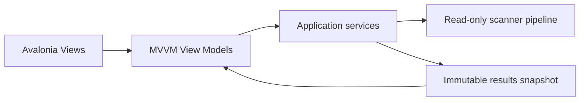

# GUI Overview

> The current GUI is an Avalonia MVVM desktop application focused on a safe, read-only scan and review workflow.

---

## Current scope

The implemented Desktop application hosts these user-facing areas:

| Component | Current role |
| --- | --- |
| Main Window | Hosts application navigation and shared status. |
| Dashboard | Shows current-session summary and routes to primary workflows. |
| Scan | Accepts selected local folders and presents processing progress and cancellation. |
| Results | Hosts the Results Explorer, selected details, warnings, exact-duplicate review, and bounded user-tag controls. |
| Saved Catalog | Lists, names, and opens opt-in application-owned historical snapshots; it shows captured source scope and offers explicit local catalog maintenance only. |
| Catalog Search | Searches metadata already saved in catalog snapshots with deterministic ranking/explanations and manages bounded named query presets. |
| Compare Snapshots | Compares two explicit historical entries in memory with source-scope status, bounded filters, cancellation, and no live path access. |
| Rules | Reviews and validates caller-supplied in-memory rule data. The current shell does not create, persist, or execute rules. |
| Settings | Edits implemented application settings. |
| Diagnostics | Presents aggregate logging health. |
| Operation History | Presents a review-only empty/in-memory foundation. The current workflow supplies no execution sessions and exposes no undo action. |
| Notifications | Shows non-blocking user-safe status messages. |

The current GUI does not expose execution, undo, file opening, file revealing, result export, live monitoring, OCR, semantic search, or selected-user-file mutation controls. Optional AI controls remain review-only, and catalog maintenance changes only OpenSorSe application data after explicit action.

## Presentation boundary

Views and view models present already-computed application data. They must not perform filesystem access, execute planned operations, or bypass the Application layer.

## Current usability guarantees

- Scan progress and cancellation are visible.
- Results are bounded through paging and are filtered and sorted in memory.
- Result and duplicate details reflect the completed scan; they do not inspect the live filesystem.
- The Results surface includes persistent read-only safety wording.
- Catalog, Catalog Search, and Compare Snapshots present historical metadata only; they do not refresh or access a selected file.
- Snapshot comparison holds at most 4,000 application changes and renders at most 500 rows for the active filters.
- User tags are application metadata only. Saved searches store names/query text only and always recalculate hits from the current catalog.
- Primary navigation uses readable labels; dense catalog action groups wrap at constrained widths; critical catalog inputs expose accessible names.
- Empty, limitation, and error states use user-safe messages.

## Future design material

The remaining GUI documents may describe future pages or extension points such as reports, dialogs, themes, and plugin-provided UI. Those descriptions are design intent unless a current release document or implementation specification identifies a feature as implemented.

## Related documents

- [System Overview](../00_System/00_Overview.md)
- [Results Page](04_Results_Page.md)
- [Catalog and Catalog Search](11_Catalog_Page.md)
- [Catalog Comparison](12_Catalog_Comparison_Page.md)
- [Release Status](../../RELEASE_STATUS.md)
