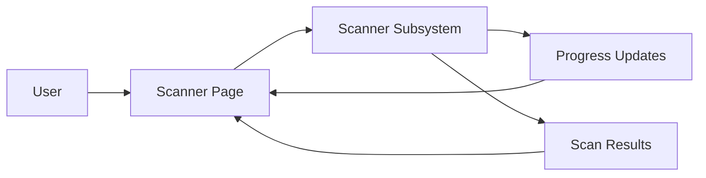

# Scanner Page

> This document defines the Scanner Page component, which provides the user interface for configuring, monitoring, and controlling document scanning operations within OpenSorSe.

---

## Purpose

The Scanner Page provides users with a dedicated interface for discovering, importing, and monitoring documents processed by OpenSorSe.

Its purpose is to allow users to configure scan operations, observe real-time progress, review scan results, and manage scanning tasks without exposing the underlying implementation details.

The Scanner Page presents and controls scanning operations but does not perform file scanning itself.

---

# Responsibilities

The Scanner Page is responsible for:

* Configuring scan operations.
* Starting and stopping scans.
* Displaying scan progress.
* Presenting scan statistics.
* Displaying scan errors and warnings.
* Providing scan management controls.

---

# Scope

### In Scope

* Scan configuration
* Scan progress
* Scan controls
* Scan statistics
* Scan summaries
* Error presentation

### Out of Scope

The Scanner Page is **not** responsible for:

* File discovery
* Metadata extraction
* AI processing
* Database operations
* Search indexing
* Business logic

These responsibilities belong to other architectural components.

---

# Architectural Overview

The Scanner Page communicates with the Scanner subsystem to configure and monitor scan operations.

The Scanner Page acts as the presentation layer for scan-related functionality.

---

# User Workflow

A typical scanning workflow consists of the following stages:

1. Select one or more folders to scan.
2. Configure scan options.
3. Start the scan.
4. Monitor scan progress.
5. Review scan statistics and detected documents.
6. Resolve warnings or errors where necessary.
7. Continue with further document processing.

The page should provide clear visibility into ongoing scanning activities.

---

# Displayed Information

The Scanner Page may present information including:

| Information              | Description                      |
| ------------------------ | -------------------------------- |
| Scan Status              | Current state of the scan.       |
| Progress                 | Overall completion percentage.   |
| Files Processed          | Number of processed documents.   |
| Files Remaining          | Estimated remaining workload.    |
| Errors                   | Scan failures and warnings.      |
| Scan Duration            | Elapsed processing time.         |
| Estimated Time Remaining | Approximate completion estimate. |

Additional information may be displayed as the scanning subsystem evolves.

---

# User Experience Principles

The Scanner Page should strive to be:

* Responsive.
* Informative.
* Predictable.
* Easy to monitor.
* Non-blocking.

Long-running scans should remain visible while allowing users to continue using the rest of the application.

---

# Design Principles

The Scanner Page should remain:

* Independent of scanning logic.
* Modular.
* Event-driven.
* Focused on presentation.
* Easy to extend.

Its responsibility is limited to controlling and displaying scan operations.

---

# Error Handling

The Scanner Page should present scan-related issues clearly.

Examples include:

* Permission denied.
* Missing folders.
* Cancelled scans.
* Corrupted files.
* Reader failures.

Errors should be displayed in a user-friendly manner while allowing scanning to continue whenever practical.

---

# Future Considerations

The architecture should support future enhancements, including:

* Multiple concurrent scans.
* Scheduled scans.
* Drag-and-drop folder scanning.
* Live filesystem monitoring.
* Plugin-defined scan sources.
* Remote storage scanning.

These enhancements should preserve the Scanner Page's primary responsibility of presenting and controlling scan operations.

---

# Related Documents

* [GUI Overview](00_Overview.md)
* [Main Window](01_Main_Window.md)
* [Scanner Overview](../02_Scanner/00_Overview.md)
* [Results Page](04_Results_Page.md)
* [Notifications](09_Notifications.md)
