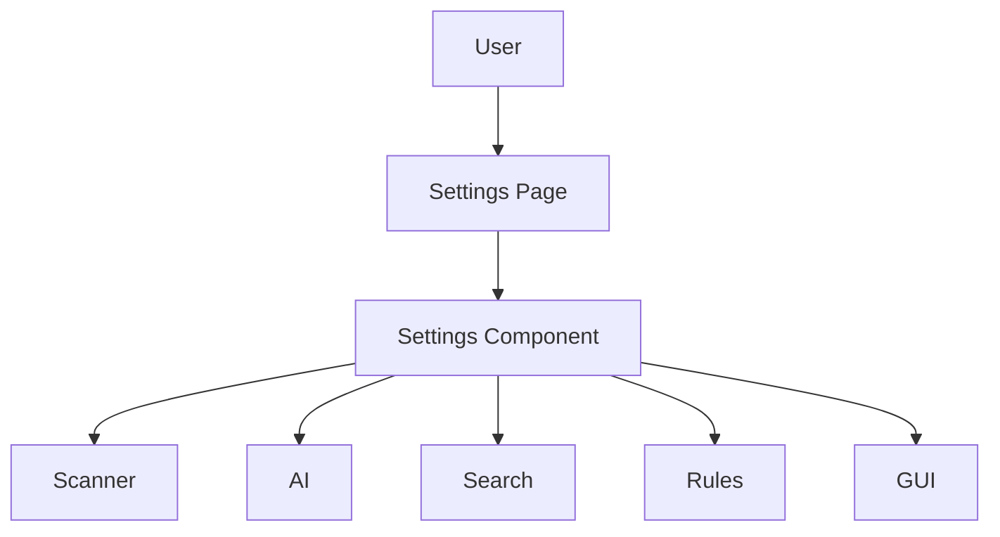

# Settings Page

> This document defines the Settings Page component, which provides the user interface for configuring OpenSorSe and managing application preferences.

---

## Purpose

The Settings Page provides a centralized interface for viewing and modifying application configuration.

Its purpose is to allow users to customize OpenSorSe's behavior, configure subsystem preferences, and manage application-wide settings while maintaining consistency with the underlying architecture.

The Settings Page presents and modifies configuration but does not implement application behavior.

## v0.9 implementation status

The delivered page includes diagnostic logging, optional Ollama-compatible settings, and the opt-in local catalog toggle. AI controls cover enabled state, endpoint, timeout, installed-model discovery/selection, connection status, preference-adaptation toggle, explicit cancellation, and a separately confirmed decision-history reset. The ViewModel delegates discovery and reset to application services; it contains no HTTP transport or persistence implementation. Remote endpoint privacy guidance is visible in the UI. Import/export and the broader categories below remain future design.

---

# Responsibilities

The Settings Page is responsible for:

* Displaying application settings.
* Organizing configuration by subsystem.
* Validating user input.
* Saving configuration changes.
* Restoring default settings.
* Presenting configuration information.

---

# Scope

### In Scope

* Application settings
* User preferences
* Configuration validation
* Settings categories
* Import and export of settings
* Reset to defaults

### Out of Scope

The Settings Page is **not** responsible for:

* Applying business logic
* Database management
* AI inference
* Rule execution
* Search execution
* Filesystem operations

These responsibilities belong to other architectural components.

---

# Architectural Overview

The Settings Page provides a unified interface to the centralized Settings component.

The Settings Page modifies configuration while remaining independent of the application subsystems that consume those settings.

---

# Configuration Categories

Settings should be organized into logical categories.

| Category   | Examples                              |
| ---------- | ------------------------------------- |
| General    | Language, startup behavior, updates   |
| Scanner    | Scan folders, exclusions, scheduling  |
| AI         | Providers, models, prompt behavior    |
| Search     | Indexing, ranking, search preferences |
| Rules      | Automation preferences and execution  |
| Database   | Backup, cache, maintenance            |
| Appearance | Themes, fonts, accessibility          |
| Plugins    | Plugin management and configuration   |

Additional categories may be introduced as the application evolves.

---

# User Workflow

A typical settings workflow consists of the following stages:

1. Open the Settings Page.
2. Navigate to the desired configuration category.
3. Modify one or more settings.
4. Validate the entered values.
5. Save the configuration.
6. Apply changes immediately or when appropriate.

Configuration changes should provide clear feedback to the user.

---

# User Experience Principles

The Settings Page should strive to be:

* Organized.
* Discoverable.
* Consistent.
* Informative.
* Easy to navigate.

Users should be able to locate and understand configuration options without requiring technical knowledge.

---

# Design Principles

The Settings Page should remain:

* Independent of business logic.
* Modular.
* Extensible.
* Consistent with the application's architecture.
* Focused on configuration.

Its responsibility is limited to presenting and modifying application settings.

---

# Error Handling

Configuration issues should be communicated clearly.

Examples include:

* Invalid values.
* Unsupported options.
* Missing dependencies.
* Configuration validation failures.

Whenever practical, invalid settings should not affect unrelated configuration areas.

---

# Future Considerations

The architecture should support future enhancements, including:

* Searchable settings.
* Configuration profiles.
* Workspace-specific settings.
* Cloud synchronization.
* Plugin-defined settings pages.
* AI-assisted configuration recommendations.

These enhancements should preserve the Settings Page's primary responsibility of managing application configuration.

---

# Related Documents

* [GUI Overview](00_Overview.md)
* [Main Window](01_Main_Window.md)
* [Database Settings](../05_Database/06_Settings.md)
* [Themes](10_Themes.md)
* [Plugins Overview](../10_Plugins/00_Overview.md)
