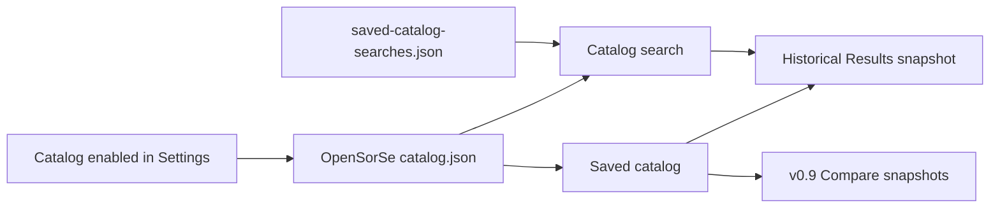

# Catalog and Catalog Search Pages

> v0.4-v0.8 add opt-in historical snapshot review, metadata search, named query presets, and snapshot identity; neither page is a live filesystem browser.

## Implemented scope

The **Saved catalog** page lists summaries from OpenSorSe-owned `catalog.json` only when the user enabled local catalog storage in Settings. Users can set, replace, or clear an application-owned snapshot name; review captured source scope; reopen a saved snapshot in Results; remove a selected entry; or request and separately confirm clearing all catalog data. Source scope is immutable provenance captured from the completed scan request and is explicitly unknown for schema-1 entries. These operations never target a selected scan directory, decision history, or log file.

The **Catalog search** page searches only metadata already held in saved snapshots: filename, stored path, extension, deterministic category, and accepted tag. It reuses deterministic ranking/match explanations, caps displayed hits at 200, and opens the historical snapshot containing a selected hit. It does not open, refresh, or inspect a result file.

v0.7 adds a separate list of up to 25 named query-text presets. Presets live in `saved-catalog-searches.json`, do not retain hits, and rerun the current catalog search explicitly. Selected removal and two-step reset affect only saved query text; reset remains available to recover malformed preset data even when catalog storage is disabled.

v0.8 advances `catalog.json` writes to schema 2 while reading schema 1 without automatic mutation. New entries capture at most 32 selected source roots and may have an 80-character name. Search hits show that name without changing v0.5 ranking. A later successful catalog write atomically upgrades the bounded envelope; listing alone does not rewrite it.

## Safety and limitations

- The feature is disabled by default because filenames and paths are personal metadata.
- Storage is bounded to ten snapshots with at most 2,000 files each.
- Identity metadata is bounded to an 80-character name and 32 roots of at most 2,048 characters each.
- Search is deterministic metadata search, not semantic or content search.
- Removing/clearing requires explicit controls; clear all requires a second confirmation action.
- Malformed catalog data is reported and preserved rather than automatically deleted.
- Saved-query data is bounded separately; malformed data is preserved until the user explicitly confirms reset.

## Related documents

- [v0.4 proposal](../../Implementation_Spec/v0.4/00_v0.4_Release_Proposal.md)
- [v0.5 proposal](../../Implementation_Spec/v0.5/00_v0.5_Release_Proposal.md)
- [v0.6 proposal](../../Implementation_Spec/v0.6/00_v0.6_Release_Proposal.md)
- [v0.7 proposal](../../Implementation_Spec/v0.7/00_v0.7_Release_Proposal.md)
- [v0.8 proposal](../../Implementation_Spec/v0.8/00_v0.8_Release_Proposal.md)
- [Catalog comparison](12_Catalog_Comparison_Page.md)
- [Search overview](../06_Search/00_Overview.md)
