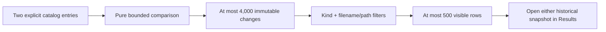

# Catalog Comparison Page

> v0.9 compares two explicit application-owned historical snapshots; it is not a live filesystem change detector.

## Implemented workflow

The **Compare snapshots** page lists enabled-catalog summaries, requires distinct baseline/current selections, loads those two bounded entries, and delegates pure stored-metadata analysis to `ICatalogComparisonService`. Optional v0.8 names identify selections. Captured source roots produce a same, different, or unknown scope state.

Changes are Added, Removed, Modified, or Unchanged. Modified fields cover stored size, last-write time, extension, category, classification, duplicate status, planned-operation preview state, and accepted non-deterministic tags. Matching uses platform-neutral historical path identity. Windows drive/UNC forms fold separators and case; Unix paths preserve case. Rename inference is not attempted.

## States and safety

- Disabled and fewer-than-two-entry states explain how to proceed without reading snapshots.
- Comparison and refresh are cancellable; selector changes cancel active work and cannot publish stale results.
- Different/unknown scope and ignored duplicate path records are explicit text warnings.
- Aggregate totals remain complete when the 500-row presentation cap or a filter applies.
- Catalog changes, including tag updates and new snapshots, invalidate cached search/comparison state.
- No comparison result, filter, or selection is persisted.
- No stored path is opened, checked, resolved, followed, executed, or modified.

## Related documents

- [Catalog page](11_Catalog_Page.md)
- [v0.9 proposal](../../Implementation_Spec/v0.9/00_v0.9_Release_Proposal.md)
- [Historical comparison service](../../Implementation_Spec/v0.9/044_HistoricalCatalogComparisonService.md)
- [User flow](../00_System/06_User_Flow.md)
