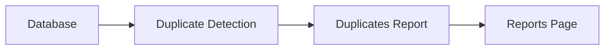

# Duplicates Report

> This document defines the Duplicates Report component, which is responsible for identifying and presenting duplicate and highly similar documents within the managed document library.

---

## Purpose

The Duplicates Report analyzes the document library to identify duplicate and potentially redundant files.

Its purpose is to help users understand where duplicate content exists, evaluate storage impact, and make informed decisions regarding file management.

The Duplicates Report presents findings and recommendations without modifying or removing documents.

---

# Responsibilities

The Duplicates Report is responsible for:

* Identifying duplicate documents.
* Grouping duplicate files.
* Estimating storage impact.
* Reporting duplicate statistics.
* Supporting duplicate review.
* Presenting duplicate recommendations.

---

# Scope

### In Scope

* Exact duplicate detection
* Similar document reporting
* Duplicate grouping
* Storage impact analysis
* Duplicate statistics
* Duplicate recommendations

### Out of Scope

The Duplicates Report is **not** responsible for:

* Deleting duplicate files
* Moving documents
* Rule execution
* AI inference
* Business logic
* User interface rendering

These responsibilities belong to other architectural components.

---

# Architectural Overview

The Duplicates Report analyzes duplicate information generated by the application and presents structured findings.

The Duplicates Report consumes duplicate analysis results without modifying the underlying document library.

---

# Report Workflow

A typical duplicate report consists of the following stages:

1. Retrieve duplicate information.
2. Group related documents.
3. Calculate duplicate statistics.
4. Estimate storage impact.
5. Generate the report.

The report should present findings clearly while leaving all decisions to the user.

---

# Report Categories

The architecture should support reporting including:

| Category            | Description                                            |
| ------------------- | ------------------------------------------------------ |
| Exact Duplicates    | Files with identical content.                          |
| Similar Documents   | Documents with significant similarity where supported. |
| Duplicate Groups    | Collections of related duplicate files.                |
| Storage Savings     | Potential storage recoverable through cleanup.         |
| Duplicate Locations | Folders containing duplicate content.                  |

Additional report categories may be introduced as the application evolves.

---

# Reporting Principles

Duplicate reporting should be:

* Accurate.
* Explainable.
* Non-destructive.
* Easy to review.
* Focused on decision support.

Users should always understand why documents are considered duplicates or highly similar.

---

# Design Principles

The Duplicates Report should remain:

* Read-only.
* Independent of duplicate detection.
* Extensible.
* Deterministic where practical.
* Focused on redundancy analysis.

Its responsibility is limited to presenting duplicate-related information.

---

# Error Handling

Duplicate reporting should handle incomplete information gracefully.

Examples include:

* Missing hashes.
* Incomplete duplicate groups.
* Interrupted duplicate analysis.
* Unsupported document types.

Whenever practical, partial duplicate reports should remain available.

---

# Future Considerations

The architecture should support future enhancements, including:

* Near-duplicate detection.
* Image similarity reporting.
* Video similarity reporting.
* AI-assisted duplicate analysis.
* Plugin-defined duplicate analyzers.
* Duplicate confidence scoring.

These enhancements should preserve the Duplicates Report's primary responsibility of presenting duplicate information.

---

# Related Documents

* [Reports Overview](00_Overview.md)
* [Cleanup Report](02_Cleanup_Report.md)
* [Statistics](01_Statistics.md)
* [Duplicate Detection](../02_Scanner/05_Duplicate_Detection.md)
* [Reports Page](../08_GUI/07_Reports_Page.md)
