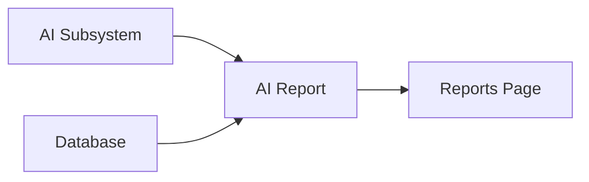

# AI Report

> This document defines the AI Report component, which is responsible for summarizing Artificial Intelligence processing, generated enrichments, and AI-related activity within OpenSorSe.

---

## Purpose

The AI Report provides users with visibility into how Artificial Intelligence has been used throughout the application.

Its purpose is to summarize AI processing activity, generated enrichments, model usage, and processing coverage, helping users understand the contribution of AI to their document library.

The AI Report presents AI-related information without performing AI processing itself.

---

# Responsibilities

The AI Report is responsible for:

* Reporting AI processing activity.
* Summarizing AI enrichments.
* Reporting model usage.
* Presenting AI performance metrics.
* Highlighting AI coverage.
* Supporting AI transparency.

---

# Scope

### In Scope

* AI processing summaries
* Classification statistics
* Summarization statistics
* Embedding statistics
* Model usage
* AI processing metrics

### Out of Scope

The AI Report is **not** responsible for:

* AI inference
* Model management
* Prompt execution
* Database management
* Business logic
* User interface rendering

These responsibilities belong to other architectural components.

---

# Architectural Overview

The AI Report analyzes AI-related information produced by the AI subsystem and presents structured summaries.

The AI Report summarizes AI activity while remaining independent of AI execution.

---

# Report Workflow

A typical AI report consists of the following stages:

1. Retrieve AI processing information.
2. Aggregate AI metrics.
3. Calculate processing summaries.
4. Generate AI insights.
5. Produce the completed report.

The report should present factual information regarding AI usage and outcomes.

---

# Report Categories

The architecture should support reporting including:

| Category            | Description                                           |
| ------------------- | ----------------------------------------------------- |
| Classifications     | Number and distribution of AI classifications.        |
| Summaries           | Generated document summaries.                         |
| Embeddings          | Semantic embedding generation statistics.             |
| Model Usage         | Models used for processing tasks.                     |
| Processing Coverage | Documents processed by AI versus remaining documents. |
| Performance Metrics | Processing duration and throughput where available.   |

Additional report categories may be introduced as the AI subsystem evolves.

---

# Reporting Principles

AI reporting should be:

* Transparent.
* Accurate.
* Explainable.
* Read-only.
* Easy to understand.

Users should always be able to see how AI has contributed to their document library.

---

# Design Principles

The AI Report should remain:

* Independent of AI execution.
* Read-only.
* Extensible.
* Deterministic.
* Focused on reporting.

Its responsibility is limited to summarizing AI activity and results.

---

# Error Handling

AI reporting should handle incomplete AI information gracefully.

Examples include:

* Missing AI results.
* Incomplete processing records.
* Unsupported AI providers.
* Missing performance metrics.

Whenever practical, available AI information should still be presented even if some metrics cannot be calculated.

---

# Future Considerations

The architecture should support future enhancements, including:

* AI quality metrics.
* Cost estimation and usage tracking.
* Provider comparisons.
* Historical AI trends.
* Plugin-defined AI reports.
* Explainability dashboards.

These enhancements should preserve the AI Report's primary responsibility of reporting AI activity.

---

# Related Documents

* [Reports Overview](00_Overview.md)
* [Statistics](01_Statistics.md)
* [AI Overview](../04_AI/00_Overview.md)
* [AI Manager](../04_AI/01_AI_Manager.md)
* [Reports Page](../08_GUI/07_Reports_Page.md)
