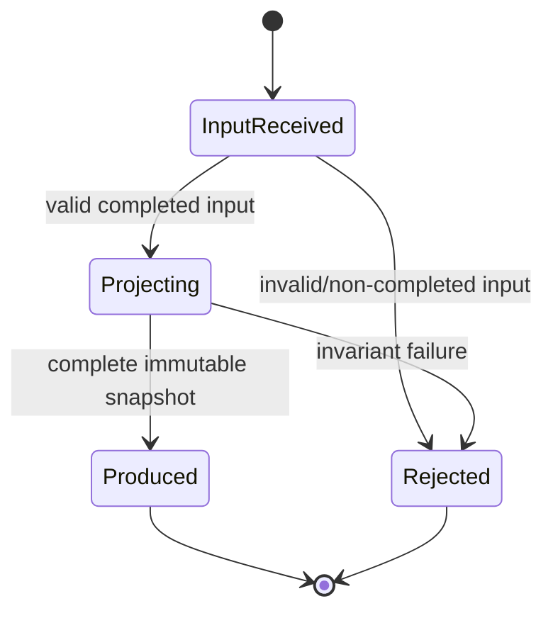

# 029 — Results Snapshot Projection

| Field | Value |
| --- | --- |
| Spec ID | 029 |
| Component | Results Snapshot Projection |
| Project | `OpenSorSe.Application` |
| Target release | v0.2 |
| Status | Implemented |
| Depends on | v0.1 specs 001–008 and 024–026; completed local v0.1 GUI validation |
| Required by | 030 Results Explorer; 031 Exact-Duplicate Review |

## Purpose

Create one immutable, in-memory, UI-safe representation of a successfully completed v0.1 processing session. The projection becomes the only data source that the v0.2 Results UI needs for file exploration and duplicate review.

The component exists to prevent the Desktop layer from reinterpreting every scanner/rules model and to preserve the current application boundary: the pipeline returns domain results; the presentation layer renders a review model.

## User value

Once processing is complete, users receive a coherent review of discovered files, exact duplicate groups, planned operations, and recoverable issues. The UI can efficiently query this data without rerunning a scan or touching files.

## Responsibilities

- Accept one terminal `ProcessingSessionResult` whose processing status is completed.
- Normalize the v0.1 terminal results into immutable review records.
- Preserve source order where the source contract defines order.
- Carry safe-to-display file attributes required by specifications 030 and 031.
- Include exact duplicate groups already produced by `IDuplicateDetector`.
- Include accepted planned operations and user-safe issue messages without evaluating or executing them.
- Produce deterministic aggregate totals and a projection timestamp supplied by the caller or a testable clock abstraction.
- Validate required inputs and reject impossible result combinations with descriptive argument/domain errors.

## Non-responsibilities

This component must not:

- Start, stop, resume, retry, or cancel processing.
- Rescan folders, call scanner services, read metadata again, hash files, or access file contents.
- Re-run duplicate detection, rule evaluation, planning, or conflict resolution.
- Call `IActionExecutor`, `IUndoEngine`, a shell, clipboard, picker, or OS file manager.
- Persist results, write settings, create a database, cache data to disk, export a report, or transmit data.
- Select a duplicate keeper, recommend deletion, or expose raw content hashes.
- Depend on Avalonia, ViewModels, Views, or Desktop project types.

## Inputs

| Input | Rules |
| --- | --- |
| `ProcessingSessionResult sessionResult` | Required. `Session.Status` and `Processing.Status` must both be completed. `Processing` and `Scan` must be non-null. `Conflicts` is consumed when present; absent conflict output produces an empty operation list with a user-safe limitation. |
| Optional time source | Used only to stamp `ProjectedAtUtc`; inject a minimal clock abstraction or pass a timestamp to make tests deterministic. |

The v0.1 pipeline supplies `ProcessingResult.Duplicates` when all stages complete. The projector may defensively support a completed result where this member is unexpectedly null by producing no groups and an explicit user-safe projection warning. It must never infer duplicate groups from arbitrary file rows; that would duplicate or alter scanner behaviour.

## Outputs and proposed domain models

Types belong in `OpenSorSe.Application.Models` (or a focused `OpenSorSe.Application.Results` namespace if that better matches current naming). All collection properties are immutable snapshots (`IReadOnlyList<T>` backed by arrays or equivalent) and all types are records with no mutable collection escape.

```csharp
public interface IResultsSnapshotProjector
{
    ResultsSnapshot Project(ProcessingSessionResult sessionResult);
}

public sealed record ResultsSnapshot(
    string SessionId,
    DateTimeOffset SessionStartedAtUtc,
    DateTimeOffset ProjectedAtUtc,
    IReadOnlyList<ResultFile> Files,
    IReadOnlyList<ResultDirectory> Directories,
    IReadOnlyList<ResultDuplicateGroup> DuplicateGroups,
    IReadOnlyList<ResultPlannedOperation> PlannedOperations,
    IReadOnlyList<ResultIssue> Issues,
    ResultsSnapshotStatistics Statistics,
    bool IsDuplicateDataAvailable);
```

The exact property names can follow repository naming conventions, but their semantic minimum is:

| Model | Required fields | Source and ordering |
| --- | --- | --- |
| `ResultFile` | stable per-snapshot ID, full path, display file name, normalized extension, optional size, optional modified time, classification category/match state, duplicate status, optional duplicate-group ID, `HasPlannedOperation` | Files are in `ProcessingResult.Duplicates.Files` order when present; otherwise `Scan.Files` order. IDs must be deterministic within the snapshot and may be derived from the source path plus source index; do not use the hash. |
| `ResultDirectory` | full path and display name | `Scan.Directories` order. |
| `ResultDuplicateGroup` | opaque group ID, group ordinal, member file IDs, member count, optional common file size, optional conservative reclaimable byte total | `DuplicateDetectionResult.Groups` order. Do not include algorithm or raw hash value in the presentation model. |
| `ResultPlannedOperation` | operation ID, operation kind, source result-file ID, optional destination path, originating rule display name | `ConflictResolutionResult.Operations` order. This is display-only. |
| `ResultIssue` | source stage, severity suitable for display, user-safe message, optional associated result-file ID | Existing stage issues in deterministic stage/input order. Do not retain exception objects or stack traces. |
| `ResultsSnapshotStatistics` | discovered file/directory totals, exact duplicate-group total, exact duplicate-file total, planned-operation total, warning/error total | Derived from snapshot records and checked against relevant upstream statistics where useful. |

`IsDuplicateDataAvailable` distinguishes an available detector result with zero groups from an unavailable detector result. This is necessary because both states otherwise map to an empty group list but require different UI wording.

### Identifier and metadata rules

- A result-file ID is an opaque UI key. It must be unique within a snapshot, deterministic for one input, and must not expose a hash value.
- `FullPath` is retained only for local display and filtering. It is not logged, persisted, exported, or sent externally by this component.
- `DisplayFileName` is `Path.GetFileName(FullPath)` with a safe fallback to the full path only when the platform path API cannot derive a name.
- `NormalizedExtension` is the existing metadata extension when present, otherwise `Path.GetExtension(FullPath)`, normalized to a leading lowercase invariant dot. Empty extensions are represented as empty, not as an invented “unknown” extension.
- Size and modification time are optional: absent metadata must remain absent rather than becoming `0` or a fabricated timestamp.
- Classification text must use the existing deterministic metadata-classification model. It must not claim AI classification.
- `HasPlannedOperation` is true when one or more accepted conflict-resolution operations reference the same source path. It does not imply authorization or future execution.

### Exact-duplicate calculation

For a source `DuplicateGroup`, retain only source member IDs and existing group order. If every member has a known non-negative size and all known sizes agree, `PotentialReclaimableBytes = (memberCount - 1) * commonSize`; otherwise this field is null. The value is an informational theoretical maximum, not a recommended deletion amount and not a filesystem-space guarantee.

This component must not recompute group membership or trust a `FileEntry.Duplicate.GroupId` that is not represented by the upstream group list. That avoids presenting incomplete or inconsistent duplicate groups.

## Concrete service

`ResultsSnapshotProjector` is a stateless singleton implementation. It may accept an `IClock`-style service if Core already provides one; otherwise use a small application-local timestamp provider rather than adding a broad Core abstraction solely for this feature. It performs CPU-only projection and allocates immutable result collections.

The initial implementation is synchronous because it reads no external resource. It must be called off the Avalonia UI thread when profiling demonstrates a large result projection can cause a visible pause. If asynchronous scheduling is introduced, it wraps the same pure projection work and honors cancellation before publishing a snapshot; it must not produce a partial snapshot.

## Processing flow


1. Reject null input.
2. Verify `Session.Status == Completed`, `Processing` is available, `Processing.Status == Completed`, and mandatory scan output is present.
3. Select the enriched file collection that represents the terminal pipeline output; preserve its documented order.
4. Map file and directory rows without modifying the source records.
5. Map accepted planned operations and correlate them to projected files by their original source paths. An unmatched operation becomes a warning rather than an invented file row.
6. Map existing recoverable stage and conflict issues to safe projection issues. Deduplicate only exact same source/message duplicates that would otherwise be shown twice; preserve first occurrence order.
7. Map existing `DuplicateGroup` values. A group whose member cannot be correlated to a projected file is excluded and yields a warning; no membership is guessed.
8. Calculate snapshot statistics, create the immutable snapshot, and return it atomically.

## State transitions

The service has no retained session state. The Desktop caller owns UI state.



## Validation and error handling

| Condition | Required behaviour |
| --- | --- |
| Null `sessionResult` | Throw `ArgumentNullException`. |
| Running, cancelled, closed, or failed session | Reject with `ArgumentException`/domain validation error. Do not emit an incomplete snapshot. |
| Completed session but missing `Processing`/`Scan` | Reject as a pipeline invariant failure; log safe structural context and surface a user-safe completion error through the caller. |
| Completed session with missing `Conflicts` | Preserve file review, expose no planned operations, and add a user-safe planned-operation limitation. |
| Duplicate output absent | Produce no groups and add a user-safe issue that duplicate review was unavailable; do not infer groups. |
| Operation path has no corresponding result file | Preserve the operation as display data only if safe; add an issue and set no file association. |
| Missing/invalid optional metadata | Preserve the row with null optional fields; do not fail the entire projection. |
| Unexpected mapping exception | Do not return partial data. Log the exception through existing logging/error handling with counts and session ID only, then allow the caller to present a generic error. |

No exception message, raw hash, or entire path list may be copied into a user notification or log entry.

## Cancellation and progress

The first implementation has no I/O and no user-visible long-running phase. If it is executed asynchronously for large result sets:

- check the supplied token before mapping and at bounded intervals during large loops;
- throw `OperationCanceledException` before publishing any snapshot;
- report only meaningful phase-level progress (`Preparing results`), never a fabricated percentage;
- keep the previous valid Results view unchanged when a new projection is cancelled.

## Logging, privacy, and safety

- Log only lifecycle messages, aggregate counts, session ID, and exception diagnostics through `ILoggingService`.
- Do not log full paths, file names, classifications, hash values, destination paths, or rule values at information/warning level.
- Do not create a file, directory, setting, cache, telemetry event, database record, or network request.
- Do not call any user-file API beyond pure `Path` string helpers. The projector must contain no `File.*`, `Directory.*`, executor, undo, or shell invocation.
- The snapshot remains process-local and becomes eligible for garbage collection when its owning ViewModel releases it or the process exits.

## Dependency-injection registration

Add one additive singleton registration in the existing Desktop composition root after the application pipeline registrations:

```csharp
services.AddSingleton<IResultsSnapshotProjector, ResultsSnapshotProjector>();
```

Do not change existing registration lifetimes or register a new database, cache, bus subscription, background service, or configuration section.

## UI integration

The Desktop shell calls the projector only after `IApplicationController.StartProcessingAsync` returns a completed session with a completed processing result. The shell passes the snapshot to the existing Results presentation state. Cancelled and failed sessions retain their existing v0.1 status/notification paths and do not call this service.

The UI must not bind directly to `ProcessingResult` after this specification is implemented. That keeps application/domain interpretation out of XAML and ViewModels and gives 030/031 a stable local contract.

## Threading and platform behaviour

- The projector is thread-safe because it is stateless and never mutates inputs.
- It has no Avalonia thread affinity.
- Use platform-neutral `Path` string operations only for display derivation. Do not call `FileInfo`, resolve links, normalize against the live filesystem, or use OS-dependent case comparisons while projecting.
- No cross-platform certification is implied. Tests should include Windows-style and POSIX-style path strings where `Path` APIs make that practical without asserting current-host semantics incorrectly.

## Configuration and persistence

No configuration, migration, application-data location, schema, backup, or persistence is introduced. Result data is explicitly non-persistent and is discarded on application restart.

## Test requirements

- Unit tests for valid completed projection, deterministic output, source-record immutability, ID uniqueness, display derivation, optional metadata, and exact ordering.
- Tests for null, non-completed, cancelled, failed, and structurally incomplete inputs.
- Tests preserving existing exact duplicate groups, excluding malformed/unmatched groups with a warning, and calculating reclaimable bytes only when valid.
- Tests mapping operations and issues while avoiding raw-hash output.
- Integration test using an actual v0.1 `ProcessingResult` fixture assembled from scanner/rule models.
- Test that neither filesystem APIs nor executor/undo interfaces are required or invoked; static review should confirm no such dependency is added.
- A 10,000-row fixture to establish a realistic allocation/time budget before Desktop integration.

## Acceptance criteria

- A valid completed v0.1 processing session maps to one immutable snapshot without changing its input records.
- Every displayed duplicate group originates from the existing exact duplicate detector output and retains member/order fidelity.
- Snapshot data contains no raw hash value and invokes no filesystem mutation or persistence API.
- Invalid or incomplete terminal results do not produce partial review data.
- Required aggregate counts, file rows, directories, operations, and user-safe issues are available to the UI.
- Focused tests pass and existing v0.1 Application tests remain green in an environment that can run them.

## Definition of done

- Contract, implementation, DI registration, XML documentation, and focused tests are complete.
- `MainViewModel` integration remains read-only and handles projector failure safely.
- No v0.1 scanner/rules/executor behaviour changes.
- Review confirms no persistence, raw-hash display, filesystem I/O, or UI dependency was introduced.
- Manual smoke test confirms a completed scan reaches the unchanged Results destination with a valid snapshot available for the next spec.

## Deferred work

- Durable session/results history, JSON/SQLite storage, migration, retention, backup, and corruption recovery.
- Library-wide search indexing, file-content search, saved filters, export, copy-to-clipboard, open/reveal-in-file-manager actions, and report generation.
- Execution authorization, deletion choices, duplicate keeper selection, undo history persistence, or any file mutation.

## Implementation correction (v0.2)

The original draft made `ConflictResolutionResult` mandatory while the immutable review snapshot is still useful for completed read-only scan results without operation output. The implemented projector treats conflict output as optional and never invents an operation. The draft also represented an unavailable duplicate detector result and a successful zero-group detector result identically; `IsDuplicateDataAvailable` was added to retain the required user-safe distinction. These corrections are additive, preserve the read-only boundary, and are covered by projector tests.
