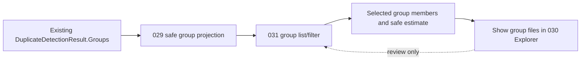
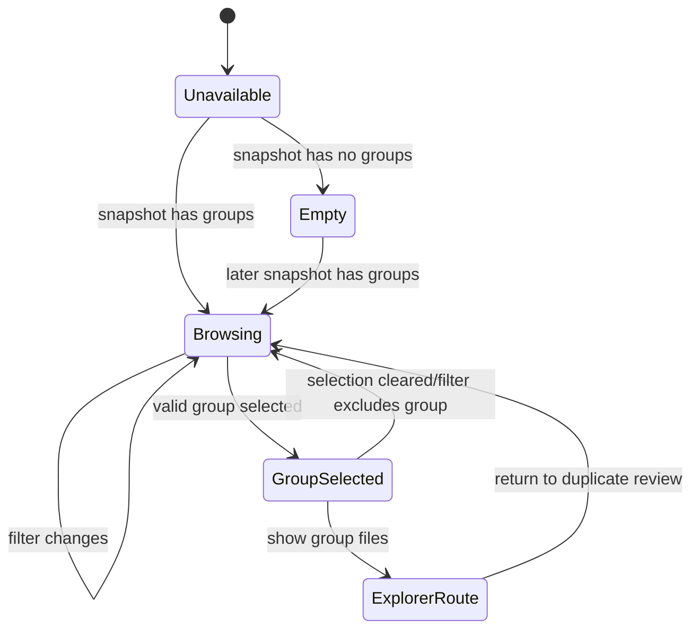

# 031 — Exact-Duplicate Review

| Field | Value |
| --- | --- |
| Spec ID | 031 |
| Component | Exact-Duplicate Review |
| Project | `OpenSorSe.Desktop` (consumes 029 Application projection) |
| Target release | v0.2 |
| Status | Implemented |
| Depends on | 005 Duplicate Detector, 029 Results Snapshot Projection, 030 Results Explorer |
| Required by | None in v0.2 |

## Purpose

Provide a focused, read-only review surface inside the existing Results destination for exact duplicate groups already produced by the v0.1 SHA-256 duplicate detector. Users can understand group membership, inspect each member’s existing metadata, and see a conservative potential-reclaimable-space estimate without being prompted to delete, move, rename, or choose a “keeper.”

The component presents detection output. It does not become a cleanup executor.

## User value

The v0.1 summary can report a duplicate count, but a count does not answer where the copies are or whether the finding is useful. v0.2 makes each existing exact group inspectable and makes the meaning of its storage impact explicit, while preserving user control and the read-only safety boundary.

## Responsibilities

- Display the ordered `ResultDuplicateGroup` records produced by specification 029.
- Let a user filter the group list by member name/path using the same safe local text-matching semantics as 030, or open a selected group from the Results Explorer.
- Let a user select one group and view its ordered member rows.
- Present group count, member count, optional common size, and optional potential reclaimable bytes with careful labels.
- Explain the scope of the result: exact duplicate means matching supported SHA-256 hash; it is not a near-duplicate or similarity result.
- Provide a “Show group files in results” route that applies the existing explorer’s opaque group filter and returns to the existing Results Explorer.
- Present duplicate-related source issues/limitations supplied by the immutable snapshot.

## Non-responsibilities

This component must not:

- Recalculate hashes, compare file contents, or create new duplicate groups.
- Inspect files, query current file size/existence, resolve paths, follow links/reparse points, or rescan.
- Designate a file to keep, rank members, recommend deletion, or infer which copy is original.
- Delete, move, copy, rename, overwrite, change permissions, quarantine, or otherwise modify a file.
- Invoke `IActionExecutor`, `IUndoEngine`, rules, conflict resolution, a file manager, shell, native dialog, clipboard, or persistence layer.
- Display raw SHA-256 hash values or claim that a missing/unknown hash is unique.
- Add a new duplicate detector, database schema, history, report export, or top-level application navigation destination.

## Inputs

| Input | Requirement |
| --- | --- |
| `ResultsSnapshot` | Required. Read only. Duplicate groups must originate from 029’s mapping of `DuplicateDetectionResult.Groups`. |
| Optional selected group ID | An opaque existing group ID received from 030 or initial state. It is valid only if it is present in the active snapshot. |
| Local group text filter | Optional. Follows the same trim and ordinal case-insensitive semantics as 030; it is not a filesystem search. |
| User selection | Changes presentation state only. |

## Outputs and proposed presentation models

The existing snapshot models remain the source of truth. Desktop-only state may be represented by a `DuplicateReviewViewModel` hosted by the existing `ResultsViewModel`.

```csharp
public sealed record DuplicateReviewState(
    string? FilterText,
    string? SelectedGroupId,
    IReadOnlyList<ResultDuplicateGroup> VisibleGroups,
    ResultDuplicateGroup? SelectedGroup,
    IReadOnlyList<ResultFile> SelectedMembers,
    string StatusText);
```

An equivalent observable ViewModel is acceptable; it must expose no mutable group/member collection and no execution command.

### Required display semantics

| Item | Required presentation |
| --- | --- |
| Group list | Group ordinal, member count, optional common file size, optional potential reclaimable bytes, and a concise member-location/name summary. Never show hash or use it as a visible label. |
| Group details | Explain “Exact duplicate group: all listed files had the same supported SHA-256 hash during this scan.” Show member path, size, modified time, and deterministic classification only when provided by the snapshot. |
| Potential reclaimable bytes | Label as “Potential reclaimable space if all but one matching copy were removed outside OpenSorSe.” Show “Unavailable” when not calculable. Do not present it as saved space or a recommendation. |
| Unknown/unavailable hash entries | State that files without a supported hash cannot be included in exact duplicate groups. Do not list them as unique or duplicate. |
| Group source issue | Show the user-safe message from 029 if groups were unavailable/incomplete. Do not surface raw exception text. |
| Empty list | “No exact duplicate groups were found in this completed scan.” Do not imply that visually similar or same-named files were checked. |
| Read-only boundary | Persistent text: “Review only — OpenSorSe will not move, rename, or delete files from this screen.” |

Do not display the opaque group ID by default because the current detector encodes a content hash in it. It may be used as an internal key and passed from 030 only.

## Concrete service and processing flow

No new duplicate service is introduced. The feature depends on 029’s already-projected groups and 030’s query/navigation state. Any local filtering helper must be pure and have no filesystem or DI dependency.



1. On snapshot load, obtain group rows in upstream detector order.
2. If an incoming selected group ID exists, select it only if it belongs to the current snapshot; otherwise clear selection and show the default group list.
3. Apply any local group text filter to members’ already-projected display values. A group matches if at least one member matches.
4. Preserve detector group order; do not sort by hash, potential size, or inferred quality in v0.2.
5. Selecting a group resolves member IDs against the snapshot. If a member is missing, omit it from display and show a user-safe data-consistency warning; never fetch it from the filesystem.
6. “Show group files in results” applies an opaque exact-group filter in 030, returns to the explorer pane, and selects no row by default.

## State transitions



State belongs only to the current process and current snapshot. A new completed scan replaces it, clears filters/selections, and never merges old and new groups.

## Validation and error handling

| Scenario | Required behaviour |
| --- | --- |
| No snapshot | Show unavailable/no-scan state; provide no group action. |
| No groups | Show the precise empty state and leave explorer available. |
| Unknown selected group | Clear selection; do not throw or retain stale members. |
| Group with missing result member | Show available members, add a user-safe warning, preserve no raw internal data, and do not access the filesystem. |
| Invalid filter text | Treat null/whitespace as no filter; arbitrary text is safely escaped by binding and never parsed as a regex. |
| Snapshot says duplicate data unavailable | Show the supplied limitation and disable group review; do not synthesize groups. |
| Unexpected view-model/filter error | Preserve last valid display when possible, log aggregate context only, show a generic retry/return-to-results message. |

## Cancellation, progress, and threading

The group list is normally much smaller than the file list. It may filter synchronously for a small collection. If a group or member set is large enough to affect responsiveness, use the same background, versioned cancellation policy as 030:

- cancel only stale local filtering/view work;
- do not cancel a completed scan or alter the snapshot;
- show a simple “Updating duplicate review…” state rather than a percentage;
- publish only the newest completed view state on the Avalonia UI thread.

There is no network or filesystem cancellation path.

## Logging, privacy, and safety

- Keep all group/member information in process memory only.
- Log feature availability, aggregate group/member counts, and unexpected exceptions. Do not log raw hashes, group IDs, member paths, file names, or potential-space values tied to a specific file.
- Never display a raw hash or opaque group ID. The group ID may reveal a content fingerprint and has no user value for this release.
- Never access a member path. It may no longer exist, may be inaccessible, or may be a reparse-point target; v0.2 reports the historical scan result only.
- No user file or application data write is permitted. This includes no cache, audit history, selection persistence, or export file.
- Add a safety regression test that activates every duplicate-review command/event and proves no executor, undo, filesystem writer, shell, or permission API is reachable.

### Mutation analysis

This feature only reads already-projected in-memory results. It does not write application data, modify/delete/move/rename files, change permissions, or follow links/reparse points. Therefore a mutation preview, confirmation, authorization boundary, dry run, transaction, rollback, audit record, undo, failure recovery, and partial-completion handling are not applicable.

If a future duplicate-cleanup feature is considered, it must be a separate release and require, at minimum: selection of every proposed action, live file/hash preflight, explicit confirmation, current destination/source conflict handling, durable audit/undo records, per-item outcomes, stop/recovery semantics, and a before/after user-visible preview. None of that is v0.2 work.

## UI integration

Host review as a tab, pane, or child state inside the existing `ResultsView`, reachable from an “Exact duplicates” control that includes the group count. Do not add a new sidebar destination or change Main Window navigation.

Suggested layout:

```text
Results / Exact duplicates
[Filter duplicate members________________]                         [Back to results]
Exact duplicate groups: 42
--------------------------------------------------------------------------------
Group | Files | Common size | Potential reclaimable space | Member summary
... groups in detector order ...
--------------------------------------------------------------------------------
Selected exact duplicate group
All listed files shared a supported SHA-256 hash during this scan.
Member path | Size | Modified | Classification
... read-only member rows ...
[Show group files in results]
Review only — OpenSorSe will not move, rename, or delete files from this screen.
```

The initial selection is none. The layout must work when a group has many members; the member list is scrollable/virtualized or otherwise bounded independently of the main Results explorer. No “Delete,” “Keep,” “Merge,” “Open,” “Reveal,” or “Execute” controls are permitted.

## Dependency injection, configuration, persistence, and migration

No service registration is required unless an internal stateless filtering helper is extracted for tests. No configuration value, setting, persisted schema, result/session storage, application-data location, migration, backup, package, or project is added. Restarting the application loses duplicate-review state with the rest of the in-memory v0.1 session state.

## Platform-specific behaviour

- Member paths are rendered as opaque strings from the prior scan; no platform filesystem API is called.
- Local filter comparisons use the same ordinal case-insensitive display/query semantics as 030, not host filesystem identity rules.
- Reparse-point/symbolic-link behaviour remains that of the v0.1 scanner/metadata reader. This view does not follow any link or reparse point.
- Cross-platform certification remains deferred. Include path-format fixtures but do not claim that all platforms are certified.

## Test requirements

### Unit and integration tests

- Map detector fixtures containing no groups, one group, multiple groups, mixed unique/duplicate/unknown entries, same-name/different-path members, and controlled size values.
- Verify group/member order exactly follows 029/upstream detector order.
- Verify potential-reclaimable calculation for valid common sizes, one-member defense, null/missing sizes, unequal sizes, overflow-safe handling, and no claim when data is invalid.
- Verify filters match member display fields, whitespace resets, no-match output, and opaque group IDs/raw hashes never occur in rendered/presentation values.
- Integration path: `DuplicateDetector` fixture → 029 snapshot → 031 group/member state → 030 group-filter route.

### ViewModel tests

- No snapshot, no group, group list, valid/invalid incoming group selection, filter change, selected details, and return-to-explorer route.
- New snapshot replacement clears old selection/filter and cannot display old members.
- Property notifications and command enablement remain deterministic.
- Large group/member list does not publish stale data when filtering is superseded.
- Test spy proves all available commands are review/navigation-only.

### Filesystem, platform, and manual GUI tests

- Build fixtures with byte-identical copies in different folders, unique files, inaccessible/missing entries, symbolic links/reparse points where supported, permission-denied cases, and large duplicate groups.
- Verify that a before/after manifest of every fixture root is unchanged after visiting/filtering every duplicate group and closing the application.
- Manually confirm terminology distinguishes exact duplicates from similarity; potential reclaimable space is not interpreted as a deletion recommendation; raw hashes are absent.
- Test keyboard navigation, screen-reader-visible labels where available, narrow window layout, resize, large group scrolling, cancellation/stale filter responsiveness, and application close during review.

## Acceptance criteria

- Every presented group corresponds exactly to an existing v0.1 exact SHA-256 duplicate group.
- Users can inspect its already-known members and return to a filtered set of those files in Results.
- No raw hash/group ID, file action, keeper recommendation, or destructive operation is displayed or invoked.
- Potential reclaimable space is shown only when it is safe to calculate and is labelled as a theoretical review value.
- Unknown/unavailable hashes and duplicate-data limitations are explained without claiming a result.
- Group selection/filtering remains responsive and cannot mutate files or application data.
- Automated and manual safety checks demonstrate no file, directory, permission, link, executor, undo, shell, or persistence operation occurs.

## Definition of done

- Exact duplicate review is integrated into the existing Results destination and requires no new top-level route.
- Data comes exclusively from 029’s immutable snapshot and agrees with controlled detector fixtures.
- 030 group-filter handoff is implemented and tested.
- No mutation controls, persistence, package dependency, or source-code change outside the additive v0.2 UI/projection scope exists.
- Tests and manual GUI checks pass where the environment permits, including a before/after fixture manifest.

## Deferred work

- Duplicate deletion/cleanup, keeper selection, live validation, copy consolidation, hard-linking, quarantine, recycle bin integration, undo, audit history, reports, and export.
- Near-duplicate/image/audio/video similarity, perceptual hashes, confidence scoring, AI-assisted analysis, and cross-library detection.
- Persistent duplicate history, scheduled rescans, background monitoring, and cloud/collaboration features.

## Implementation note (v0.2)

`DuplicateReviewViewModel` is hosted inside the existing Results destination and consumes only `ResultsSnapshot`. It preserves upstream group order, filters member display values locally with ordinal case-insensitive matching, and routes the opaque group key back to the existing bounded explorer. The key is not displayed. Common-size and potential-reclaimable values are rendered only as historical, theoretical review data; no keeper, action, or file-system command exists.
