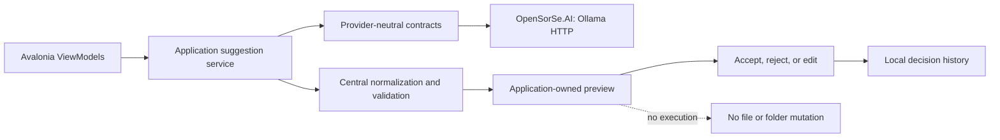

# OpenSorSe v0.3 Release Proposal

| Field | Value |
| --- | --- |
| Product | OpenSorSe |
| Target release | v0.3 |
| Status | Implemented and validated in the v0.3 working tree |
| Theme | Optional local AI suggestions, deterministic ranked search, and read-only workflow polish |
| Related specifications | 032, 033, 034 |
| Safety boundary | Selected user files and folders remain read-only |

## Purpose and current state

v0.2 delivered one process-local immutable scan snapshot with filtering, sorting, paging, details, and exact duplicate review. Its scan pipeline was safe, but AI, tags, persistence, semantic retrieval, content extraction, and any Desktop operation execution were intentionally absent.

v0.3 makes that review workflow more useful without changing its fundamental safety boundary. It introduces an optional Ollama integration only for untrusted, review-only organization suggestions; a metadata-aware ranked search; application-owned tag associations for the current result session; and a small local decision history used as transparent preference context.

## Current-state audit

| Finding | Classification | v0.3 disposition |
| --- | --- | --- |
| Scan, metadata, hashing, classification, duplicate detection, results snapshots, paging, and cancellation are implemented and read-only. | Must preserve | Preserved; regression-covered. |
| Existing search was case-insensitive substring filtering over filename, path, extension, and classification. | Must fix | Replaced with tokenized deterministic ranking and explanations. |
| AI and Search architecture documents described future intent while no code existed. | Obsolete or misleading documentation | Marked with implemented v0.3 scope and explicit exclusions. |
| No provider-neutral application contract or selected-model persistence existed. | Must fix | Added application contracts, settings, discovery, and Ollama infrastructure. |
| No tag model or user-decision history existed. | Must fix | Added normalized in-memory tag associations and versioned local JSON decision history. |
| Executor and undo code exists but the Desktop workflow deliberately does not expose execution. | Architectural risk | Remains excluded; all v0.3 suggestions stop at review and decision recording. |
| Existing UI had good read-only scan and duplicate flows but did not state AI availability or search-match reasons. | UX inconsistency | Added clear AI states, non-mutating proposals, tag display, search explanation, and a minimum window size. |
| No automated Ollama tests existed. | Missing test coverage | Added fake-HTTP tests; no test needs a real Ollama installation. |

## Delivered scope

- Optional Ollama endpoint configuration with a localhost default, connection test, model discovery, model selection, timeout, cancellation, redacted diagnostics, and unavailable-provider states.
- A provider-neutral application boundary and infrastructure-owned Ollama HTTP transport. Ollama DTOs do not reach the Desktop or domain/result models.
- JSON-only metadata requests for file organization and bounded folder-structure previews. Requests use opaque result IDs, filename, extension, deterministic category, selected folder names, and bounded approved-preference signals—never file contents or full source paths.
- Strictly validated rename, tag, category, relative destination, and structure-preview suggestions. Suggestions remain application-owned values and cannot execute operations.
- Local, versioned JSON decision history with opt-in preference adaptation, reset control, deterministic aggregation, and no model training or fine-tuning.
- Tokenized metadata-aware ranked search, match explanations, stable tie-breaking, tag matching, existing filters, sorting, paging, and cancellation.
- Product polish for the Results and Settings workflows, including explicit safety statements, long-text trimming, tooltips, status feedback, responsive minimum window dimensions, and disabled commands when prerequisites are missing.

## Explicit exclusions

- File or folder mutation, operation execution, automatic organization, undo, shell launching, or automatic approval.
- Persistence of scan snapshots, tag associations, search indexes, or model output. Accepted tags exist only during the current results session.
- Document readers, OCR, previews, extracted-text search, embeddings, vector indexes, semantic search, cloud providers, telemetry, analytics, or external uploads.
- AI confidence scores, provider fallback, streaming, background refresh, batch execution, and custom model training or fine-tuning.

## User stories

- As a privacy-conscious user, I can keep AI disabled and still scan, explore, search, review duplicates, use Settings, Diagnostics, and History.
- As a local Ollama user, I can test my endpoint, discover models, select one, and understand when it is unavailable or has no models.
- As a reviewer, I can request a rename, tag, category, destination, or bounded structure suggestion, inspect or edit it, and accept or reject it without changing any files.
- As a search user, I can enter multiple tokens, see deterministic ranked metadata/tag matches, understand why a result matched, and continue to use filters and paging.
- As a repeat user, I can optionally reuse locally approved patterns, inspect that behavior through its controls, and reset it completely.

## Dependency and approval flow

## Compatibility, migration, and risks

`ApplicationSettings` gains an additive `Ai` object. Missing v0.3 properties deserialize to safe defaults: disabled AI, local endpoint, no selected model, 30-second timeout, and enabled local preference adaptation only when AI is later enabled. No database migration is needed because the repository has no database implementation. Decision history is a separate application-data JSON envelope with schema version `1`; malformed or unknown data is rejected and omitted from preference context.

The principal risk is user configuration of a remote endpoint. Settings explicitly warns that the bounded request metadata is sent to that endpoint. The default remains loopback, and OpenSorSe never starts Ollama or requires it at application startup.

## Release-readiness checklist

- [x] No direct filesystem mutation is introduced by AI flows.
- [x] Provider failures, malformed JSON, timeout, cancellation, no models, missing selected model, and disabled AI have safe states.
- [x] Search is named ranked/metadata-aware search, not semantic search.
- [x] Existing scan, result, duplicate, paging, settings, diagnostics, and history workflows remain available.
- [x] New persistence is local, bounded, resettable, and does not store source paths or document contents.
- [x] Restore, build, and tests were executed successfully in a clean isolated copy because repository `obj` paths are access-denied in this environment.
- [x] Public release documents identify actual scope and limitations.

## Deferred work

Embedding-backed semantic search, persistent catalogs, tag editing beyond accepted suggestions, content readers, operation planning execution, richer destination conflict checks against a live filesystem, and multi-provider support require separate proposals and safety reviews.
