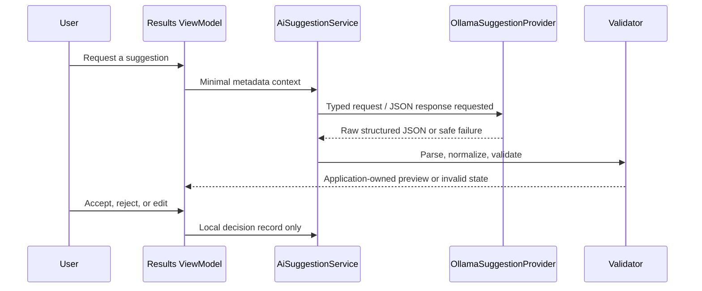
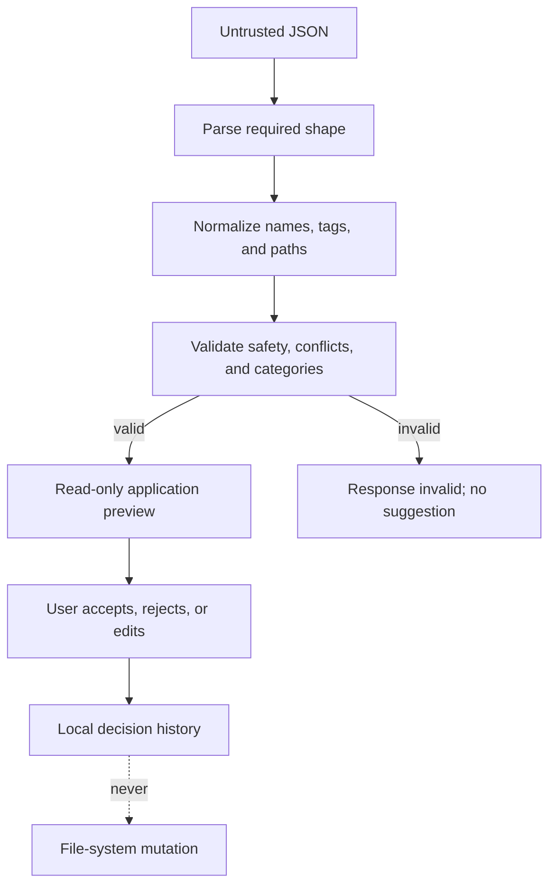

# 032 — Optional Ollama Integration and Suggestion Safety

> **Current v0.9 supersession:** Settings now serializes connection/discovery/reset work through one cancellable operation boundary, rejects provider-controlled model identifiers containing controls or more than 256 characters, and requires a separate confirmation before deleting owned decision history. Provider prompts are capped at 128 KiB, responses at 1 MiB, and the published model list at 100 validated identifiers. See [v0.9 audit corrections](../v0.9/AUDIT_CORRECTIONS.md).

| Property | Value |
| --- | --- |
| Component | Optional AI provider and suggestion workflows |
| Target release | v0.3 |
| Status | Implemented |

## Purpose and scope

This specification defines the optional local Ollama integration and the application-owned suggestion boundary. It covers connection health, installed-model discovery, selected-model persistence, structured generation, rename/tag/category/destination suggestions, bounded folder-structure previews, validation, cancellation, errors, privacy, and user review. It does not authorize filesystem changes.

## Interfaces and services

`OpenSorSe.Application.AI` owns `IAiSuggestionProvider`, `IAiSuggestionService`, typed request/result contracts, `AiSuggestionValidator`, preference aggregation, suggestion models, and decision contracts. `OpenSorSe.AI` owns `OllamaSuggestionProvider` and `JsonDecisionHistoryStore`. The Desktop knows only application contracts and ViewModels.

## Functional requirements

- Default endpoint: `http://127.0.0.1:11434`; only absolute `http` or `https` endpoints and 1–120 second timeouts are valid.
- AI is disabled by default and never participates in startup, scanning, duplicate detection, deterministic search, diagnostics, or result projection.
- Health and discovery use Ollama `/api/tags`; generation uses `/api/generate` with `stream: false`, `format: "json"`, and a low temperature.
- The Settings surface exposes connection test, discovery, selected-model persistence, timeout, enabled state, preference-adaptation state, and reset history.
- The provider reports Disabled, Unavailable, Connected, NoModelsAvailable, ModelSelected, RequestCancelled, and ResponseInvalid states with user-safe messages.
- Every generation request has a linked cancellation token and bounded timeout. Timeout and user cancellation are distinct outcomes.
- Logs contain provider, request kind, model, duration, HTTP/status class, and validation result. They never contain full prompts, complete model responses, source paths, or document contents.

## Request privacy

File-organization requests include only opaque result ID, display filename, extension, deterministic category, up to 30 selected folder names, and up to five values in each local preference signal. Folder-structure requests include the same bounded fields for up to 25 files. Full source paths, file hashes, file bytes, extracted text, and all scan output are excluded.

When the configured endpoint is not local, Settings warns that this bounded metadata may be transmitted to the endpoint. OpenSorSe adds no hidden network calls, telemetry, analytics, cloud account, or automatic sharing.

## Validation and safety

All provider output is untrusted. The application requires structured JSON and rejects malformed or incomplete response envelopes. Before a file suggestion reaches the UI, it is parsed and then centrally validated:

1. Rename values must be non-empty, ≤255 characters, one filename only, preserve the original extension, avoid invalid/reserved Windows names, avoid traversal/absolute paths, and avoid known same-folder conflicts.
2. Tags are bounded, control-character-free, normalized with Unicode compatibility normalization and separator canonicalization, and de-duplicated by normalized value.
3. Categories are constrained to the existing `FileCategory` enum rather than invented labels.
4. Destinations are relative paths only; absolute paths, colon injection, traversal, invalid segments, trailing spaces/dots, and duplicate segments are rejected.
5. Folder-structure items must reference supplied opaque file IDs exactly once and use validated relative destinations.

## UI and user review

The Results page presents editable proposal fields and explicit accept/reject controls for rename, tags, category, and destination. A separate command proposes a structure for the current bounded page. Accepting tags makes them searchable only within the current in-memory Results session; accepting any other suggestion records a local preference decision. None of these actions renames a file, changes deterministic classification, creates a folder, or moves anything.

## Persistence, compatibility, and errors

AI settings are persisted through the existing JSON configuration service. Decisions are written atomically to `%LocalAppData%\OpenSorSe\decision-history.json` as schema version 1 and capped at 1,000 records. Records contain decision kind/outcome, extension, suggested/final values, provider, model, and timestamp—not source path or file content. Corrupt history is ignored for preference context and reported safely; it can be reset from Settings.

Provider unavailable, wrong endpoint, removed selected model, HTTP failure, malformed response, timeout, cancellation, no models, and disabled AI all leave the rest of OpenSorSe usable. No fallback provider is implied.

## Testing and acceptance criteria

Tests use fake provider contracts and `HttpMessageHandler`; a real Ollama installation is never required. Covered cases include reachable/no-model/unreachable/HTTP-invalid providers, timeout, cancellation, structured JSON, malformed data, unsafe names and paths, extension preservation, sibling conflict, tag normalization, category validation, traversal rejection, decision aggregation, JSON history round-trip, malformed history, deterministic search tags and ranking, and existing regression suites.

The component is accepted when a user can configure but disable Ollama, discover a model when installed, obtain only validated previews, record/reject/edit decisions, reset local history, and continue every core v0.1/v0.2 workflow when Ollama is absent.

## Deferred work

Streaming, provider fallback, capability negotiation, image/content context, live filesystem conflict probing, batch operation execution, and cloud providers are excluded.
