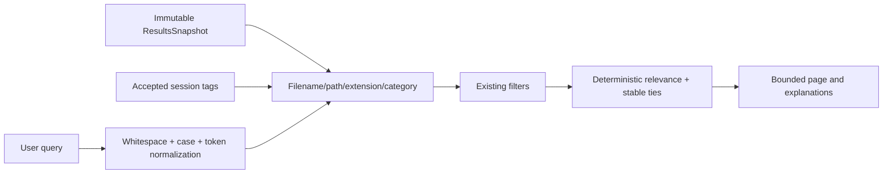

# 033 — Ranked Search, Tags, and Local Preference History

| Property | Value |
| --- | --- |
| Component | Result-session search, tag associations, and decision adaptation |
| Target release | v0.3 |
| Status | Implemented |

## Purpose and current state

v0.2 supported text filtering and deterministic field sorting. v0.3 keeps those filters but adds tokenized ranked search over information actually available in the immutable scan snapshot and current in-memory accepted tags. It is metadata-aware ranked search, not semantic search and not a persistent index.

## Domain changes

`TagAssociation` is an application-owned value containing tag identity, file association, display name, normalized value, category, source, acceptance state, explanation, and timestamp. Sources distinguish deterministic extension tags, AI proposals, user-approved tags, and future preference signals. Initial deterministic extension tags and accepted AI tags exist only for the current Results session.

`AiSuggestionDecision` records only real review actions: rename, tags, category, destination folder, and folder structure with accepted/rejected/edited outcome. `AiPreferenceAggregator` deterministically aggregates frequently approved tags, folders, categories, and rejected patterns; it provides concise request context rather than training a model.

## Search flow

Each query has up to 12 unique whitespace tokens. Every token must match. A token receives the best available deterministic signal: exact filename (120), filename prefix (100), exact tag (90), filename contains (80), partial tag (75), extension (70), category (60), or path (45). A normal text query defaults to relevance order; explicit sort controls remain available. Ties always use ordinal full path then opaque file ID. Empty queries retain the existing field-sort behavior.

The UI exposes a short explanation such as `tag match: Finance` through the row tooltip and selected-file details. Matching is case-insensitive where appropriate, cancellable, bounded, and has clear no-results and loading states.

## Filtering, sorting, paging, and compatibility

Duplicate state, extension, deterministic category, planned-operation state, exact duplicate group, sort field, sort direction, and page size remain part of `ResultsQuery`. Page sizes remain bounded to 50, 100, 200, or 500. Query normalization repairs invalid enum values, page sizes, indices, and extensions. Existing `ResultsQueryEngine` callers remain valid without tags because its tag lookup is optional.

## Preference adaptation

Preference adaptation is local, optional, inspectable, resettable, and deterministic where possible. It:

- ranks repeated approved patterns into bounded request context;
- includes edited final values as approved patterns;
- includes rejected suggestions only as bounded avoidance context;
- never changes a deterministic result classification or directly changes a user file;
- does not train, fine-tune, or claim to teach Ollama.

Disabling adaptation sends no prior-decision context. Resetting history deletes the application-owned JSON history file. The history is not part of a scan snapshot and therefore does not create a durable file catalog.

## Non-functional requirements, errors, and tests

Search performs no I/O, does not access a provider, and checks cancellation periodically. Bad tag data is excluded through central validation before association. Corrupt decision history is not used. Search tests cover filenames, paths, extension, category, accepted tags, multiple tokens, whitespace/case normalization, deterministic score ordering, stable ties, paging, filters, no matches, and cancellation through the existing query path.

## Deferred work

No extracted-text search, document metadata persistence, full-text index, vector store, embeddings, semantic provider, saved searches, or persistent tags is delivered by v0.3. A future embedding provider may implement a separate application search contract without replacing the user-facing `ResultsQuery` contract.
