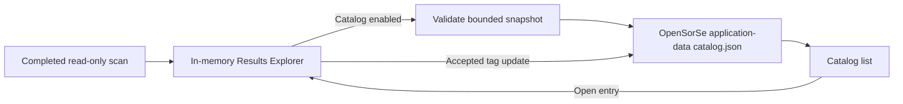

# OpenSorSe v0.4 Release Proposal

| Field | Value |
| --- | --- |
| Target release | v0.4 |
| Theme | Opt-in local catalog |
| Scope type | Read-only persistence and review |
| Depends on | v0.3 immutable snapshots, session tags, and metadata-aware search |

## 1. Purpose and scope

v0.3 intentionally discards completed scan snapshots and accepted tags when the process closes. v0.4 adds an explicitly enabled, bounded local catalog so a user can reopen a completed read-only scan after restarting OpenSorSe. The catalog is application-owned metadata stored under the existing OpenSorSe local-application-data directory.

In scope:

- An opt-in catalog setting, disabled by default.
- Atomic, versioned JSON storage for completed immutable snapshots and accepted non-deterministic tags.
- Bounded retention of the ten newest entries and a 2,000-file maximum per entry.
- A Catalog surface that lists, refreshes, and reopens persisted entries.
- Safe degradation for unavailable, malformed, unsupported, oversized, cancelled, and failed catalog work.

Out of scope:

- Persistent full-text or semantic search, databases, OCR, content extraction, report export, cloud synchronization, or automatic organization.
- Persisting source hashes, file contents, suggested/rejected AI drafts, AI decision history, or live filesystem state.
- Any rename, move, delete, overwrite, permission, timestamp, or metadata change to a selected user file.

## 2. User flows

1. In Settings, the user explicitly enables local catalog storage and saves settings.
2. A later completed scan is shown normally in Results. OpenSorSe asynchronously stores a validated catalog copy only when the snapshot is within the documented limit.
3. The user opens Catalog, refreshes its application-owned entries, and selects **Open** to load a saved snapshot into the existing Results Explorer.
4. Accepted AI tags for an open catalog entry are persisted; deterministic extension tags are regenerated from the snapshot. Other suggestion state remains process-local.
5. If the feature is disabled, no catalog read or write is attempted by scan completion. If storage is malformed or inaccessible, current scan results remain available and a safe status is shown.

## 3. Architecture and domain changes

`OpenSorSe.Application` owns `CatalogEntry`, `CatalogEntrySummary`, `CatalogLimits`, `IResultsCatalogStore`, and `JsonResultsCatalogStore`. The store accepts only `ResultsSnapshot` and accepted application-owned tags; it has no scanner, executor, UI, or provider dependency. It serializes an envelope with schema version one and uses a per-store semaphore plus temporary-file replacement.

The Desktop composition root gives the store a rooted path beside `settings.json`. `MainViewModel` saves completed snapshots only after the existing results load succeeds. `CatalogViewModel` is the sole catalog-list UI state and raises an open request; the shell owns navigation and reuses `ResultsViewModel` to present the snapshot.

`ResultsViewModel` gains an overload for restoring persisted accepted tags and exposes a snapshot-safe tag snapshot for persistence. It regenerates deterministic extension tags and accepts only persisted tags that reference files in the loaded snapshot.

## 4. Persistence and compatibility

The file is `catalog.json` in `%LOCALAPPDATA%/OpenSorSe` in production; tests pass only temporary absolute paths. The envelope contains a schema version and entries. An entry contains a generated catalog ID, UTC saved timestamp, the existing display-safe snapshot, and accepted non-deterministic tags. Raw content hashes never enter `ResultsSnapshot` and are not added by this release.

The store retains at most ten newest valid entries. It declines to write a snapshot with more than 2,000 files rather than silently truncating it. A missing file is an empty catalog. An unsupported or malformed file is left untouched and reported as unavailable; OpenSorSe never deletes or repairs it automatically. v0.3 settings deserialize compatibly because the new `Catalog` settings group has a default.

## 5. Error handling, cancellation, and safety

- Every public asynchronous store operation accepts and observes a cancellation token before and while waiting for the lock or doing I/O.
- A cancellation never creates a catalog entry; temporary files are removed in a `finally` block.
- I/O, authorization, malformed JSON, unsupported schemas, invalid entries, and capacity violations are returned to the Desktop layer as categorized catalog exceptions or safe statuses. They do not invalidate a completed scan.
- The store writes only its explicitly configured, rooted application-data path. It never follows selected scan paths, opens a result file, executes a file, or uses the executor.
- Retention replaces only the application-owned JSON file atomically. It does not alter user folders or files.

## 6. Testing strategy

- Application tests cover round trip, deterministic newest-first retention, cancellation, malformed data, schema rejection, oversize rejection, and accepted-tag filtering.
- Desktop tests cover disabled persistence, successful scan persistence, catalog reload/open, and unavailable-state resilience.
- Existing complete/cancelled/failed scan, results-query, duplicate-review, and AI-tag tests remain regression coverage.
- Manual testing confirms paths are stored only after opt-in and no scanned fixture file changes before or after catalog activity.

## 7. Delivery phases and acceptance criteria

| Phase | Deliverable | Exit criteria |
| --- | --- | --- |
| 1 | Domain contract and store | Atomic bounded persistence tests pass. |
| 2 | Results and Desktop integration | Catalog opens saved snapshots and preserves accepted tags. |
| 3 | Documentation and validation | README, roadmap, status, architecture, build, and full suite agree with implementation. |

The release is accepted when catalog storage is disabled by default, no user file can be mutated by any catalog flow, the catalog has bounded behavior and user-safe failures, a saved scan reopens in Results without new filesystem access, and automated validation passes where the environment permits it.

## 8. Risks and mitigations

| Risk | Mitigation |
| --- | --- |
| Persisted paths are sensitive metadata. | Explicit opt-in, local application-data location, clear UI disclosure, no remote use. |
| Catalog growth affects disk or startup. | Ten-entry / 2,000-file bounds and on-demand loading. |
| Interrupted write corrupts storage. | Temporary file plus replacement; malformed files are never rewritten automatically. |
| Stale data is mistaken for live state. | Every Catalog surface labels data as a saved snapshot and does no filesystem refresh. |

## 9. Documentation updates

Update README, roadmap, release status, system overview, database/search status notes, and GUI catalog documentation. Distinguish v0.4's JSON catalog from the future database and search-index architecture.
