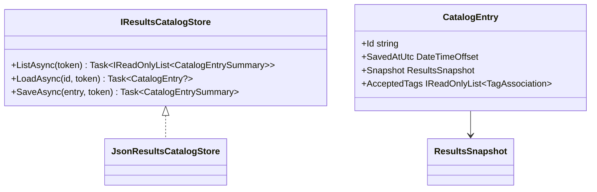

# Specification 035 — Local Results Catalog Store

| Field | Value |
| --- | --- |
| Component | Application-owned JSON catalog persistence |
| Target release | v0.4 |
| Dependencies | `ResultsSnapshot`, `TagAssociation`, Core logging |

## Requirements

`IResultsCatalogStore` shall asynchronously list, save, and load catalog entries without accessing selected user paths. `SaveAsync` shall reject null input, non-UTC invalid timestamps, and snapshots above `CatalogLimits.MaximumFilesPerEntry`. It shall filter out tags that do not identify an existing file or are not accepted, and store only accepted non-deterministic tags; deterministic tags are reproducible and excluded.

> **Current v0.9 supersession:** the store also enforces the v0.6 twelve-tag-per-file/text bounds and a 128 MiB encoded catalog bound on read and write. See [v0.9 audit corrections](../v0.9/AUDIT_CORRECTIONS.md).

`JsonResultsCatalogStore` shall require an absolute file path, use schema version 1, serialize enum values as strings, make all returned collections read-only, retain the newest ten entries by saved UTC timestamp (with ID as a deterministic tiebreaker), and use a semaphore to serialize load/save operations. It shall write a temporary sibling file and replace only the catalog file after a complete serialization. It shall remove temporary files after failure or cancellation.

`ListAsync` shall return summaries newest first. `LoadAsync` shall return a full entry or null when the ID is absent. Missing catalog files are valid empty state. A malformed, unsupported, or invalid envelope shall throw `InvalidDataException` after a redacted warning is logged. The implementation shall not delete, modify, or attempt recovery of such a file.

## Model and interface

## Non-goals

No SQLite, migrations, catalog deletion UI, saved searches, tag editing, file observation, background rescans, content reads, hash persistence, or execution is part of this specification.

## Acceptance tests

- A valid temporary-path entry round trips exactly in snapshot fields and accepted tags.
- Save stores no deterministic, rejected, or unknown-file tag.
- Eleven writes retain exactly the newest ten summaries.
- A 2,001-file snapshot is rejected and leaves prior persisted data intact.
- Cancellation and malformed input leave user folders untouched and do not turn into an empty catalog.
