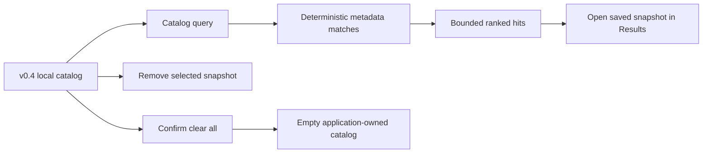

# OpenSorSe v0.5 Release Proposal

| Field | Value |
| --- | --- |
| Target release | v0.5 |
| Theme | Catalog-wide deterministic discovery and explicit maintenance |
| Scope type | Read-only search plus user-authorized application-data management |
| Depends on | v0.4 opt-in local catalog |

## 1. Purpose and new capabilities

v0.4 stores bounded historical snapshots but requires a user to open each snapshot before using the existing Results Explorer. v0.5 adds a catalog-wide search surface across those already-saved snapshots, while preserving the same deterministic metadata matching and no-live-filesystem-access rule. It also gives the user explicit controls to remove one stored snapshot or clear all stored catalog data.

New capabilities:

- Search filenames, paths, extensions, deterministic categories, and accepted persisted tags across all opt-in saved snapshots.
- Stable relevance ranking, match explanations, bounded result rendering, cancellation, empty and unavailable states.
- Open a selected search hit in the existing historical Results Explorer.
- Remove a selected saved snapshot and clear all catalog data only after an explicit second confirmation action.

## 2. Non-goals and compatibility

v0.5 does not add semantic search, embeddings, content extraction, a full-text index, database migration, query persistence, cloud sync, catalog encryption, live file verification, rescans, export, or any modification of selected user files.

v0.4 catalog schema version one and its ten-entry/2,000-file bounds remain compatible. Search reads the existing store through its contract and does not write index data. The new remove/clear operations affect only the explicitly configured OpenSorSe `catalog.json` file; they do not alter settings, decision history, logs, or any scanned folder.

## 3. User flows

1. With catalog storage enabled, a user opens **Catalog search**, enters a non-empty query, and waits for bounded local search results.
2. The user reads the matching field explanation and saved-snapshot timestamp, then opens a hit. The existing Results Explorer labels it as historical and does not touch the filesystem.
3. On the Catalog page, the user may select an entry and remove it. The action alters only local application-owned catalog data.
4. A user can request a complete clear; OpenSorSe displays a separate confirmation action. Only that confirmation deletes the catalog file. Cancellation, failure, or closing the app leave catalog data intact.

## 4. Architecture, services, and models

`IResultsCatalogStore` extends with `RemoveAsync` and `ClearAsync`. `JsonResultsCatalogStore` preserves its semaphore and atomic save behavior. `ClearAsync` deletes only the rooted application-owned catalog path after explicit caller authorization.

`CatalogSearchViewModel` is a Desktop-layer coordinator. It reads saved entries, evaluates each snapshot through the established `ResultsQueryEngine`, preserves accepted per-entry tags, aggregates match scores, sorts stably, and presents no more than 200 rows. It caches only the entries needed to open a displayed hit during its current lifetime; no search index or query is persisted.

`CatalogViewModel` gains removal and two-step clear state. The shell reuses the v0.4 saved-entry event path for Catalog and Catalog Search, preserving Results presentation and dashboard behavior.

## 5. Functional requirements

| Area | Requirement |
| --- | --- |
| Query | Trim input, require non-empty text, reuse v0.3 tokenization/matching/ranking semantics, and evaluate only catalog entries. |
| Bounds | Cap rendered catalog search hits at 200; preserve deterministic score, saved time, path, and ID tiebreakers. |
| Tags | Use accepted persisted tags plus deterministic extension tags regenerated by the Results query engine. |
| Opening | Load the saved entry, restore tags, label it historical, and perform no filesystem read. |
| Remove | Require a selected entry; update the list only after store success. |
| Clear | First command only exposes confirmation. Confirmation clears the catalog; cancellation or failure preserves data. |
| Disabled/unavailable | Do not enumerate, load, search, remove, or clear while catalog is disabled. Show a safe status instead. |

## 6. Errors, cancellation, and safety

All catalog read/write operations use cancellation tokens and the store lock. Repeated searches cancel older search work and only publish the latest version. Malformed, unsupported, inaccessible, or unavailable catalogs report a generic local-catalog status without raw JSON, exception details, content hashes, or execution controls.

The release performs no selected-folder I/O after a catalog entry is saved. Its only mutation is a user-directed replacement/deletion of the rooted application-owned catalog file. It never follows scan-folder links, launches files, invokes executor or undo services, or changes any selected source file.

## 7. Tests and acceptance criteria

- Store tests cover remove-missing, remove-existing, clear, cancellation, and no user-folder writes.
- Search tests cover text/accepted-tag matches, ranking tie breaks, cap, empty query, disabled store, cancellation/stale search, and opening a hit.
- Catalog ViewModel tests cover remove and two-step clear behavior.
- Full v0.1–v0.4 regression suite runs with v0.5 tests.

Acceptance requires that every displayed hit comes from an existing saved snapshot, opening it performs no live access, clearing requires confirmation and removes only app-owned catalog data, successful validation has no test failures, and public documentation retains the distinction between deterministic catalog search and future semantic search.

## 8. Risks and mitigations

| Risk | Mitigation |
| --- | --- |
| Historical paths can be mistaken for live files. | Timestamp and historical-snapshot wording on every result/open flow. |
| Repeated catalog scans cause UI churn. | Versioned cancellation, background evaluation, 200-row cap, and stable ordering. |
| User deletes catalog unintentionally. | Explicit per-entry remove and a two-step clear action. |
| Search is mistaken for semantic search. | Use existing deterministic matcher, explanations, and explicit scope wording. |

## 9. Delivery phases

1. Extend store contract and test explicit application-owned maintenance.
2. Add bounded search view model, view, navigation, hit opening, and regression tests.
3. Update safety, architecture, roadmap, release, and implementation decision documents; build, test, and corrective-review the complete v0.5 tree.
