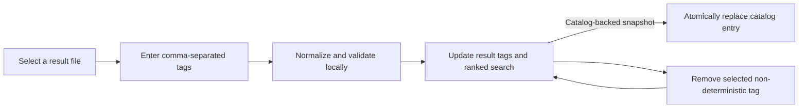

# OpenSorSe v0.6 Release Proposal

| Field | Value |
| --- | --- |
| Target release | v0.6 |
| Theme | User-managed metadata tags |
| Scope type | Read-only metadata curation and catalog integration |
| Depends on | v0.3 tag/search model and v0.4/v0.5 catalog persistence/search |

## 1. Purpose and user value

OpenSorSe can already search accepted tags, but a user without an AI provider cannot create one and no Results control can remove an accepted tag. v0.6 closes that workflow gap with deterministic, local user-tag controls for the selected result. Tags remain OpenSorSe metadata: adding or removing one never changes the selected file.

In scope:

- Add up to twelve normalized, accepted non-deterministic tags per result file.
- List and remove accepted non-deterministic tags from the selected result.
- Refresh current Results search/detail state immediately after a tag change.
- Reuse the v0.4 catalog update path when the open snapshot is catalog-backed.
- Preserve in-memory-only behavior for scans that are not stored in the opt-in catalog.
- Present explicit empty, validation, duplicate, capacity, persistence, and historical-snapshot states.

Out of scope:

- Writing tags beside user files, changing embedded metadata, or renaming/moving a file.
- Global tag taxonomies, tag categories, bulk editing, automatic tag propagation, cloud sync, databases, content extraction, or semantic search.
- Increasing the catalog retention or file-count limits.

## 2. User flow

1. The user selects a file in Results and enters one or more comma-, semicolon-, or line-separated tags.
2. OpenSorSe validates and normalizes the values, removes duplicates, and adds only values that are not already present.
3. Rows, selected details, and metadata-aware search refresh without reading the file.
4. The user may select any non-deterministic accepted tag and remove it. Deterministic extension tags remain visible but are not removable.
5. If the snapshot came from the enabled catalog, the existing catalog persistence event replaces that entry. Otherwise the change remains in memory for the session.

## 3. Functional and architecture impact

`OpenSorSe.Application.Tags.UserTagFactory` owns normalization and association construction so user input does not depend on the optional AI provider. `UserTagLimits` owns the twelve-tag-per-file and 64-character-per-tag limits. The factory is a pure, deterministic application helper and performs no I/O.

`ResultsViewModel` owns tag-editing presentation state, because tags are associated with its active immutable snapshot and already participate in its query engine. It exposes a bounded editable-tag collection, input/status properties, and add/remove commands. The existing `PersistedTagsChanged` event remains the only shell persistence signal; no new dependency direction or service lifetime is introduced.

`MainViewModel` continues to decide whether the active result is catalog-backed and whether persistence is enabled. `JsonResultsCatalogStore` requires no schema change: v0.4 already stores accepted non-deterministic `TagAssociation` values and validates file ownership.

## 4. State, error, cancellation, and performance behavior

| State | Behavior |
| --- | --- |
| No snapshot or no selected file | Editing controls are disabled and no state changes. |
| Empty input | No tag is added; a concise validation message is shown. |
| Invalid/control-only/oversized input | The complete input operation is rejected without partial mutation. |
| Duplicate tag | Existing association is retained; no duplicate is created. |
| Twelve-tag capacity reached | Additional non-deterministic tags are rejected without truncation. |
| Successful add/remove | Selected details and the current bounded query refresh; catalog persistence is requested when applicable. |
| Persistence failure | The session tag remains usable and the shell reports the existing non-blocking catalog warning. |
| Historical entry removed concurrently | Existing v0.5 identity checks prevent writing tags into another entry. |

Tag mutation is synchronous, bounded to at most twelve user-managed tags, and does not need cancellation. The subsequent query refresh retains existing versioned cancellation behavior. Catalog writes retain v0.4 cancellation, locking, and atomic replacement behavior.

## 5. Safety, privacy, persistence, and compatibility

- User tags are application-owned metadata only. No selected path is opened or written.
- Tags are stored only when the user previously enabled the local catalog and the snapshot is catalog-backed.
- Persistence remains bounded, local, atomic, and schema-version-one compatible.
- v0.1-v0.5 scans, results, AI suggestion review, catalog search, and maintenance remain compatible.
- Existing accepted AI tags are removable through the same explicit control; deterministic extension tags are not.
- No migration is required. Older entries load with their existing accepted tags.

## 6. Testing strategy and acceptance criteria

Automated tests cover normalization, Unicode compatibility normalization, punctuation handling, duplicate removal, invalid input, bounds, correct source/category/state, adding and removing selected tags, deterministic-tag protection, query/detail refresh, catalog persistence signaling, restored-tag editing, repeated commands, and no-selection/empty-snapshot states. The entire earlier solution suite remains regression coverage.

Acceptance requires:

- A user can add and remove tags without configuring AI.
- Search immediately finds a newly added tag and stops finding a removed tag.
- No operation can exceed the documented bound or alter a user file.
- Catalog-backed tags survive reopen through the existing store; non-catalog tags remain session-only.
- Restore, build, tests, and diff checks pass where the environment permits.

## 7. Delivery phases, risks, and documentation

| Phase | Deliverable | Exit criteria |
| --- | --- | --- |
| 1 | Application normalization contract | Pure validation and bound tests pass. |
| 2 | Results ViewModel and Avalonia controls | Add/remove/search/persistence-event tests pass. |
| 3 | Documentation and review | Safety, search, GUI, roadmap, and release documents match the implementation. |

| Risk | Mitigation |
| --- | --- |
| Tags create unbounded state | Twelve accepted non-deterministic tags per file; catalog file/file-count bounds remain unchanged. |
| A manual tag overwrites a deterministic tag | Existing normalized values are retained and deterministic tags cannot be removed. |
| UI claims persistence when catalog is unavailable | Results describes metadata state; the shell retains its explicit non-blocking persistence warning. |
| Personal labels reveal sensitive context | Local-only storage, existing opt-in catalog disclosure, and no remote transmission. |

Update README, roadmap, release status, Results/Catalog GUI architecture, search architecture, project philosophy, and v0.6 implementation decisions. Historical v0.1-v0.5 documents remain available; v0.6 explicitly supersedes their earlier “no manual/persistent tags” current-boundary statements.
