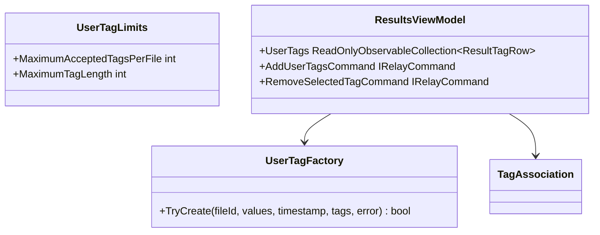

# Specification 039 — User-Managed Result Tags

| Field | Value |
| --- | --- |
| Component | Application tag validation and Results editing |
| Target release | v0.6 |
| Dependencies | `TagAssociation`, `ResultsViewModel`, v0.4 catalog tag persistence |

## Requirements

`UserTagFactory` shall normalize one to twelve input values using Unicode Form KC, lower-invariant identity, alphanumeric preservation, and a single hyphen for each punctuation/whitespace run. Display values shall be trimmed, contain no control characters, and be at most 64 characters. An input operation containing an invalid value shall fail as a whole. Normalized duplicates shall collapse in first-input order.

Created associations shall use the selected opaque result-file ID, `TagSource.UserApproved`, `TagAcceptanceState.Accepted`, category `User`, a UTC timestamp, and a deterministic ID derived from the file ID plus normalized tag. The helper shall not inspect paths or perform I/O.

`ResultsViewModel` shall expose:

- `UserTagText` and `UserTagStatusText`.
- A read-only collection of accepted tags for the selected file, including deterministic tags for context.
- A selected tag row and add/remove commands with accurate command state.
- A fixed per-file maximum of twelve non-deterministic accepted tags.

Adding shall retain existing normalized values, reject overflow without partial mutation, clear successful input, refresh rows/details/search, and raise `PersistedTagsChanged` exactly once when state changed. Removing shall accept only a selected non-deterministic tag associated with the currently selected file, update the same presentation state, and raise the event exactly once. Repeated add/remove requests that do not change state shall not raise persistence events.

## UI, errors, cancellation, and large-state behavior

The editing panel belongs in selected-file details and is hidden or disabled without a selection. It shall state that tags are OpenSorSe metadata and never change the file. Invalid and capacity failures are presented locally without clearing valid existing tags. Because mutation is memory-only and bounded, it is synchronous. Query evaluation and any subsequent catalog persistence retain their independent cancellation behavior.

At the catalog maximum of 2,000 files, only the selected file's bounded tag list is materialized in the editing collection. Repeated selection and navigation rebuild that small collection and do not add event subscriptions.

## Persistence and safety constraints

No new persistence type or format is introduced. The existing catalog sanitizer remains authoritative and stores accepted non-deterministic associations only for known file IDs. Tag editing never calls the filesystem, executor, shell, AI provider, or network. A tag is never written into file metadata or beside a scanned file.

## Acceptance tests

- Normalization is deterministic and rejects malformed values atomically.
- Duplicate input and existing values do not create duplicate associations.
- The twelfth accepted non-deterministic tag is allowed and the thirteenth is rejected.
- Add/remove update rows, details, query matches, command state, and persistence events.
- Deterministic extension tags cannot be removed.
- Restored historical tags can be removed and new manual tags can be added.
- No-selection, empty-snapshot, repeated-command, and failed-validation states remain usable.
